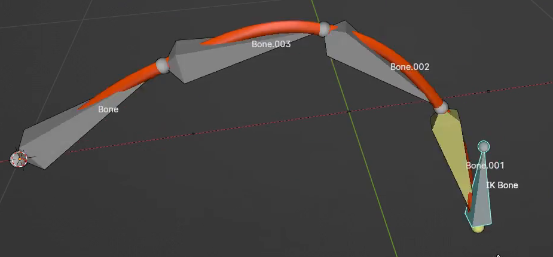
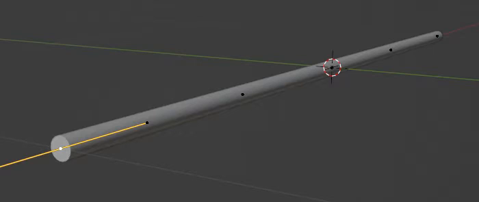
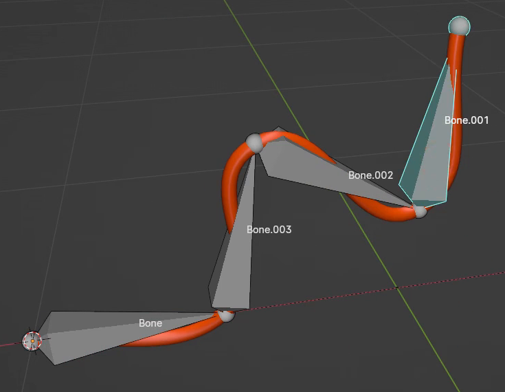
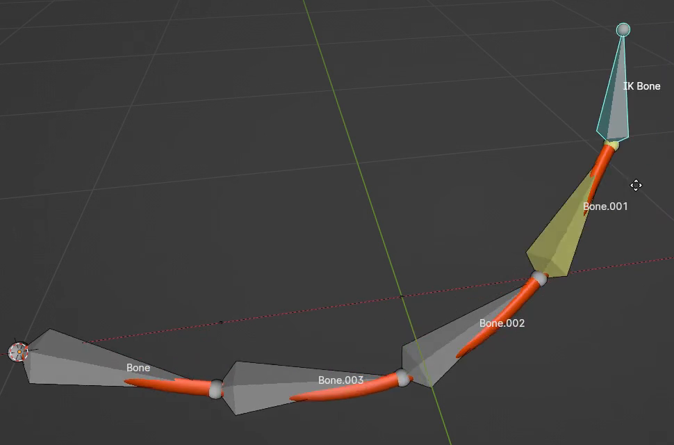

# 骨骼控制的贝塞尔软管

用代码创建一条可继续编辑的圆截面软管：通过分段骨骼直接调整弯曲，也能拖动末端控制器，让整条软管跟随形成自然的弧线。交付的是实时绑定资产，恢复默认状态后软管平直展开。

图 1：末端控制后的软管与骨骼关系。骨骼覆盖显示用于说明绑定；图中的颜色、骨骼名称和显示形状不要求照搬。

## 起始条件

- 使用 Blender 5.1.2，从空场景开始；`input/` 为空，不提供初始模型或外部素材。
- 软管、曲线和骨骼均由代码创建，不需要第三方插件。以 `+Z` 为上方，默认软管由根部沿 `+X` 展开。
- 以下用 `L` 表示默认软管的中心线长度，用 `d` 表示默认管径。整体尺度自行选择，保持参考中的细长比例。

## 1. 细长圆管与默认形态

软管是一条不分叉的连续细管，默认状态的中心线平直，管径与长度之比 `d/L` 为 0.018 至 0.022。根部和末端清楚可辨，不能用数段互不相接的圆柱冒充整条软管。

管身截面接近圆形，沿长度保持一致，两端都有与管身连成一体的封口。默认状态从正面、侧面和端部查看，不应有明显的扁平截面、突变粗细、开放管口或破面。截面的最大直径与最小直径之比不超过 1.1。

图 2：绑定前的细圆管与端部。视口中的控制点和手柄不是管身的一部分。

## 2. 可编辑的曲线与骨骼接口

保留实际参与软管生成的贝塞尔曲线和可摆姿的骨骼链。曲线控制点或等价的曲线锚点沿骨骼链分布，并在运动时跟随相应关节；曲线修改后仍能更新可见管身。只交付静态网格、预制姿态切换或不参与变形的展示骨骼不满足要求。

提供可辨认的分段骨骼控制，以及位于末端的独立 IK 目标骨骼。目标骨骼能够独立移动，不会被它正在驱动的链条反向拖走。实现方式、辅助骨骼数量、曲线点数、名称及修改器配置自行选择。

在 `.blend` 内留下简短控制说明，标出根部、末端、分段骨骼、IK 目标、IK/FK 切换或暂时停用 IK 的方法，以及恢复默认状态的方法。直接调整约束影响值也可以，不要求制作额外控制面板。

## 3. 分段骨骼调姿

在 FK 状态下，链条中的各段骨骼都应真实驱动相应软管锚点。以默认状态为起点，逐一将各段骨骼绕全局 `Y` 轴转动 30 度，每次独立恢复后再测试下一段：该骨骼末端及其后续部分随动，该关节根部一侧的锚点保持原位，不能串到无关部位或只移动骨骼外观。

还应支持组合摆姿：选择分别靠近长度三分之一和三分之二处的两个内部关节，按从根部到末端的顺序绕全局 `Y` 轴分别转动 `+45` 度、`-60` 度，形成多段、反向弯曲的姿态。关节数量可自行安排，但应具有足够的分段控制完成这种形变。FK 检查时允许按文件内说明临时停用 IK，检查后恢复 IK。

图 3：多段骨骼调姿的参考状态。图示弯曲幅度用于说明控制能力，不要求精确复制这一个姿态。

## 4. 末端 IK 拖动与根部锚定

默认状态启用 IK。保持根部不动，从默认状态分别将末端目标平移 `(-0.15L, 0, 0.20L)` 和 `(-0.30L, 0.15L, -0.20L)`，每次独立开始。每种偏移下，实际软管末端应到达移动后的目标，距离误差不超过 `0.01L`；链条沿长度分布的多个关节共同调整，软管形成连续弯曲。不能仅平移整件资产，也不能只移动目标而管身无响应。

图 4：单独移动末端目标时，整条链条重新定向。

在上述 IK 偏移和第 3 节的 FK 摆姿中，实际软管根部相对默认位置的漂移均不超过 `0.005L`。曲线锚点始终贴合所对应的实际骨骼关节，距离误差不超过 `0.01L`；不得出现管身与骨骼脱开、根部滑动或弯曲位置明显错位。

## 5. 弯曲后的管身质量

在第 3 节组合姿态和第 4 节两个 IK 姿态中，管身都保持连续、平滑，关节附近不能撕裂、产生尖刺、突然折成硬角或塌缩成细线。截面的局部管径相对默认 `d` 的变化不超过 20%，端部仍然封闭。以关闭骨骼覆盖显示后的实际管身检查，不能由骨骼或选择高亮遮住缺陷。

允许贝塞尔插值造成中心线长度随弯曲有少量变化；不要求物理仿真、严格不可伸长、自动避碰、指定表面材质或预设动画。

## 6. 恢复与交付

提交 `submission.blend` 和 `build.py`。文件以平直默认状态保存，并启用可操作的 IK。按文件内说明，完成任一公开摆姿后能够恢复同一默认位置和形态；再次操作控制器仍然有效，不需要重跑生成脚本。

`build.py` 应能在 Blender 5.1.2 的空场景中生成并保存完整资产，运行方式写在脚本开头。资源应随文件保存或由代码生成，不能依赖本机绝对路径、未交付文件或联网下载。构建、保存并重新打开后，曲线、骨骼和两种控制方式仍应可编辑和使用。

展示相机、灯光与背景自行安排；若提供渲染图，使用 Cycles GPU。无需提交动画或另建演示模型。

图片均为实际参考画面的裁切。比例范围、功能测试幅度及容差是本任务的公开验收约定。

## 渲染效果交付

在原有交付文件之外，另提交 `B01_骨骼控制的贝塞尔软管.png`。图片采用 PNG 格式，从实际交付工程渲染，清楚展示主要成品及其形体或材质效果。使用本题规定的渲染环境；若原题没有指定展示相机，可设置能完整观察主体的相机。该文件应与 `submission.blend` 中的结果一致，不以参考图、视口截图或外部素材代替实际渲染。
