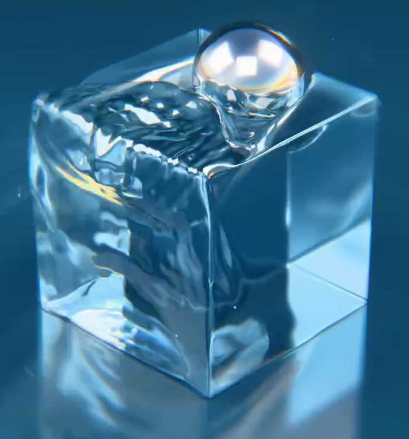
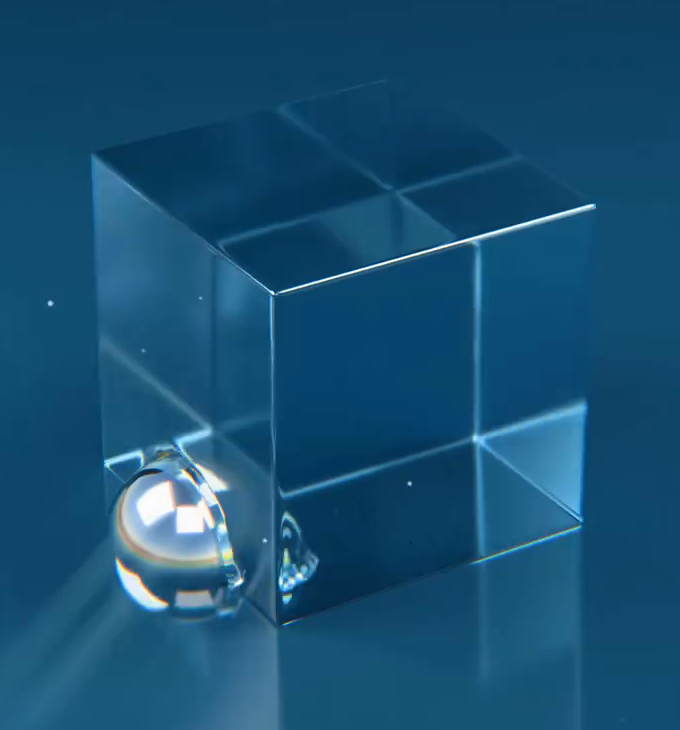
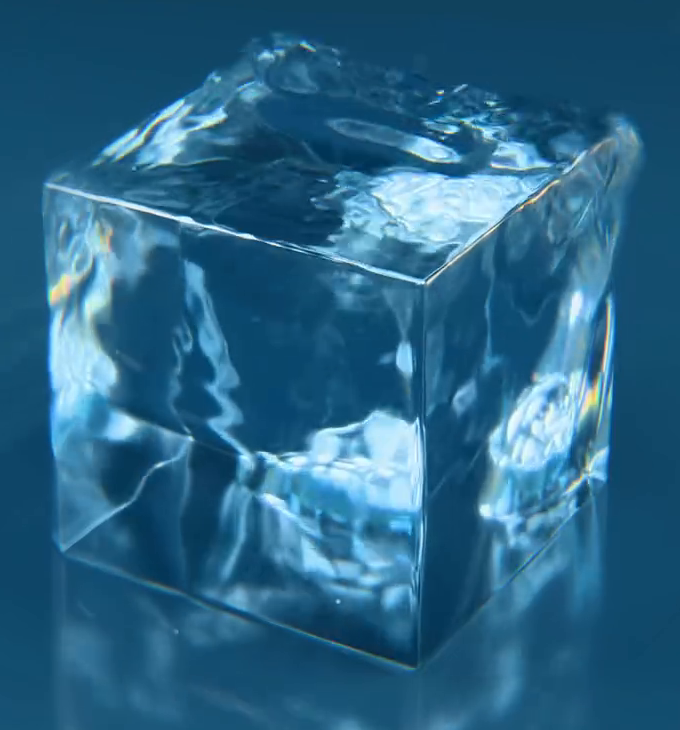

# 金属球驱动的水体方块波纹

用代码创建一个透明蓝色的水体方块，以及沿它的外表面游走的金属球。球体经过侧面和顶面时，水体应产生真实的凹凸波形；球体离开后，波纹继续在表面传播。动画中既能看见球体的运动，也能看见水面起伏带来的高光和折射变化。

图 1：水体仍保持方块的整体形态，顶面与侧面出现波纹，金属球部分接触水面。

## 起始条件

- 目标环境为 Blender 5.1.2，从空场景开始；`input/` 为空，无需外部模型或纹理。
- 采用 `+Z` 向上。以初始水体的名义边长 `L` 为尺度基准，整体尺寸和世界坐标位置自行选择。
- 动画范围为第 1–240 帧，帧率为 24 fps。设置便于查看顶面及两个侧面的固定展示视角；需要渲染时使用 Cycles GPU。

## 1. 水体与金属球形态

水体是有体积、封闭的近似立方体，而非一张平面。第 1 帧除球体接触区的小范围形变外，应能辨认平整的侧面、顶面和完整棱边；三个方向的名义边长之比不超过 1.15。动画全程保留水体方块的主体轮廓，允许表面波纹改变局部轮廓。

金属球为完整、平滑、近似正球形，直径为 `0.30L` 至 `0.55L`，运动中保持尺寸和球形。水体和球体均不能有意外开口、破面或缺失部分。网格密度和生成方法自行决定。

图 2：起始时水体大部分表面较平静，球体位于水体下部一侧，并与外表面部分相交。

## 2. 连续的表面游走

第 1 帧球体从水体下部一侧出发，随后沿侧面上升，越过顶面，再沿表面返回下部。第 240 帧球心与起始球心的距离不超过 `0.10L`。路径应覆盖侧面和顶面，具体方向、转弯位置、速度分配和关键帧数量自行决定。

球体连续移动，相邻帧的球心位移不超过 `0.10L`。至少 90% 的帧中，球体应与求值后的水体表面相切或部分相交；由波谷造成的小间隙允许不超过 `0.03L`。球体不能整段悬空、瞬移，或仅从水体内部穿行。球体允许被水体遮挡，但展示视角应容纳完整运动范围。

水体的整体位置和朝向保持固定，波纹由表面变化体现。首帧允许接触点附近已有小幅响应，末帧允许仍有余波；不要求第 240 帧的水面与第 1 帧无缝接合。

## 3. 可重算的波浪响应

使用可重新计算的波浪模拟，让球体接触与水体形变具有实际联系。可以使用动态绘画波浪或等价的可编辑模拟，不限定修改器、节点、对象名称或内部参数。

球体经过侧面与顶面时，两处都应产生跟随接触位置的凹陷、隆起或波峰。形变必须存在于求值后的水体几何上，在中性材质或实体视图下也能观察到。波面应连续，不出现大块折面、裂缝或失控尖刺。

球体离开某处后，该处附近的波形应继续变化至少 12 帧，并向接触区域以外传播，传播距离至少达到一个球体半径。不能只是随球移动的一块固定凹坑，也不能让整块水体同时做相同的起伏。

在工程副本中将球体移离水体、清除旧缓存并从第 1 帧重新计算后，原路径上不应再产生球体驱动的新波纹；恢复接触路径并重算后，应能再次得到相应波纹。工程内应保留完成这种重算所需的可编辑模拟关系。

图 3：波纹已经扩展至顶面和侧面。参考图用于观察波形与透明材质，无需逐像素复制水面形状。

## 4. 透明水体与金属反射

水体呈蓝色或青蓝色，具有清楚的透射和折射：透过水体能够看到另一侧表面、棱边或背景，波纹会使这些形象发生局部扭曲。水体不能仅靠降低 Alpha 形成平面透明感。

表面具有清晰、连续的光亮反射，波峰与波谷会改变高光形状。固定相机和灯光后比较不同动画帧，水面高光与折射图案应随真实波形变化，不能成为贴在画面上的静态图案。球体呈中性银色金属外观，能辨认环境或灯光的反射，不能表现成白色漫反射球或透明球。

为主体提供简洁背景与照明，使透射、波形和金属反射可以同时辨认。背景颜色、灯光数量与布置自行选择，无需复制参考图的地面反射或摄影棚结构。

## 5. 交付与重放

提交 `submission.blend` 和 `build.py`。`build.py` 应能在 Blender 5.1.2 的空场景中创建、配置并保存整个资产；脚本开头写明运行方式以及必要的计算或缓存步骤。

将工程保存在第 1 帧，在 `.blend` 内保留简短说明，标明球体、水体、播放范围、恢复初始状态和重新计算波浪的方法。按说明从第 1 帧开始播放或计算，应得到完整的 1–240 帧运动和波纹。

所有必要资源应由代码生成、打包入工程，或随工程以相对路径提供。需要磁盘缓存时应包含可用缓存或可从头生成它的步骤，不能依赖本机绝对路径、未提供的文件或联网下载。场景结构和模拟关系保持可编辑。

图片为实际视频画面的裁切。24 fps、尺寸比例、接触容差、传播距离和持续帧数是本任务的交付约定。

## 渲染效果交付

在原有交付文件之外，另提交 `B02_金属球驱动的水体方块波纹_动态.mp4`。视频采用 MP4 格式，按本题规定的完整时间范围和帧率，从实际交付工程渲染动画，清楚展示动作与效果变化。使用本题规定的渲染环境；若原题没有指定展示相机，可设置能完整观察主体的相机。该文件应与 `submission.blend` 中的结果一致，不以参考图、视口截图或外部素材代替实际渲染。
