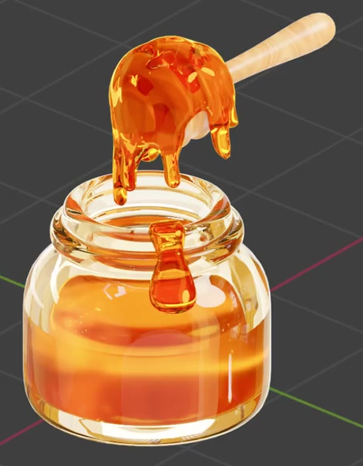
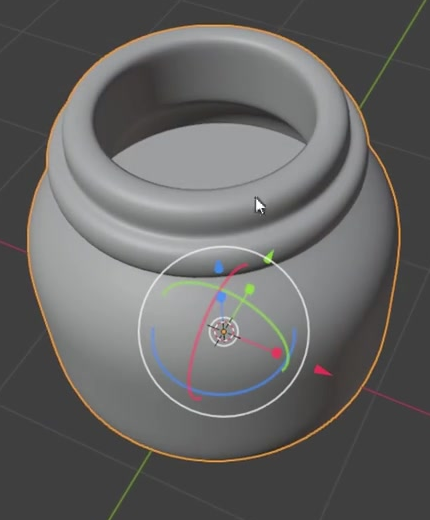
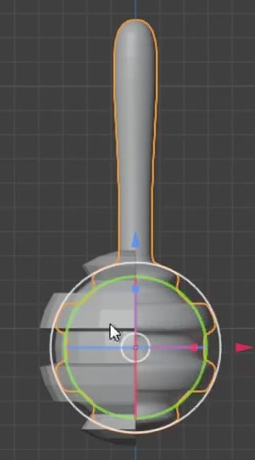
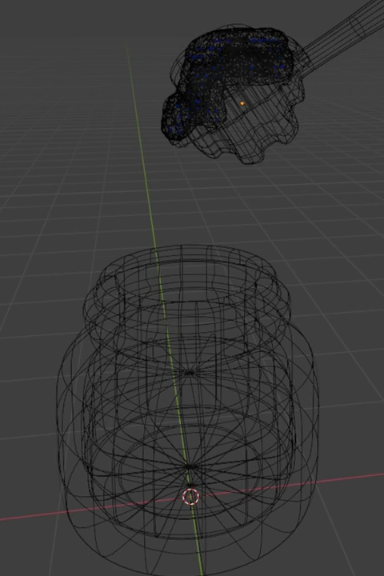
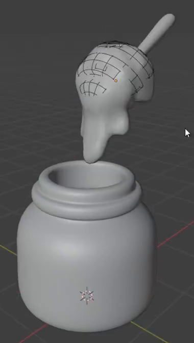

# 玻璃蜂蜜罐与黏稠滴落

用代码制作一组可编辑的蜂蜜罐资产：圆润的透明玻璃罐内盛有琥珀色蜂蜜，带环形储蜜槽的木质蜂蜜棒斜置在罐口上方，棒头的蜂蜜经液体模拟缓慢下垂。成品应同时呈现玻璃壁厚、蜂蜜的透光与黏稠感，以及罐口外侧的一条圆润流挂。

## 输入与交付

- 使用 Blender 5.1.2，从空场景开始；没有外部输入素材，`../input/` 为空。
- 交付 `submission.blend` 和可从空场景重建结果的 `build.py`，包含实际使用的材质、液体模拟设置以及完整缓存或可自动再生成缓存的流程。
- 液体片段采用第 1 至 24 帧、24 fps。文件打开后停在清楚展示下垂蜂蜜的帧，并为该帧添加时间线标记。允许调整模拟时间比例以完成这段短过程。
- 用 Cycles GPU 呈现材质，保留能看清罐口、蜂蜜棒和液体的展示视角。灯光与背景自由，参考中的网格、文字和选择高亮无需复现。

## 1. 开口玻璃罐

罐体具有较宽的圆柱状腹部、圆滑底缘、收窄的肩部和短颈。顶部保持真正开口，瓶口具有明显的圆润卷边及其下方的凸起环带；不能用实心圆柱或只有外表面的空片代替。

内外壁和罐底共同形成有厚度的玻璃容器，近景能读出瓶口及底部厚度。除开口通向容器内部外，玻璃实体本身没有破洞、重叠表面或明显自相交；罐体轮廓平滑。

## 2. 蜂蜜棒

蜂蜜棒具有细长手柄、圆头握持端和明显较粗的圆润棒头。棒头沿轴向分布至少两道可辨认的环形凹槽，形成交替的储蜜槽与圆润凸环；不能仅靠颜色条纹表示凹槽。

蜂蜜棒斜置于罐口上方，棒头朝向罐口，手柄向侧上方伸出。棒体与罐体保持固定位置，棒头与罐口之间留出能看清下垂蜂蜜的空间。隐藏蜂蜜后，棒头及其槽形仍完整可检查。

## 3. 罐内蜂蜜与口沿流挂

罐内有独立可编辑的蜂蜜体积，液面位于罐身下部到中部偏上的区域，上方保留明显空气空间，外观接近半罐至大半罐。液面基本平缓，蜂蜜贴合内腔，不穿出玻璃外壁，也不与容器之间留下明显悬空缝隙。

罐口前侧保留一条覆盖口沿、向外壁下垂的厚蜂蜜流挂：上端与口沿接触，中段稍收窄，下端圆润鼓起，具有真实厚度。此处可以使用静态网格；它与棒头的动态蜂蜜分别可选取或隐藏。

## 4. 高黏度液体过程

棒头上的蜂蜜必须由实际液体模拟产生。第 1 帧在棒头上已有贴附的初始蜂蜜，随后受重力向下拉长；第 24 帧前出现至少一条明显伸出棒头下方的圆润长滴或短蜜柱，位置朝向罐口。早期状态与展示帧的最低滴端应有清楚可辨的下降，不能靠整体移动一个固定形状或切换静态模型伪装。

蜂蜜在拉长时保持较厚的连续包覆层和有黏性的连接颈部，表面圆润，避免表现成大量细碎水花、粉末粒子或突然爆开的液体。可以有少量自然分离的小滴；不要求滴落已经进入罐内，也不要求循环动画。

蜂蜜棒与罐体均需参与有效液体碰撞。动态蜂蜜应贴附、绕过棒头表面，而不是直接穿过棒头；若接触罐口或罐壁，应被容器挡住或沿表面流动。整个片段中罐体与蜂蜜棒保持静止，液体不得被模拟边界硬切平、瞬间消失或产生明显穿透。

## 5. 玻璃、蜂蜜与木质外观

外罐是清透、略带暖色的玻璃，能透过罐壁看到蜂蜜与内部空间，并在口沿、底部和曲面上呈现合理反射、折射及厚度变化。避免变成不透明陶瓷、金属或均匀塑料壳。

罐内蜂蜜、棒头动态蜂蜜和口沿流挂均呈一致的金黄至琥珀橙色，具有透光感和湿润高光。厚处较浓、薄缘较亮，动态蜂蜜和外侧流挂可比罐内蜂蜜更光滑；不要求它们共用同一个材质数据块。

蜂蜜棒露出部分呈浅木色至暖棕色，带细微、非均匀的纹理或色调变化，手柄上的变化大体沿长度方向展开。它应显得有适度粗糙度并与蜂蜜的湿亮外观区分，不能是纯色塑料或同样透明的琥珀玻璃。实现方式自由，无需使用指定节点配方。

## 6. 编辑与重放

玻璃罐、棒体、罐内蜂蜜、口沿流挂和动态液体应能分别选取或隐藏，允许通过独立对象、集合或等效的可编辑组织实现，不限定对象数量或名称。

缓存、纹理和其他依赖应打包或使用提交目录内的相对路径。将提交目录移到新位置后，打开 `submission.blend` 并从第 1 帧播放到第 24 帧，应能看到同一段液体过程；如需先生成缓存，`build.py` 应提供无需手工补设参数的入口，并注明命令、缓存相对目录与完成条件。重建后必须保留同样的几何、材质、初始状态和碰撞关系。

## 渲染效果交付

在原有交付文件之外，另提交 `B03_玻璃蜂蜜罐与黏稠滴落_动态.mp4`。视频采用 MP4 格式，按本题规定的完整时间范围和帧率，从实际交付工程渲染动画，清楚展示动作与效果变化。使用本题规定的渲染环境；若原题没有指定展示相机，可设置能完整观察主体的相机。该文件应与 `submission.blend` 中的结果一致，不以参考图、视口截图或外部素材代替实际渲染。
