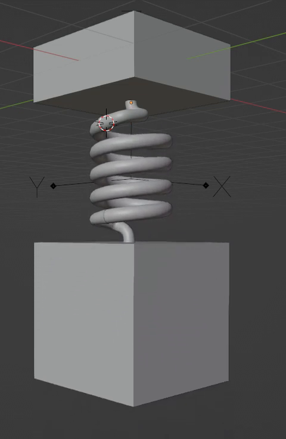
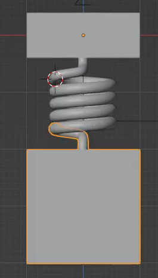
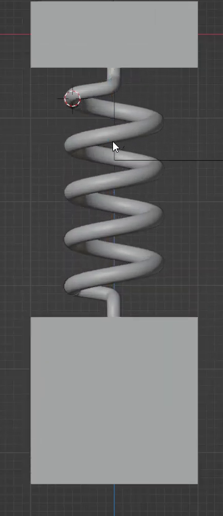

# 可伸缩弹簧系统

用代码创建一套悬挂式弹簧装置：上方薄块固定，下方方块受重力下落并回弹，四圈螺旋弹簧随两端距离实时伸缩。弹簧的上端始终留在固定连接处，下端始终跟随下方方块；改变刚度和阻尼后，运动应随物理参数变化。

图 1：装置在回弹过程中的立体形态。参考中的坐标线和控制标记无需作为可见几何制作。

## 起始条件

- 使用 Blender 5.1.2，从空场景开始。`input/` 为空，无需外部模型、贴图或插件。
- 以 `+Z` 为竖直向上方向。令下方方块的宽度为 `W`，整体尺度自行选择；下述距离均相对 `W` 定义。
- 时间范围为第 1–250 帧，24 fps。第 1 帧是从静止释放前的初始状态。
- 可用实体着色视口展示；需要渲染时使用 Cycles GPU。颜色、材质、相机和灯光自行安排，以能清楚观察线圈和接头为准。

## 1. 装置布局

下方重块为近似立方体，三个边长相对 `W` 的偏差不超过 5%。上方固定块具有相近的正方形平面尺寸，边长为 `0.9W–1.1W`，厚度为 `0.3W–0.5W`。两块在水平面内的中心偏移不超过 `0.05W`。

初始状态下，上块底面与下块顶面之间的净间距为 `0.7W–1.0W`。线圈和上下连接段位于这段间隙内，形成上块、连接段、弹簧、连接段、下块的完整装配关系。

图 2：初始状态的正面参考。弹簧较短，线圈密集，两端已经接入连接段。

## 2. 连续线圈与连接段

弹簧主体是一根圆截面线材形成的连续四圈螺旋，绕竖直轴展开。初始外径为 `0.5W–0.7W`，线材直径为 `0.07W–0.12W`。各圈间距均匀，轮廓平滑，不能由互不连接的圆环冒充；不得出现明显破面、尖刺或线圈互相穿过。

上下各有一段圆滑的弯曲连接段，将线圈端部转接至相邻块体靠近中心的位置。连接段粗细与线材相近，在接入线圈的一端略微加宽，形成自然过渡；上下连接段方向相反。连接处可以有合理重叠，但不能悬空断开或留下裸露的管口。连接段应作为对应块体的一部分一起运动，内部是否合并为同一网格由实现决定。

## 3. 由位移驱动的伸缩关系

保留可编辑、实时更新的伸缩关系。线圈长度应由下方重块的实际竖直位移决定，不能依靠逐帧手工关键帧去追随一个预先录好的运动。

在固定上块、暂停物理求解的检查状态下，从初始位置分别将下块向下移动 `0.5W`、`1.0W`，再恢复初始位置。每次线圈两端中心之间的轴向长度变化应等于下块位移，误差不超过 `0.02W`；恢复后应回到原长度。使用驱动器、约束、参数化几何或其他实时方式均可。

这组检查以及默认模拟全过程中，线圈上端均应留在上连接段，下端均应留在下连接段，与各自连接位置的偏差不超过 `0.02W`。线圈保持四圈，伸长主要体现为圈间距增大；外径相对初始状态变化不超过 5%，线材粗细变化不超过 10%，不得整体缩放、倒转、断裂或产生明显自相交。

图 3：下方重块下降后的正面参考。圈数不变，间距增加，两端仍连接于各自块体。

## 4. 重力与回弹

使用真实物理模拟产生运动，保留可重新计算的弹簧作用及刚体响应。从第 1 帧连续播放至第 250 帧，下块先因重力下落，再被弹簧拉回，至少出现两次可辨认的向上回弹。第一次下落的最大位移至少为 `0.2W`。

上块在全过程中的位置漂移不超过 `0.01W`。下块主要沿竖直方向运动，水平漂移不超过 `0.05W`，相对初始姿态的转角不超过 3 度。不得持续自由下落、发散抖动或卡死。弹簧外形实时跟随物理求解后的状态，不得滞后一帧或与下块脱节。

## 5. 刚度与阻尼可调

保留可编辑的刚度和阻尼参数，并在文件内简短标明它们的位置、基准值和各自一对有效比较值；每对的较大值至少是较小值的两倍。参数可以使用物理系统原生字段，无需另建控制面板。

每次比较从相同的初始状态重新计算，并保持其他参数不变。较高刚度应缩短主要振动周期，或减少第一轮最大下落量；较高阻尼应使后续往返振幅衰减更快。两种变化都必须反映在实际运动中，不能只改变显示文字。比较后能恢复基准参数并重放默认回弹。

## 6. 交付与重放

提交 `submission.blend` 和 `build.py`。脚本应能在 Blender 5.1.2 的空场景中创建并保存整个装置，运行方式写在脚本开头。依赖应随交付保存或由代码生成，不依赖本机绝对路径或联网下载。

文件以第 1 帧初始状态保存。在文件内保留简短说明，标明固定块、运动块、伸缩关系、物理参数，以及如何重置模拟、连续播放和进行第 3 节的暂停求解检查。允许使用可移植缓存，但重新计算不能依赖未交付的缓存文件。重新打开或重置后，从第 1 帧连续播放应复现相同的回弹和连接关系。

参考图均为源视频实际画面裁切。比例范围、帧率、测试位移和数值容差是本任务的统一验收约定。

## 渲染效果交付

在原有交付文件之外，另提交 `B04_可伸缩弹簧系统_动态.mp4`。视频采用 MP4 格式，按本题规定的完整时间范围和帧率，从实际交付工程渲染动画，清楚展示动作与效果变化。使用本题规定的渲染环境；若原题没有指定展示相机，可设置能完整观察主体的相机。该文件应与 `submission.blend` 中的结果一致，不以参考图、视口截图或外部素材代替实际渲染。
