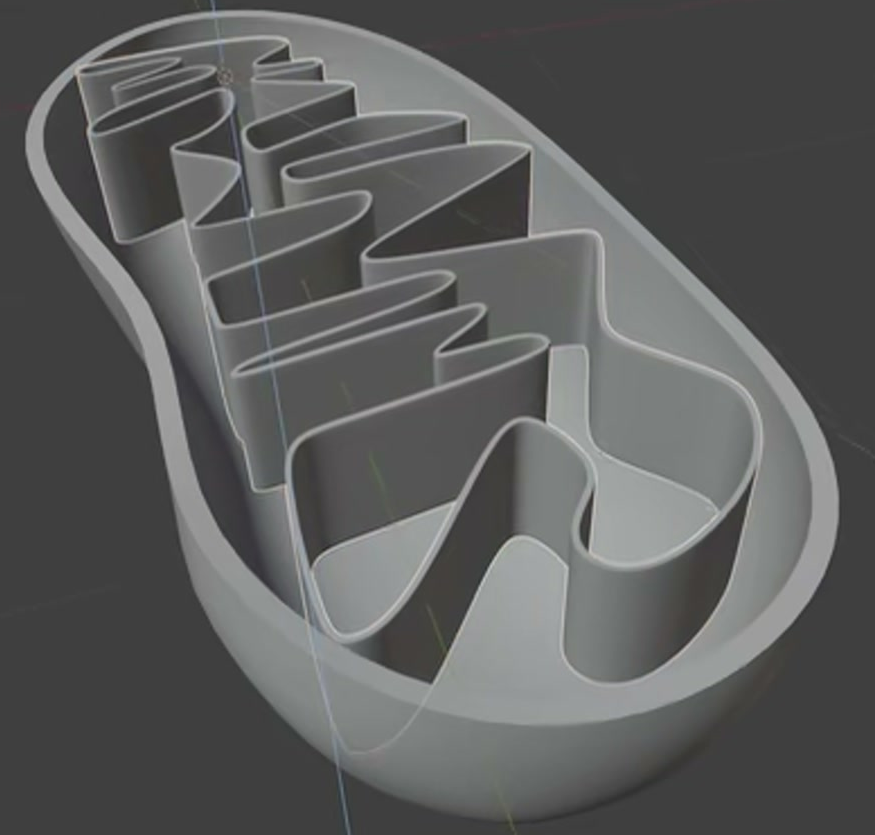
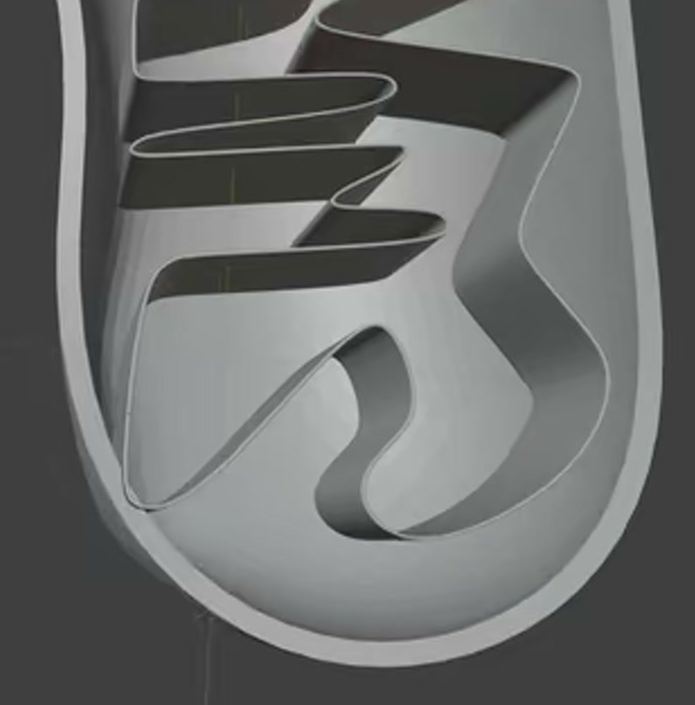
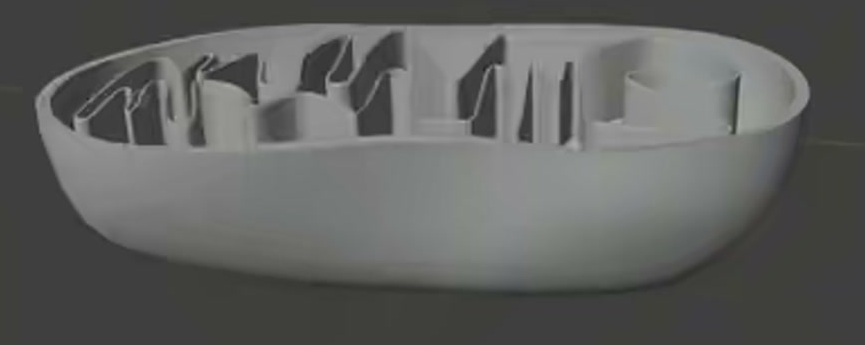

# 开放式线粒体

用代码制作一个可编辑的开放式线粒体模型：长椭圆外壳像一只顶部敞开的厚壁浅碗，包围内部连续折返的竖直薄壁嵴。模型应让人从斜上方同时看清开放环口、壳体深度以及内部密集而错落的褶皱。

## 输入与交付

- 使用 Blender 5.1.2，从空场景开始。没有外部输入素材，`input/` 为空。
- 交付 `submission.blend` 和 `build.py`。脚本须能在 Blender 5.1.2 中从空场景重建相同结果，不能依赖本机绝对路径、联网下载或未随交付打包的素材。
- 外壳与内部嵴须能分别选择、隐藏和编辑。整体尺寸、世界朝向、对象名称及建模方法自由；不要求特定修改器、网格密度或操作历史。
- 灰模即可。参考图中的选择高亮、控制点、网格及界面元素不属于模型。如需渲染，使用 Cycles GPU；相机和灯光只需支持观察模型。

## 1. 长椭圆开放外壳

外壳俯视轮廓呈长椭圆或略不规则的胶囊形，长宽比为 1.8 至 4，两端圆钝，长侧边过渡自然。整体不能退化为圆碗、扁平轮廓线或两端尖锐的梭形。

顶部沿整个内部区域敞开，不存在盖板。底面连续，并向两侧和两端弯起，形成有明确深度的碗状腔体；除顶部开口外，底部和侧壁不能再有破洞。

## 2. 真实壁厚与连续环口

外壳具有可辨认的内表面、外表面和连接二者的环口侧面。壁厚在整个主体上连续，开口边缘不能是零厚度纸片，也不能用另一圈悬浮线条代替。

环口围合完整，宽度视觉上基本一致，允许随有机轮廓轻微变化。外壳保持轻薄的包裹感，不应成为堵住内腔的实心块。

## 3. 连续折返的内部嵴

内部嵴是一条首尾连通的薄壁，在俯视平面内反复折回；沿壁体应能连续追踪一周，不得由互不连接的短隔板拼出相似投影。

至少形成六处清楚可辨的 U 形或弧形回转。长轴两侧都有向中部伸入的褶皱，回转长度、宽度和间距有变化，形成密集但仍可阅读的有机排列。不能只做一圈贴着外壳的平滑内环，或一列彼此独立、形状完全相同的栅板。

## 4. 薄壁高度与内外关系

内部嵴具有真实厚度和明显的竖向侧面，不是平铺在底面的线、管子或贴图。除转弯过渡处外，局部壁厚不大于该处壁高的 15%；沿路径的壁高连续，顶部大致位于壳口高度附近，允许轻微起伏。

内部嵴整体位于外壳的开口轮廓以内，覆盖腔体的大部分长度。四周大部分区域能看到内壁与嵴之间的间隙，相邻回转之间也保留可辨认的通道，不得相互穿插或大面积粘成实心块。嵴的下缘可贴合或局部嵌入内底，但不能穿出外壳的外表面。

## 5. 曲面与边缘质量

在中性灰的实体着色下，从整体和正常近景观察，外壳侧面与底面应呈连续平滑曲面；内部嵴的侧面和回转边缘也应圆顺。两部分均不得出现明显逐面明暗断裂、尖刺、夹痕、重叠面闪烁或破损阴影。外壳环口和内部薄壁的上缘仍须清晰可辨，不能为平滑而把边缘和通道抹平。

## 6. 独立编辑与重建

可以单独隐藏外壳检查整条内部嵴，也可以单独隐藏内部嵴检查碗状内腔。对其中一部分做局部形状编辑或修改其专用参数，不应同时改变另一部分。允许任意等效网格、修改器或程序化实现，只要实际生成的几何满足上述结果，并且 `build.py` 可独立重建它们。

## 渲染效果交付

在原有交付文件之外，另提交 `B05_开放式线粒体.png`。图片采用 PNG 格式，从实际交付工程渲染，清楚展示主要成品及其形体或材质效果。使用本题规定的渲染环境；若原题没有指定展示相机，可设置能完整观察主体的相机。该文件应与 `submission.blend` 中的结果一致，不以参考图、视口截图或外部素材代替实际渲染。
