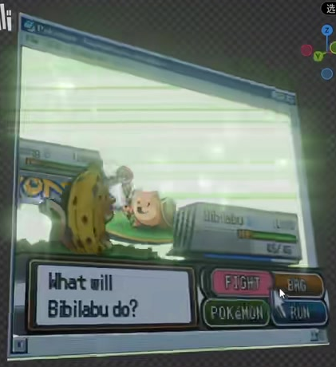
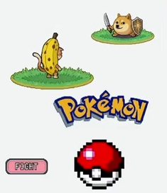
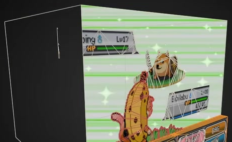
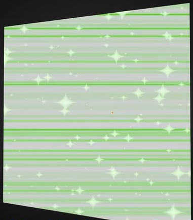

# 像素游戏视差立体画

制作一幅装在开口画框中的复古像素游戏立体画。正面看是一张完整的双角色战斗界面，转向左右斜角时，角色、状态栏、底部界面和背景之间显出真实距离；浅绿扫描线背景上有持续漂移的发光星点。

## 起始条件与输入

- 使用 **Blender 5.1.2**，从空场景通过 Python 构建，目标渲染引擎为 **EEVEE，使用 GPU**。
- `../input/` 为空，没有提供原角色 PNG、HDRI 或起始工程。自行制作一套风格统一的像素角色和界面图像；图像须能由 `build.py` 生成或从脚本内嵌数据恢复，不能依赖网络下载或未交付的素材。
- 必须将像素图像用于实际可渲染、可独立编辑的图层。角色造型、名称、标志和按钮文字可自定，保留下面规定的界面层次、像素风格和空间关系。
- 参考图中的软件界面、网格线、光标、水印和透明棋盘格不属于成品。结构局部图处于制作阶段；默认外观以首图和文字要求为准。

## 1. 完整的复古游戏界面

画面由复古桌面窗口边框围合，包含两个外形易于区分的像素角色及各自的脚下区域、两个状态栏、底部对话框和四个分组明确的操作按钮，并有一个小型标题或装饰标志。

近处角色位于画面较低处，远处角色位于较高处，状态栏分别与其对应。对话框和按钮集中在底部，保留角色活动区；这些元素从正面合成完整界面，不互相遮掉主要轮廓和文字。状态栏能辨识条形状态值，按钮和对话框中的短文本清楚可读。具体文字和数值不固定。

保存一个完整包含画框的默认展示相机，使用轻微斜视角度，使观者同时看清界面内容和前后层次。构图边缘不截断窗口或底部界面。

## 2. 可观察的分层视差

背景、角色和界面元素之间应形成至少三个有实际间隔的深度层次。主要角色、状态栏和底部界面保留可独立选择和调整的几何图层；不能将整幅场景合成一张平面贴图。

从正面以及左右各约 20 度斜视检查：近处角色与远处角色产生可见的相对位移，前景界面与背景也有不同的投影位移。层序始终稳定，无共面闪烁、突然的透明排序翻转或明显穿插；轻微斜视时仍能辨识两个角色及底部界面。允许不同网格、实例或其他等效的三维实现，不限定深度轴、对象数量或修改器。

## 3. 有厚度的开口画框

窗口具有可从斜角辨认的实际三维边缘厚度，并围合一段容纳各图层的浅空间。背板与侧向内壁形成连续的空间背景，朝观者的一面敞开，不能让一块实心前板盖住界面。

在上述左右斜视范围内，画框和内壁仍能表达窗口深度，不出现破口、孤立漂浮的框边或挡住主要角色的整面外墙。框体、背景和图层应组合成一个完整的立体画，而非散落的独立贴片。外部背面可以透明或采用其他不遮挡观看的等效处理；不限定面数、厚度数值或具体材质结构。

## 4. 透明像素图层与发光背景

角色和界面图像保留清楚的像素轮廓及色块，比例不被拉伸。轮廓以外透明，没有不透明矩形底色、明显白边或大面积缺失；透明边缘在斜视时也保持完整。必要的半透明界面不能抹掉自身文字。

空间背景以浅绿和近白色为主，具有细密、连续的横向扫描线。扫描线贴合背板和可见内壁，方向稳定，不能变成竖条、大块噪声或覆盖全画面的粗带。

扫描线之上分布疏密有变化的明亮星点，包含可辨识的尖角或星芒以及较小亮点。星点之间仍有大面积背景间隔，不能变成均匀白雾或密集雪花；默认状态下扫描线和星点都可见。

星点与背景具有适量的发光溢出和柔和辉光。辉光主要集中在亮点与亮线附近，像素角色的主色、状态栏以及按钮文字保持可辨；画框侧边也有足够的明暗层次让厚度可见。可以自行选择材质与合成实现。

## 5. 可回放的星点漂移

将场景时间范围设为 **1 至 120 帧，24 fps**，保留一段可直接播放的星点漂移动画。固定相机观察时，星点应持续沿一个总体方向平稳移动；首、中、末状态有可见差别，区间内部不突然重置、停顿或跳到另一处。

窗口、角色、状态栏、底部界面和扫描线位置在这段动画中保持稳定。运动属于背景星点，不得通过转动整幅画或移动相机替代。星点可从背景边界连续进入或离开，不要求第 120 帧与第 1 帧无缝循环。

## 提交文件

- `submission.blend`：完整可编辑的工程，保存有效的展示相机、EEVEE GPU 渲染设置和第 1 帧默认状态，全部使用中的图像已打包。工程内的简短文本说明应注明前方观察方向、主要图层位置和动画播放范围。
- `build.py`：在 Blender 5.1.2 空场景中重建上述工程的脚本，包含纹理生成或恢复过程；注明运行方式和输出路径，不依赖本机绝对路径、网络访问或未提供的插件。存在随机变化时固定种子，使默认构图和动画能够重建。

工程可打开且包含实际场景，是内容验收的前提。仅提交最终截图或预渲染视频不能代替可编辑工程。

## 渲染效果交付

在原有交付文件之外，另提交 `B06_像素游戏视差立体画_动态.mp4`。视频采用 MP4 格式，按本题规定的完整时间范围和帧率，从实际交付工程渲染动画，清楚展示动作与效果变化。使用本题规定的渲染环境；若原题没有指定展示相机，可设置能完整观察主体的相机。该文件应与 `submission.blend` 中的结果一致，不以参考图、视口截图或外部素材代替实际渲染。
