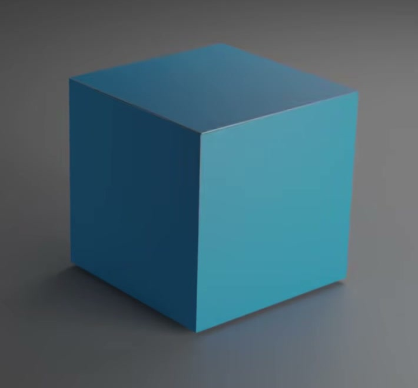
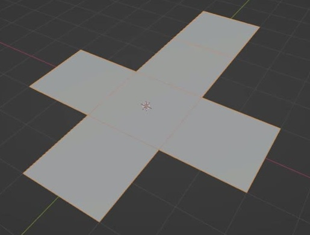
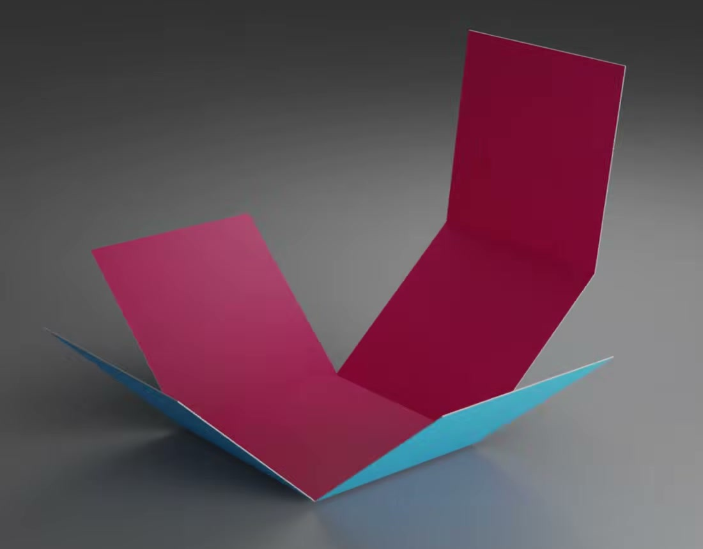

# 可展开的纸盒

用代码创建一个可以从平面展开网折成闭合立方纸盒的动画资产。底面保持不动，四面侧壁向内竖起，连接在一面侧壁外侧的盒盖随之抬升并盖住顶部。纸盒外侧为蓝色、内侧为粉红色，薄薄的切边为白色；折叠关系应保留可编辑控制。

图 1：闭合后六块面板构成立方体，盒盖平整，接缝细而整齐。

## 起始条件

- 目标环境为 Blender 5.1.2，从空场景开始。`input/` 为空，不提供模型、纹理或起始工程。
- 使用自行创建的几何和材质。整体尺寸自由，以下以正方形面板边长 `L` 为单位，`+Z` 向上。
- 使用 Cycles GPU 配置展示渲染。相机、灯光与背景自行安排，能清楚查看平面、半折叠和闭合状态即可。

## 1. 六面展开网与薄纸结构

展开结构由六块等大的正方形面板构成：中央为底面，底面四边各连一块侧壁，其中一块侧壁的外边再连一块盒盖。沿长方向依次是侧壁、底面、侧壁、盒盖，另两块侧壁接在底面两侧；整体平面轮廓为长臂十字形，外包尺寸为 `3L × 4L`。面板边长相对 `L` 的误差不超过 2%，保留五条清楚的折线。允许额外细分、辅助几何或多个对象，但不能用六个彼此无连接关系的面片冒充展开网。

图 2：展开时的面板布局。盒盖是长臂最外端的一块正方形；图片中的选中线只是用于识别面板。

面板具有真实薄层厚度，厚度为 `0.003L` 至 `0.01L`，切边封闭，表面平整，轮廓和折线干净。不能出现缺失的大面、重叠的重复表面、尖刺或破洞。可以采用任意等价的厚度与连接实现，不限定网格数量或修改器类型。

## 2. 两端状态与播放

动画范围为第 1 至 250 帧，帧率为 24 fps。第 1 帧六块面板完全展开，面板中面在同一水平面内，偏差不超过 `0.005L`；纸的实际厚度不需要压成零。

第 250 帧折成闭合纸盒：底面保持水平，四面侧壁相对底面为 `90° ± 2°`，盒盖覆盖整个顶部并与底面平行，角度误差不超过 2 度。闭合体的长、宽、高均接近 `L`，误差不超过 2%；相邻壁面和盒盖的自由边接缝宽度不超过 `0.01L`，不得有明显互穿或突出的多余盖片。

正向播放呈现展开到闭合；反向拖动时间轴应恢复相应的展开状态。第 250 帧到第 1 帧的循环跳回无需制作连续过渡。

## 3. 折叠过程与稳定性

四面侧壁围绕各自与底面的共边转动，盒盖围绕它与相连侧壁的共边转动。底面在整个动画中保持位置与朝向：中心位移不超过 `0.005L`，朝向变化不超过 2 度。每块运动面板保持刚性和平整，边长变化不超过 1%，偏离自身拟合平面的距离不超过 `0.003L`。五条铰接边两侧的对应边应持续贴合，间距不超过 `0.01L`，不能拉伸面板来完成合拢。

图 3：侧壁抬起时能看到盒内，盒盖保持连接并跟随相邻侧壁移动。蓝色外面、粉色内面和白色薄边在同一状态下可辨认。

五处折叠在时间轴上连续朝闭合方向推进，允许不同的缓动和轻微错开，不限定关键帧数量或旋转表示。第 125 帧每处局部折角均处于 20 至 70 度之间；相邻整数帧的局部折角变化不超过 5 度，回退不超过 2 度。整个过程不应闪跳、翻面、明显互穿或出现面板突然消失。

## 4. 可编辑折叠控制

保留四面侧壁和盒盖的可编辑折叠关系。控制可以通过骨骼、对象、属性或等价结构实现，名称和骨骼数量自由；应能辨认每一处折叠的用途，并在 `.blend` 内简短说明如何暂停动画、调整局部折角及恢复动画。

暂停动画并从平面状态开始，分别将每一面侧壁单独折到 45 度，角度误差不超过 2 度。被选侧壁应改变姿态，底面与另外三面侧壁的局部折角变化不超过 2 度；带盖侧壁转动时盒盖应跟随该侧壁。每次试验均从平面状态独立开始。

保持带盖侧壁折到 45 度，盒盖局部折角为 0 度时应与该侧壁共面；再将盒盖单独折到相对该侧壁 45 度，侧壁姿态保持不变，盒盖与侧壁的连接间距不超过 `0.01L`。恢复动画后，完整折叠仍应正常播放，无需重新运行构建脚本。

## 5. 内外颜色与白色切边

六块面板朝向盒内的一面为饱和粉红色，朝向盒外的一面为蓝色；展开时从两侧查看也应保持这种材料分区。材质应附着于实际面板，随折叠一起运动，不能只通过视口对象显示颜色或一张静态图片表现。

实际暴露的切边使用白色或接近白色的窄边带，与蓝色和粉色大面清楚区分。白边宽度来自薄纸厚度，不应变成宽大的装饰描边。材质槽数量、节点结构和分配方法自行决定。

## 6. 交付内容

提交 `submission.blend` 和 `build.py`。`build.py` 应能在 Blender 5.1.2 的空场景中创建并保存完整资产，在脚本开头写明运行方式。全部依赖由代码生成、打包或随文件提供，不依赖本机绝对路径和联网下载。

文件保存于第 1 帧，动画与折叠控制均可继续编辑。重新打开文件后能够按时间轴重放，并依照文件内说明操作第 4 节的控制。展示时隐藏不必要的控制覆盖即可，不限定场景对象数量。

图片为原视频实际画面裁切。归一化尺寸、24 fps、控制测试角度及容差是本任务的公开约定。

## 渲染效果交付

在原有交付文件之外，另提交 `B07_可展开的纸盒_动态.mp4`。视频采用 MP4 格式，按本题规定的完整时间范围和帧率，从实际交付工程渲染动画，清楚展示动作与效果变化。使用本题规定的渲染环境；若原题没有指定展示相机，可设置能完整观察主体的相机。该文件应与 `submission.blend` 中的结果一致，不以参考图、视口截图或外部素材代替实际渲染。
