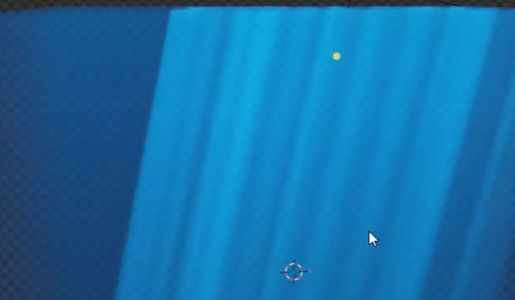
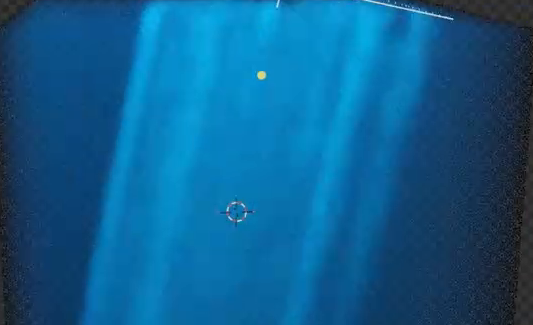

# 海洋体积光

用代码构建一个可编辑的静态水下光照场景：蓝色水体中，多束青蓝色光线从上方斜向下穿入。光束有宽窄变化和柔和边缘，束间保留较暗的水体，形成明确的空间深度。

## 输入与交付

- 使用 Blender 5.1.2，从空场景开始；没有外部输入素材，`input/` 为空。
- 交付 `submission.blend` 和能够从空场景重建结果的 `build.py`。保存可直接渲染的主相机，使用 Cycles GPU。
- 场景为静态效果，不要求动画、独立海面几何、海底地形或海洋生物。参考图中的网格、光标和选择标记不属于成品。
- 允许采用等效的体积、灯光和纹理实现；对象名称、节点数量、绝对尺寸以及灯光功率不作固定要求。

## 1. 蓝色水体与真实体积

水体必须是参与实际渲染的三维体积介质，光束在介质内部形成可见散射。水体不能只是一张背景图、发光条纹平面或不透明蓝色盒壳。改变观察位置时，应仍能看到光束处于有深度的水体中。

水体整体为蓝色至青蓝色；受光区域较亮，未直接受光的区域呈较深的蓝色。保留水体的通透感和明暗层次，不能整片发白、完全漆黑或像不透明塑料。

## 2. 多束光线的形态

主镜头中至少能分辨三束从上方延伸的亮光带，相邻光束之间有可辨认的较暗间隙。光束沿长度方向保持连贯，不以互不相连的光斑代替。

光束的宽度、亮度或边缘应有自然变化，呈受扰动的条带感；主要方向仍一致。边缘从亮部柔和过渡到蓝色水体，不能全部是等宽、等亮、边界笔直的硬条纹，也不能模糊成一整片无分束的亮雾。

## 3. 入光方向与水下空间

光线从水体上方进入，整体略向一侧倾斜，并向下延伸。主相机画面应同时容纳较亮的上方入光区域和向下延展的光束，主要光束的可见长度至少达到画面高度的一半。

光源的方向和覆盖范围应与可见光束一致，使画面读作光穿过水体的空间。上方的入光区域可以由体积与灯光的关系形成，无需另做海面物体。

## 4. 主镜头与照明

主相机以水体中的光束为视觉主体，光束与暗部都有足够画面空间。相机可以位于水体内部，或从外部观察，但最终画面不能露出有限体积容器的侧边、底边、透明棋盘格或灯光辅助线。

保存的场景照明应在正式渲染中保留青蓝亮部、深蓝暗部和分束细节。曝光应使最亮处仍能区分光束，不依赖仅在材质预览中存在的环境来呈现效果。

## 5. 有效编辑

保留可直接编辑的水体颜色和密度。改变颜色后，实际水体色调应随之改变；提高或降低密度后，水体的浓淡与透光程度应发生可见变化，随后能够恢复原效果。

保留可编辑的入光方向，以及控制光束宽度或间距的设置。调整入光方向时光束应随之改变倾斜方向；调整宽度或间距时应改变实际光带分布，同时保留多束光的结构。可直接使用已有材质、纹理或灯光参数，不要求额外制作控制面板。

## 6. 重建与依赖

`build.py` 应建立与提交场景一致的水体、灯光、主相机和有效编辑参数，并保存 `submission.blend`。重建后应能获得同等构图和光照效果。

所有使用的外部资源必须随提交提供或打包进场景，使用可移植路径；重建和渲染不能依赖原电脑上的私人目录、临时文件或未随附的预览环境。

## 渲染效果交付

在原有交付文件之外，另提交 `B08_海洋体积光.png`。图片采用 PNG 格式，从实际交付工程渲染，清楚展示主要成品及其形体或材质效果。使用本题规定的渲染环境；若原题没有指定展示相机，可设置能完整观察主体的相机。该文件应与 `submission.blend` 中的结果一致，不以参考图、视口截图或外部素材代替实际渲染。
