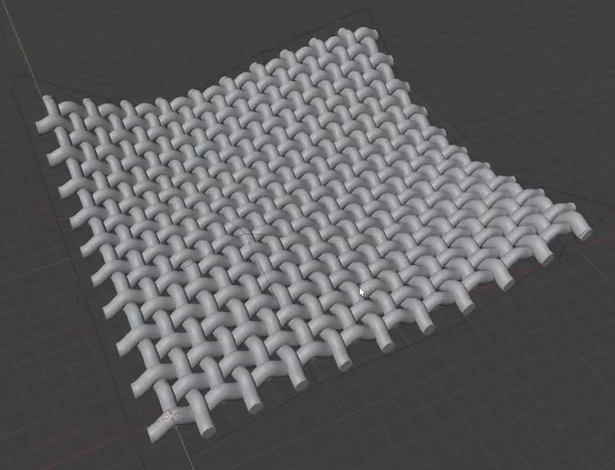
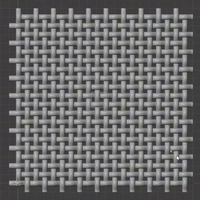
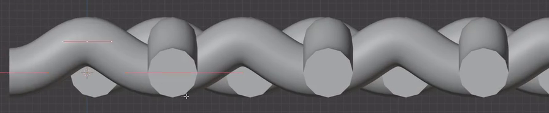
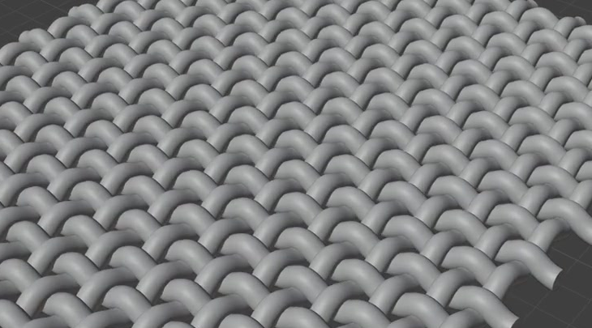

# 可编辑编织布片与静态起伏曲面

用代码制作一片由真实纱线几何组成的编织布片。两组纱线交替从对方上方和下方穿过，形成紧密而可辨的经纬组织；整片布料具有宽缓的凹凸与边角高低变化，并保留统一调节编织结构和整体形状的能力。

## 输入与交付

- 使用 Blender 5.1.2，从空场景开始。没有外部输入素材，`input/` 为空。
- 交付 `submission.blend` 和可从空场景重建结果的 `build.py`。打开文件时显示已经塑形的完整布片；几何、生成参数和形状控制均须随文件保存。
- 在文件内的文本说明中标明重复覆盖、统一粗细和整体塑形的控制入口，以及恢复交付形态的方法。所需资源应内置，或通过随交付保存的相对路径读取。
- 这是静态可编辑织物任务，无须制作布料下落动画、物理模拟、碰撞体或支架。灰模即可；颜色、材质、灯光和背景不作要求。如需渲染，使用 Cycles GPU。
- 整体尺寸、世界朝向、对象名称、对象数量和实现方法自由。参考中的网格、辅助线、选择高亮与界面无需复现。

## 1. 双向编织与片状覆盖

布片由两组横纵交叉的纱线构成，每组至少 12 根，覆盖同一片接近方形的区域。在展平状态下，两组方向应近乎正交，重复节奏和排布间距稳定，四周可以看到整齐排列的纱线端头。纱线必须具有可检查的三维几何，不能用表面贴图、法线或凹凸效果代替经纬组织。

## 2. 交替穿插与编织间距

沿任一方向追踪一根内部纱线，在连续交点处应看到“上、下、上、下”的交替关系；相邻平行纱线的上下顺序相反。局部俯视和侧视都应能读出这层关系，而不是两层始终上下分离的栅格。

布片内部保持紧密的编织密度，典型空隙的宽度不应超过一根纱线的直径。交叉处可以贴合或留下很小间隙，但不能大面积互相吞并、显著悬空或穿透；同一根纱线沿程应连续，不出现波形单元之间的可见断口。

## 3. 纱线体积与几何质量

纱线具有圆润、近圆形的实体截面，粗细基本一致，暴露端头封闭。近景中能看出圆柱状纱线在交叉处柔和弯曲；不能是零厚度曲线、扁平带片或空心管口。

纱线侧面和弯曲轮廓应平顺，正常近景下没有明显折线、尖刺、夹痕、重叠表面闪烁或破损阴影。平滑要求针对实际几何与显示结果，不限定细分数量。

## 4. 宽缓的静态起伏

交付形态中，整片布料至少有一处宽缓下凹区及高于它的边角，不同边缘的高低不完全相同。主要曲率变化应跨越多根纱线，能从斜视和侧视看出整片布料的连续弯曲，不能仅靠纱线自身的小波浪或整体旋转形成非平面外观。

整体变形后仍应保持可读的经纬组织和片状覆盖，不把织物压成一团或扯出明显断裂。图中的局部高度和弯曲幅度只作形态参考，不要求相同控制点坐标。

## 5. 可复用生成与整体塑形

保留能够在文件内实际修改并重新求值的生成结构，支持以下三种操作。可使用曲线、网格、修改器、节点或其他等效结构，无须复现指定修改器栈。

- **重复覆盖：** 通过共享的重复数量或覆盖长度控制，让一个方向的覆盖范围增加至少两个编织节奏。允许用少量全局控制同步调整另一组纱线的长度与对齐，但不应逐根复制或逐点重建纱线；调整后仍形成完整交织区域。
- **统一粗细：** 一个共享控制能把所有纱线的代表性直径减少约 10%，而纱线条数、中心线和整体形态保持不变；恢复控制后回到交付粗细。
- **整体塑形：** 通过少量形状控制改变一个边角区域的高度，使该区域和相邻纱线一起连续弯曲。试改的边角位移约为未变形布片短边的 5%；两组纱线均须跟随，不能只移动一根纱线、一个重复单元或把整片刚性平移。试改后可恢复交付形态。

每项操作都应通过可见几何变化成立。静止时的外观、孤立控制对象或未连接的参数不能代替这些编辑能力。

## 渲染效果交付

在原有交付文件之外，另提交 `B09_可编辑编织布片与静态起伏曲面.png`。图片采用 PNG 格式，从实际交付工程渲染，清楚展示主要成品及其形体或材质效果。使用本题规定的渲染环境；若原题没有指定展示相机，可设置能完整观察主体的相机。该文件应与 `submission.blend` 中的结果一致，不以参考图、视口截图或外部素材代替实际渲染。
