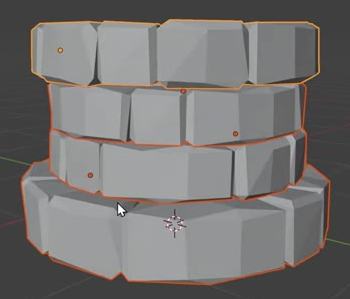
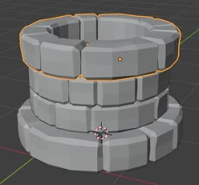
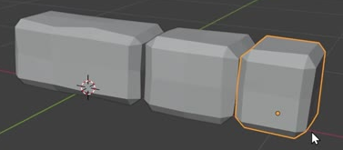

# Low-Poly Stone Well Base

Create a hollow, round well base made from four stacked courses of chunky, chiselled stones. The wall has a broad foot, a narrower middle, and a slightly flared upper rim. Its low-poly character must come from the geometry, with editable construction that can reveal the straight stone rows beneath the circular courses.

The finished stone wall establishes the blocky proportions and geometric faceting.

## Starting Scene

Use Blender 5.1.2. The input folder is empty; no external assets or add-ons are required. Start from a new scene and create the stones from native geometry. This task covers the stone base only. Use neutral presentation materials and lighting so the masonry remains easy to inspect.

## Hollow Four-Course Wall

Build four horizontal circular courses around one vertical axis. Keep the central opening clear from the top through the bottom of the wall. Each course must read as a closed ring of individual masonry blocks, with a round plan and a normal stone joint where the ring closes. The opening must have visible inner stone faces and real wall thickness.

This earlier construction state shows the opening and the relative widths of the courses.

## Wall Profile and Masonry Joints

Make the overall height about three fifths of the base diameter; a height-to-diameter ratio from 0.55 to 0.70 is suitable. The base is the widest course. Each middle course is about 0.80 to 0.90 of the base diameter, and the upper rim is about 0.90 to 0.98 of the base diameter while remaining wider than both middle courses. Choose a consistent overall scale.

Keep the courses concentric and seated against one another. Small irregular contact is appropriate for hand-cut stones, but there must be no floating course or deep overlap that hides a substantial part of a course. Offset the majority of vertical stone joints at every neighboring course interface so the wall does not develop long continuous vertical seams.

## Stone Variety

Mix elongated, medium-width, and small squarish stones around each course. Keep their heights and depths compatible with the wall, while varying their lengths and subtly tilting some end faces. The medium stone must differ in shape as well as length from the elongated stone. Arrange the sizes in an irregular sequence, with uneven joint spacing and enough substantial blocks that the result reads as coarse masonry.

These source forms establish the three size families and their narrow geometric chamfers.

## Chiselled Stone Geometry

Give the stones broad, mostly planar faces, narrow chamfered edges, slightly uneven corners, and a restrained scattering of irregular facets. Preserve their rectangular block character. The final result should look hand-cut and chipped, with angular changes in silhouette and shading across outer faces, inner faces, and the upper rim.

Use actual three-dimensional stone solids with complete inner, outer, top, bottom, and end surfaces. Keep neighboring stones as separate closed shells, even when several shells share a mesh object. Small masonry overlaps are acceptable, but holes within a stone, exposed missing faces, inverted surfaces, or stray fragments are not. Materials must not substitute for the required geometry.

## Editable Construction

Retain an editable straight row of distinct stone shells beneath each course's circular result. A live row-to-ring bend must close each row into a full circle. Each course must have an independently adjustable bend amount: reducing it visibly opens that course into an arc, and setting it to zero reveals its straight row. Restoring the saved value must restore the finished ring without rebuilding the scene.

After the bend, retain a live geometric simplification control that changes the density and arrangement of facets on the already curved stones. Reducing simplification must visibly restore more faces; stronger simplification must reduce faces. Both states must retain recognizable masonry. Give each course an independent control and save the completed wall with the chipped result active. Equivalent procedural implementations are acceptable when these geometric relationships and controls remain inspectable and functional.

Preserve a separate reusable copy of the unbent stone row as individually editable stones. Keep this backup organized separately and disabled in the saved presentation and in renders. It must preserve the three stone size families and their arrangement without requiring a reconstruction of the final curved meshes.

## Deliverables

- `submission.blend`: the finished editable wall, its reusable unbent backup stones, and the complete presentation scene. Save the closed, chipped wall as the active result.
- `build.py`: a Blender Python script that recreates the scene from a new scene without external assets and explicitly saves `submission.blend`. Running the script must produce a saved file that can be reopened independently with the wall, backup stones, and functional controls intact.
- `B100_Low_Poly_Stone_Well_Base.png`: a PNG rendered from the actual submitted scene using Cycles with GPU rendering. Use a clear elevated three-quarter view that shows the whole wall, its opening, its four courses, and the geometric facets. The delivered image must be a scene render, not a viewport screenshot, source image, or external replacement.
