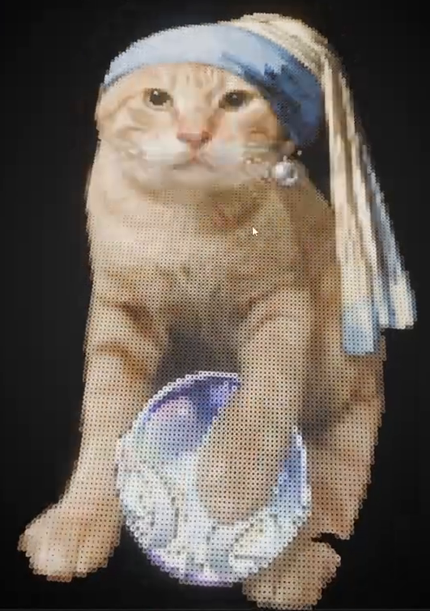
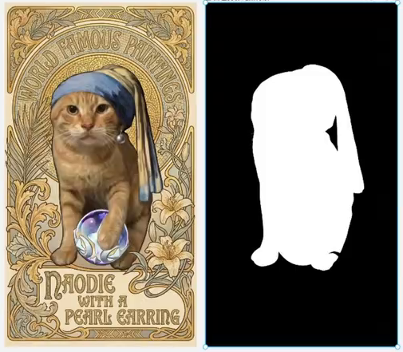
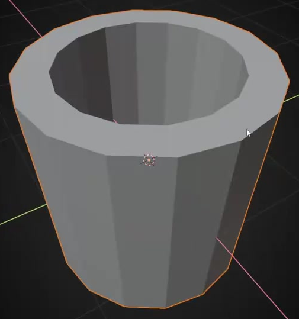
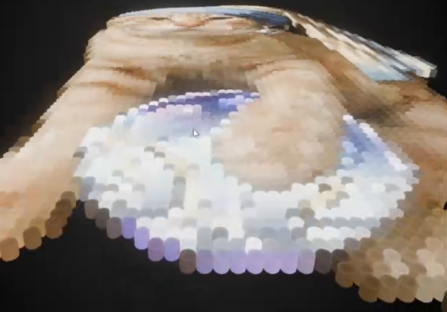

# Procedural Image Bead Mosaic

Create an editable procedural mosaic that turns the supplied artwork into a portrait made of individual hollow beads. The delivered scene shows the seated subject, blue headscarf, pearl earring, and iridescent orb inside the supplied silhouette. Color, silhouette, image proportions, and detail must remain driven by editable inputs.

## Starting Scene and Inputs

Use Blender 5.1.2 and Cycles with GPU rendering. Start with an empty scene and model the bead from native geometry. No starter model or external add-on is required.

Use both supplied images:

- [color_artwork.png](../input/color_artwork.png): the complete color artwork, including its decorative border and lettering.
- [subject_mask.png](../input/subject_mask.png): the matching white-on-black silhouette. White identifies retained bead locations; black identifies empty space.

Both images are 240 x 430 pixels and share the same canvas alignment. Keep their content and alignment intact. Include both image dependencies in the saved project. Their supplied resolution defines the available image detail.

## Bead Geometry

Model a reusable short cylindrical bead with a central hole that passes completely through it. The bead has an outer wall, an inner wall, and continuous annular rims at both ends. Its wall thickness is positive and reasonably uniform; the solid wall is closed, without caps across the hole, missing strips, self-intersections, or inverted surfaces.

The circular cross-section may retain modest visible facets or use smooth shading. Preserve the bead as an editable prototype whose geometric changes propagate to the generated mosaic. Each visible bead must retain real thickness and an open central hole.

## Image-Driven Mosaic

Generate the mosaic procedurally from the bead prototype. Bead centers lie on a regular planar lattice with orthogonal rows and columns, approximately equal spacing in both directions, and parallel hole axes perpendicular to the image plane. Use one bead per retained sample location. Adjacent beads remain individually distinguishable without intersecting walls or large irregular gaps.

Sample the color image at each bead location using consistent normalized image coordinates. A bead carries one sampled color across its surface; local shading may vary, but the artwork must not be a continuous image projected across every bead. Preserve the artwork's orientation and the spatial relationships between the face, headscarf, earring, paws, and orb. Choose enough samples for these features to remain recognizable while the individual holes remain visible on close inspection.

Changing the color image must update the generated bead colors without rebuilding the procedural setup or manually recoloring beads. Geometry must remain editable through the live generator.

## Silhouette Selection

Use the mask at the same normalized coordinates as the color image to determine whether a bead exists. In the delivered state, retain the complete white subject silhouette and its internal cutout while removing the surrounding black background. The decorative border and lettering therefore appear only when the mask is bypassed.

Provide editable mask-image and cutoff controls, plus a way to bypass masking. Bypassing the mask reveals the full rectangular color mosaic. Replacing the mask with an all-black image yields no beads; replacing it with an all-white image restores the complete lattice. Intermediate mask changes must update actual bead occupancy, including edge locations, without manually deleting geometry.

## Proportions and Detail Control

Derive the full lattice's physical aspect ratio and row-to-column sampling ratio from the color image dimensions. The supplied portrait must retain its proportions, and replacing the inputs with a matching color/mask pair of a different aspect ratio must update both the lattice shape and sampling arrangement without editing the generator's internals. The beads themselves remain circular in cross-section.

Expose one linked size/detail control that can be varied over at least a factor of two. Increasing it enlarges the full mosaic and increases both row and column counts in the same proportion, apart from integer rounding. A twofold increase therefore produces approximately twice the width and height and twice the samples along each axis. Bead dimensions and spacing remain visually consistent, so the larger mosaic resolves more image detail with more beads. Preserve this behavior with masking enabled as well as bypassed.

## Materials and Presentation

Give the beads an opaque, nonmetallic, plastic-like appearance with matte to soft reflections. Their sampled colors remain readable across the face, blue cloth, pale earring, and multicolored orb. Shading distinguishes the upper rims, inner walls, and outside walls without washing out the holes or replacing the material with a flat image card.

Present the complete masked subject against an uncluttered neutral background. Use a near-front or slightly oblique view that retains the portrait's readability and shows the bead surface. Keep the entire silhouette in frame. The source prototype may be hidden from the final camera while remaining available to edit.

## Deliverables

- `submission.blend`: the complete editable scene, including the live bead generator, editable prototype, material, controls, camera, lighting, and both image dependencies. It must reopen without missing resources.
- `build.py`: a script that builds the submitted scene from a clean Blender scene using only the supplied inputs. It must reproduce the generator and its controls, save `submission.blend`, and configure or perform the final render.
- `B101_Procedural_Image_Bead_Mosaic.png`: a finished static PNG rendered from the actual submitted scene, showing the complete masked mosaic. Use the scene's real beads and materials; do not substitute a source image, viewport screenshot, or externally assembled replacement.
