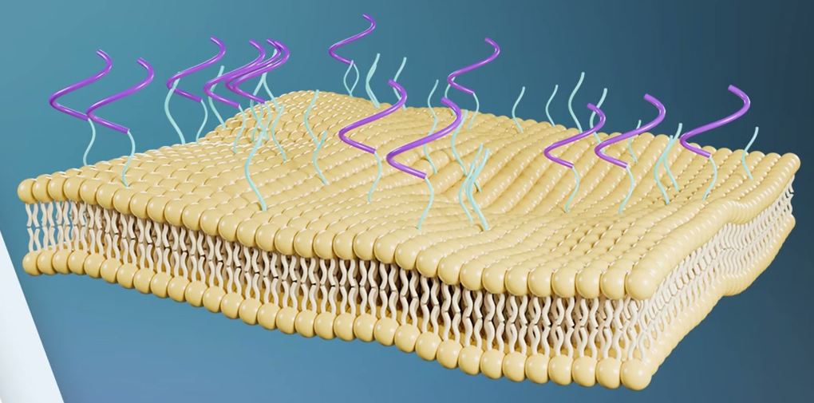
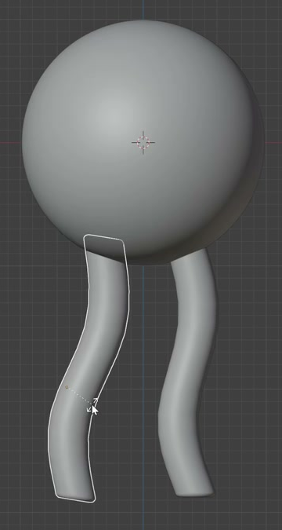
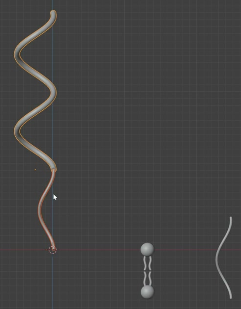
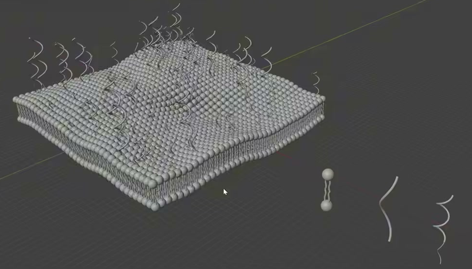

# Procedural Phospholipid Bilayer

Create a static, editable phospholipid bilayer sheet with dense rows of spherical heads, inward-facing paired tails, and two kinds of sparse chains projecting from its upper surface. The membrane should have gentle, broad undulations while remaining a coherent sheet.

The reference shows the overall proportions and separation of the components. Its colors are optional.

## Starting Scene

Use Blender 5.1.2 and Cycles with GPU rendering. Start from an empty scene. The `input/` folder is empty: create the molecular forms, chains, and procedural support geometry using native Blender geometry. No external model, texture, or curve extension is required.

## 1. Phospholipid Units

Each phospholipid has one round head and two separate, slender tubular tails emerging from the same side. Give the tails gentle opposing bends. Their length should be comparable to the head diameter, with enough separation to read as two tails.

Arrange two opposing phospholipids across the membrane thickness: their heads face the two outer surfaces, and their tail tips face one another in the interior. A narrow gap between opposing tail tips is acceptable.

## 2. Undulating Bilayer Sheet

Repeat the phospholipids in many closely spaced rows across both dimensions of a broad, roughly rectangular patch. The upper and lower head layers must cover corresponding areas, with the tails contained between them. Keep the two layers distinct along the exposed edges.

Give the whole sheet smooth crests and troughs. Both outer layers should follow the same broad undulations, maintaining a consistent membrane thickness. Avoid large missing patches, isolated columns, or head intersections that merge the rows into an indistinct mass. Keep the interior tails visible at the exposed edges, without an opaque support plane covering them.

## 3. Two Surface Chain Families

Create two distinct tubular chain shapes: a simple elongated wave, and a longer compound chain with a gently bending stem followed by a helical section of approximately two turns. Both should have smooth curvature and a slender, continuous cross-section.

Distribute multiple examples of both families sparsely over the upper surface. Their combined population must be visibly much smaller than the phospholipid population, leaving most heads readable. Vary their heights and turns about their growth direction so that the result does not look like identical aligned copies.

The chain bases must emerge from the upper head layer, with no visible floating gaps. A small amount of embedding at the base is acceptable. The chains should project outward and avoid long exposed stems passing through the full membrane thickness.

## 4. Editable Procedural Relationships

Keep editable master geometry for the phospholipid and both chain families, together with a reusable procedural setup in the saved scene. Geometry Nodes or an equivalent editable generator is acceptable. Changes must update the repeated result without individually remodeling its copies.

- Changing the phospholipid master must update the repeated molecules in both outer layers. Editing either chain master must update that family while preserving the other family.
- Provide controls for the sheet's undulation and molecular spacing or density. Modest changes must regenerate a coherent, populated bilayer with both outer layers intact.
- Provide independent population controls for the two chain families, controls for their size variation, and repeatable distribution randomness. Reducing one family's population must leave the other family and the phospholipids intact. Restoring the same settings and seed must restore the same distribution.
- After a modest change to the sheet's undulation, both chain populations must remain attached to the upper surface and project outward from the local surface.

Use readable control labels or properties so these relationships can be exercised directly. Keep the master geometry available for editing and excluded from the final camera image.

## 5. Geometry Finish and Presentation

Round the head silhouettes and shade the existing head, tail, and chain surfaces smoothly. Keep the tubes fairly consistent in thickness and finish their ends. Avoid obvious faceting, collapsed tube sections, sharp accidental kinks, open tube ends, or visible construction seams.

Frame the complete sheet in a clear three-quarter view that shows the upper surface, both head layers along an exposed edge, the inner tails, and both chain families. Use lighting and a simple background that keep these forms readable. Neutral materials are sufficient; no exact palette is required. The final camera image must contain only the intended membrane asset and its presentation environment.

## Deliverables

- `submission.blend`: the complete saved scene, including the editable masters, functioning procedural relationships, and final camera setup.
- `build.py`: a reproducible Blender Python script that recreates the complete scene from an empty scene and saves `submission.blend`. The saved file must reopen with the geometry, controls, materials, and camera intact; leaving a rebuilt scene only in memory is insufficient.
- `B102_Procedural_Phospholipid_Bilayer.png`: a PNG rendered from the actual submitted scene through its final camera. Do not substitute a reference image, viewport screenshot, or externally created image.
