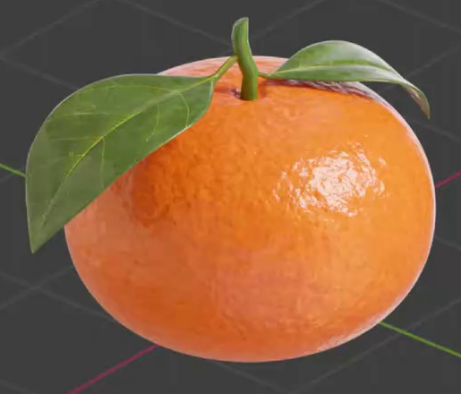
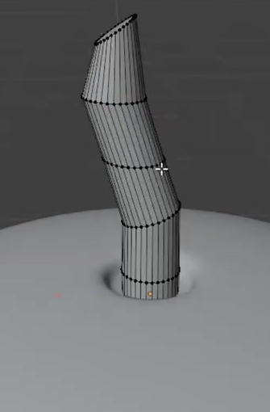
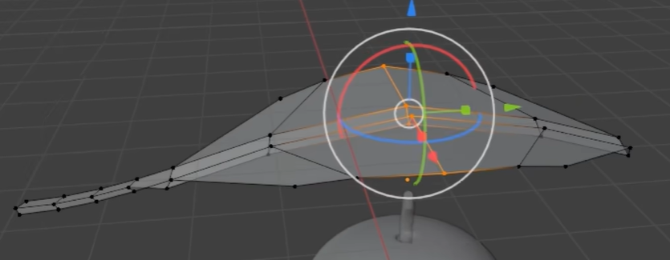
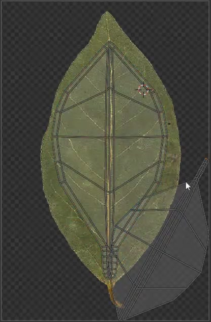

# Procedural Mandarin with Textured Leaves

Create a single mandarin with a gently flattened orange body, a short bent green stem, and two curved green leaves. The peel should show fine citrus pores and softer irregular surface variation. The leaf image must provide recognizable veins on both leaves.

## Starting Scene and Input

Use Blender 5.1.2 and Cycles with GPU rendering. Begin with an empty scene and create the fruit, stem, and leaves from native Blender geometry.

Use [leaf_texture.jpg](../input/leaf_texture.jpg) as the color-image source for both leaves. It contains one leaf on a white background and has no alpha channel. Map the leaf interior to the modeled surfaces so the white background does not appear on them. Keep this supplied file unchanged; material color adjustments are allowed. No starter model is supplied.

## Fruit Body and Stem

Make the fruit round across its width and slightly flatter vertically, with smoothly rounded shoulders and a shallow recessed area at the top. Preserve a full, continuous fruit body rather than a thin shell or open surface.

A short, slender stem emerges from the top recess. Its base meets the fruit without a visible gap, its centerline bends gently, and its upper end tapers. The stem remains much narrower than the fruit and does not dominate its silhouette.

## Curved Leaf Pair

Create two elongated leaves, each widest around its middle and narrowing to a pointed tip and a slim petiole. Give each leaf a shallow central fold, a broad lengthwise bend, and thin but visible edge thickness. The blades must have a shaped surface rather than being flat image rectangles.

Place the leaves on different sides of the stem with distinct orientations. Their petioles meet the stem near the top of the fruit. One leaf spreads outward and droops toward the fruit's shoulder; the other arches outward with a visibly curled tip. Keep both blades readable and avoid unintended intersections through the fruit or through each other.

## Geometry Finish

The fruit, stem, and both leaves must keep smooth silhouettes and coherent shading at close range. Maintain thin leaf edges and clean transitions around the stem base. Avoid open holes, doubled surfaces, prominent polygon facets, and shading creases that are unrelated to the intended leaf folds.

## Leaf and Stem Surfaces

Use UV mapping to align the supplied image's central vein along each leaf from petiole to tip. Keep branching veins recognizable across the blade without obvious stretching, unintended seams, or white background patches. Both leaves should read as green foliage with visible tonal variation; color correction may make the supplied muted image richer and greener.

Give both leaf blades a restrained waxy sheen, spatially varying roughness, and fine surface relief that remains secondary to the photographed veins. Keep the surface nonmetallic. The stem should be a darker green than the broad leaf highlights, with subtle roughness and surface variation rather than a featureless flat color.

## Procedural Orange Peel

Build the fruit's peel appearance procedurally. Its base color stays within a warm orange range with irregular lighter and darker patches distributed over the body, without visible tiling or mapping seams. Do not use an external peel image.

Combine dense, fine citrus pores with a broader and gentler irregular relief. Both scales must affect the rendered surface under directional light while preserving the fruit's rounded silhouette. The finish should have soft glossy highlights broken up by the peel detail, without looking metallic, glassy, or sharply spiked. Bump, displacement, or an equivalent editable material implementation is acceptable.

Keep the orange color variation, fine-detail size, fine-detail strength, and broader-relief strength independently editable in the saved material. Adjusting one relief strength must visibly change that layer without removing the other layer or changing the fruit's overall shape.

## Deliverables

Submit all three files:

- `submission.blend`, containing the complete editable scene, working materials, texture mapping, and a camera framing the entire fruit, stem, and both leaves in a clear three-quarter view.
- `build.py`, which recreates the scene from an empty Blender file, loads the supplied texture through a relative input path, and saves the recreated scene as `submission.blend`. Resolve paths relative to the script or package location rather than the current working directory, and keep the saved scene's texture dependency relative or packed. Rebuilding only an unsaved scene is insufficient.
- `B103_Procedural_Mandarin_With_Textured_Leaves.png`, rendered from the actual submitted scene using Cycles GPU. Use clear lighting and a quiet background that reveal the orange peel and leaf veins. Include the full silhouette; do not substitute a source image, viewport screenshot, or externally generated image.

The saved result must reopen with its leaf texture available after the package is moved to another location, and the render must match that saved scene.
