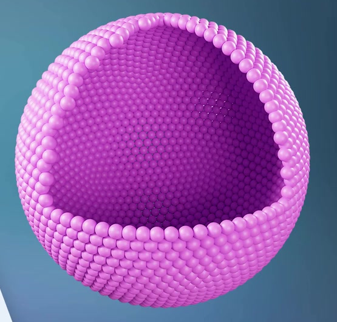
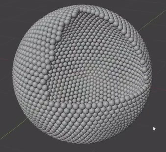

# Hollow Octant Particle Shell

Create an editable spherical aggregate of small rounded beads with one octant removed, exposing an empty center and the inside of the particle shell.

## Starting Scene

Use Blender 5.1.2 and Cycles GPU. Start from an empty scene and create the supporting geometry and bead shape with native Blender geometry. No external input assets are provided; `../input/` is empty. This is a static scene.

## Spherical Form and Octant Opening

Keep approximately seven eighths of a spherical envelope. The missing region is one octant defined by three mutually perpendicular planes through the sphere's center. Its boundary should read as three curved arcs meeting at three corners, with only bead-scale scalloping. The orientation and overall world scale are unrestricted.

## Hollow Interior

Place the bead centers in a single layer on the retained spherical surface. Leave the central volume empty, with the far interior visible through the opening. There must be no flat sheets across the cut, solid core, large source sphere in the cavity, or continuous opaque backing surface between the beads.

## Particle Geometry

Use consistently sized, smooth, round beads. A bead's diameter should be approximately 2-5% of the aggregate's overall diameter. Cover the retained shell densely and regularly, including the opening's rim. Neighboring beads may touch, overlap slightly, or leave small gaps, while remaining individually readable. Avoid large bare patches, isolated floating particles, stretched default beads, and a fused, featureless wall.

## Editable Particle Generation

Retain a live procedural relationship between an editable supporting shell or point layout and the generated particles. A local change to the supporting layout must move the corresponding bead centers while leaving unrelated regions in place.

Keep a reusable bead shape source: a change to that source's proportions must propagate to the generated beads. Also provide an editable uniform bead-size control that changes particle dimensions without moving their centers or changing their count. Restore the default round, densely packed result before saving. Equivalent procedural implementations are acceptable if these relationships remain functional in the saved file.

## Surface Appearance

Give the generated beads a consistent pink-to-magenta surface with soft glossy highlights, as in the overview. The material must be applied to the actual bead geometry, including the visible interior. Preserve visible shape and color in both highlights and shadows.

## Scene Presentation

Present the entire aggregate from an oblique view into the opening, showing the rim, the far inner shell, and some exterior curvature at once. Use a restrained contrasting background and lighting that separates adjacent beads and conveys cavity depth. Keep source geometry and construction helpers out of the final image. Leave comfortable space around the silhouette.

## Deliverables

- `submission.blend`: the editable scene with working particle relationships, assigned materials, and the final camera and render settings.
- `build.py`: a script that recreates the complete scene from an empty Blender state and saves `submission.blend`. The saved file must reopen in a fresh Blender process with the same aggregate and functional edits; rebuilding only an unsaved in-memory scene is insufficient.
- `B104_Hollow_Octant_Particle_Shell.png`: a final PNG rendered from the actual submitted scene. Do not substitute a reference image, viewport screenshot, or external replacement.
