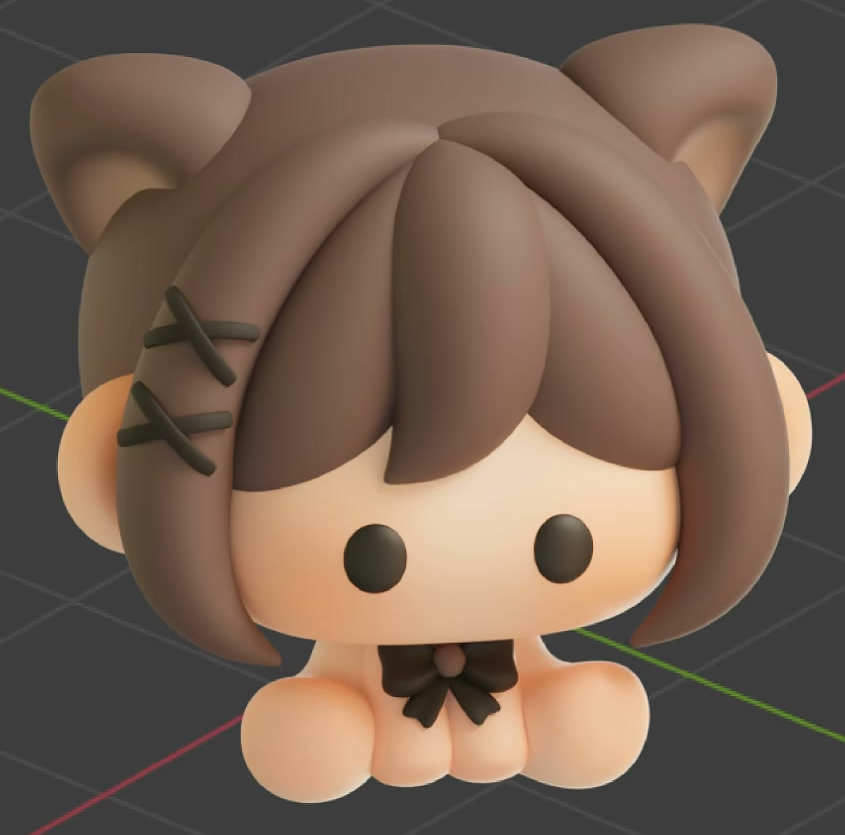
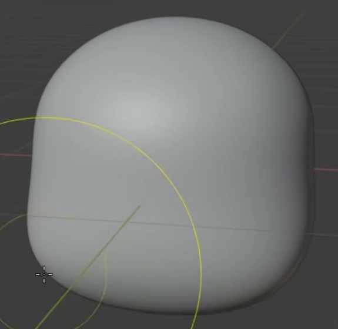
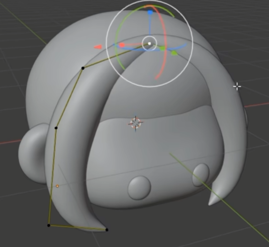

# Seated Cat-Eared Girl

Create a small, seated cartoon girl with an oversized rounded head, a brown layered bob, soft triangular cat ears, simple dark eyes, warm skin colors, and a dark bow at the neck. The finished character should have the compact, softly modeled toy-like appearance shown below.

## Starting Scene

Use Blender 5.1.2 and Cycles GPU rendering. Start from an empty scene and construct the character from native Blender geometry. No input assets are provided; `../input/` is empty. Native curves, meshes, and color attributes are sufficient. Choose the overall scale freely while preserving the reference proportions.

## Head and Facial Features

Give the head a rounded crown, full cheeks, substantial depth, and a broad, softly flattened lower face. Its silhouette should be gently shaped rather than a perfect sphere, with no pointed chin. The head and hair together should be visibly wider than the small seated body beneath them.

Place two small, dark, vertically oval eyes low on the exposed face. They should have shallow rounded volume, equal size and height, balanced spacing, and visible contact with the facial surface. Add a small rounded human ear on each side of the head, partly framed by the side hair. Keep the face simple, with the eyes and warm cheeks providing its expression.

## Hair and Ear Silhouette

Build a rounded hair mass over the crown and back of the head, layered bangs across the forehead, and longer curved side locks that frame both cheeks. The locks should be broad, solid forms with rounded cross sections and tapered ends. Their overlapping arrangement must read as separate locks while covering the scalp naturally. Keep both eyes and the lower face exposed.

Place a pair of rounded triangular cat ears above the hair. Each ear needs a substantial outer rim and a recessed inner area. The pair should be balanced across the head, with the bases integrated into the hair and the tips clear in the silhouette.

## Seated Body and Bow

Create a tiny rounded torso immediately below the head. Two short front arms descend close together in front of it, ending in soft rounded hands. Two broad rounded feet extend forward and outward on either side. The compact arrangement must read as a seated figure, with the hands and feet gathering along a common supporting level. Keep the head supported, the limbs attached, and the visible body approximately balanced from left to right.

Center a small bow immediately beneath the face. It needs a rounded center knot, two broad pinched loops, and two short downward tails with shaped ends. The bow should fit across the upper torso, remain distinct from the hands, and leave the face unobscured. The crossed hair clips visible in the overview are optional.

## Editable Geometry and Finish

Keep the head, hair locks, ears, eyes, body parts, and bow accessible for independent shape editing. Preserve an editable path or equivalent compact shape controls for the long side locks so that their curvature can be adjusted without reshaping the head or adjacent locks. An equivalent native Blender representation is acceptable.

Use smoothly rounded surfaces and clean silhouettes. Intentional overlap at attached roots is acceptable; visible cracks, detached pieces, accidental spikes, large self-intersections, and shading bands are not. Check the face, hair, ears, and body from front, side, and three-quarter views so the model remains a complete three-dimensional figure.

## Color and Surface

Use a coordinated brown color for the hair and outer cat ears, warm peach skin for the face, human ears, torso, hands, and feet, and near-black eyes and bow loops and tails. A small brown center knot may tie the bow to the hair palette. Surfaces should appear opaque, soft, and mostly matte, with restrained highlights that reveal the rounded forms.

Use editable mesh color attributes, connected to the rendered skin material, to store the skin colors and soft warm accents. Add gentle blush to both cheeks and warm color variation within the cat-ear recesses and on the hands and feet. The accents should blend into the base color instead of forming hard-edged spots. Keep these local colors editable independently of the hair and eye colors.

## Deliverables

- `submission.blend`: the complete editable character, its working color attributes and materials, and a camera and lighting setup ready to render. Use a clean, unobtrusive background and a front or slight three-quarter composition that includes the whole figure and makes the face, ear recesses, seated limbs, and bow easy to inspect.
- `build.py`: a reproducible Blender Python script that recreates the scene from an empty file and saves the completed result as `submission.blend`. It must work with the empty input directory and use no unavailable external models, images, or add-ons. The saved file must reopen with the same geometry, local colors, and render setup.
- `B105_Seated_Cat_Eared_Girl.png`: a still image rendered from the actual submitted scene. Do not substitute a source image, viewport screenshot, or external image for this render.
