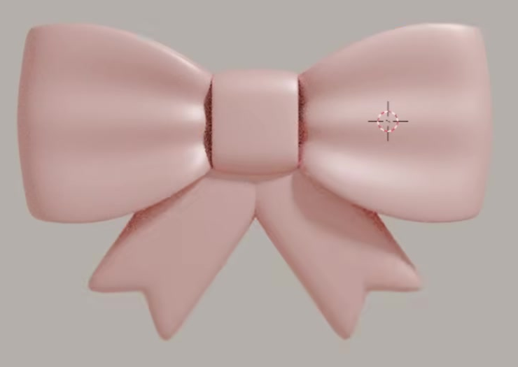
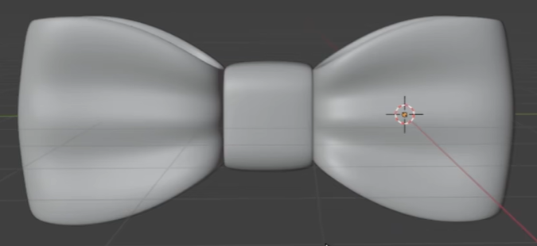
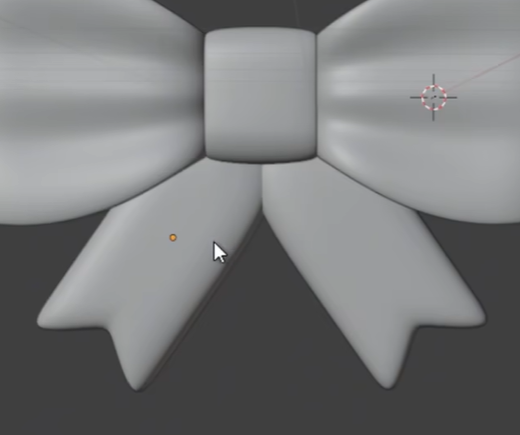
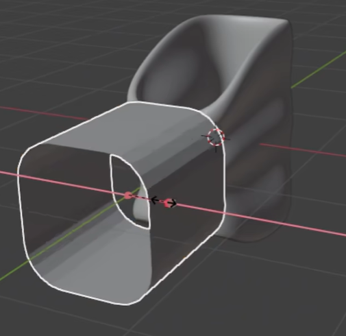

# Pink Ribbon Bow

Create a soft, pale pink ribbon bow with two broad folded wings, a rounded center band, and two hanging tails with notched ends. The finished model should have a compact, symmetrical silhouette and readable three-dimensional ribbon folds.

## Starting Scene

Use Blender 5.1.2 and Cycles with GPU rendering. The `input/` directory is empty: start from an empty scene and construct the bow from native geometry. No external model or texture is needed. Choose a convenient overall scale and use the references for relative proportions.

## Wing Loops

Create a pair of broad wings extending horizontally from the central junction. Each wing narrows substantially toward the center and opens into a full outer end with softly rounded corners. The upper assembly should read as a wide bow, with the center band much narrower than either wing's outward span.

Shape the wings with visible folds running outward from their gathered inner ends. The folds must be geometric relief that remains visible from an oblique view, with alternating ridges and valleys across the wing face. Keep the outer portions full and the inner portions gathered; a flat fan silhouette alone is insufficient.

## Center Band and Tails

Place a short rounded rectangular band over the central junction. Its broad front should be gently curved, with rounded corners and enough depth to read as a strip wrapping the gathered wings. It should visually bind the assembly while leaving both wing faces visible.

Add two broad tails emerging from behind the lower part of the center band. They descend and spread diagonally outward, remain shorter than the full wing span, and leave a clear opening between their lower portions. Each tail has a shallow inward notch at its free end, producing two softened points. The tails should have gentle curvature and sit naturally beneath the wings without detached gaps at their roots.

## Ribbon Structure and Finish

Make the wings as folded ribbon loops with separated front and back surfaces and an inspectable inner opening from an oblique view. Give the ribbon walls, center band, and tails visible thickness at exposed edges, while keeping them thin relative to the broad ribbon faces. The center band should also read as a wrapping strip with an inner passage rather than a solid block.

The depth reference below shows the loop and band construction before the full bow is assembled. Use it to understand their hollow structure; the completed model must have the smooth, rounded finish of the other references.

Finish the existing wing, band, and tail surfaces with continuous shading, rounded rims, and clean transitions. Avoid unintended faceting, shading seams, collapsed strips, and self-intersections. The intended fold valleys and tail notches must remain legible after smoothing.

## Editable Symmetry

Maintain the paired wings and paired tails through an editable bilateral relationship about the center of the bow. A shape edit to one source wing must update its opposite counterpart as a reflection; the same must hold for a shape edit to one source tail. Preserve this behavior in the saved scene. Mirroring, linked procedural construction, or an equivalent working relationship is acceptable.

## Pink Surface

Apply a consistent pale pink appearance to the wings, center band, and tails. All broad faces and exposed edges should be covered, with no unintended unassigned regions or contrasting parts. Use a soft reflective finish that produces broad highlights across the wing folds and center band. Preserve visible pink midtones and readable fold shadows; avoid a flat unlit appearance or a mirror-like finish that overwhelms the form.

## Deliverables

Submit these three files together:

- `submission.blend`: the editable completed bow, including the symmetry relationships, applied materials, camera, lighting, and render settings.
- `build.py`: a Blender Python script that runs from an empty scene without manual input, recreates the complete scene and its editable relationships, and saves `submission.blend` beside the script. Use relative output paths and do not rely on external assets.
- `B106_Pink_Ribbon_Bow.png`: a PNG rendered from the actual submitted scene using its camera and materials. Show the complete bow from the front or a slightly oblique front view, with the folds, center band, and both tails clearly visible. The image must be a scene render, not a viewport screenshot, a source reference image, or an external replacement.
