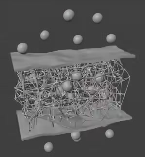
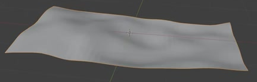
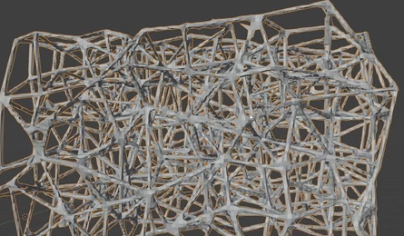
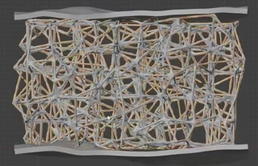

# Double Membrane Porous Model

Create a three-dimensional scientific illustration of an irregular porous scaffold held between two thin, gently undulating membranes. Small spherical particles surround the assembly and appear among its pores. Preserve the open structure and the different wave profiles of the upper and lower membranes.

## Starting Scene

Use Blender 5.1.2 and Cycles with GPU rendering. Start from an empty scene and create the membranes, scaffold, and particles from native Blender geometry. No external input assets are provided; the input directory is empty. Any modeling method is acceptable if the saved scene has the required evaluated geometry and remains editable.

## Membrane Form

Create two separate, broad rectangular membrane panels with similar footprints. Each panel is longer than it is wide and remains recognizable as a sheet. Their dimensions should be large relative to their thickness, with enough area to cover the porous core while leaving a modest visible margin around it.

## Membrane Waves and Thickness

Give both membranes broad, shallow, smoothly flowing rises and depressions. Preserve their overall rectangular footprints and avoid sharp, crumpled folds. The upper and lower profiles must differ visibly, rather than being identical copies separated vertically.

Both membranes must be solid thin shells: their boundaries reveal continuous sidewalls joining the two faces. Keep the thickness small and reasonably consistent, without open edge gaps or large local bulges.

## Open Porous Core

Build a substantial three-dimensional block of interconnected rods. Pores must extend through the block's depth, with several layers of openings visible from oblique views. The result should read as an open volume, with much of its interior visible through the gaps.

Vary the cell sizes, rod directions, and junction positions throughout the core. Retain a roughly rectangular block envelope while breaking up the regularity of an orthogonal grid. Avoid a uniformly repeated lattice, a flat web, or a solid block with only surface markings.

## Rounded Fused Structure

Give the rods rounded solid cross-sections. At junctions, adjoining rods should blend into continuous surfaces instead of remaining visibly intersecting cylinders. The existing rods and junctions must appear smooth at a close inspection distance, without prominent faceting, sharp voxel steps, surface tears, or shading spikes. Keep the openings readable as the junctions become rounded.

## Sandwich Placement

Place the core between the two membranes, with its broad faces aligned to their footprints. The lower membrane supports the core and the upper membrane caps it. Keep the core's lateral outline mostly inside the membrane boundaries.

Bring the top and bottom of the core close to the facing membrane surfaces, so the parts read as one layered assembly. Trim or adjust long protrusions beyond the outer faces of the membranes. Small local clearances caused by the waves are acceptable, but avoid a conspicuous continuous separation or long rods extending outside the sandwich.

## Particle Arrangement

Add several small, smooth spherical particles. Their diameters must remain small relative to the membrane span. Distribute multiple particles above the upper membrane and below the lower membrane, and include at least one visible among the open pores. Vary their heights, lateral positions, and sizes modestly to avoid regular rows.

Use a clear oblique presentation that shows membrane depth, the porous core, and the upper and lower particle groups together. Keep the complete assembly in frame with a margin. Use neutral gray surfaces, a simple background, and lighting that reveals rod curvature and pore depth. The particles must remain secondary and must not obscure most of the core.

## Deliverables

- `submission.blend`: the complete editable scene, including the camera and lighting used for the final image. Keep the upper membrane, lower membrane, core, and particles separately accessible for editing. Pack any resources created for the scene or store them with portable relative paths.
- `build.py`: a reproducible Blender Python script that recreates the complete scene from the empty starting scene and explicitly saves the result as `submission.blend`. It must also configure the camera, lighting, and render settings used by the submission.
- `B107_Double_Membrane_Porous_Model.png`: a finished PNG rendered from the actual scene in `submission.blend`. Show the complete modeled assembly, rather than a viewport screenshot, source reference, or externally substituted image.
