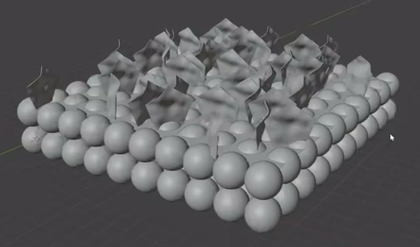
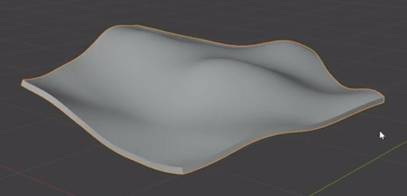
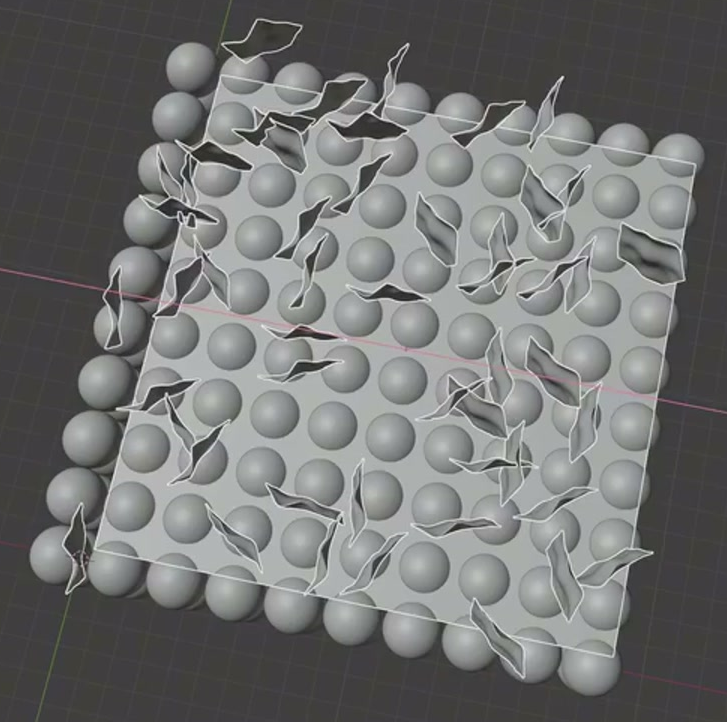

# Wavy Flake Molecular Array Board

Create an editable static scientific model with a compact, two-layer lattice of smooth spheres and a scattered coating of thin, wavy pentagonal flakes. The regular lower structure and irregular upper structure must remain easy to distinguish.

## Starting Scene and Inputs

Use Blender 5.1.2 and Cycles with GPU rendering. Start from an empty scene and create the geometry from native Blender primitives or generated meshes. The `input/` directory is empty; no external model, texture, image, or other asset is required. This is a static asset, with no animation requirement.

## 1. Two-Layer Sphere Lattice

Build a dense rectangular lattice of equal-sized spheres in two vertically aligned layers. Use a roughly square to slightly rectangular footprint, with many regular rows in both horizontal directions. Spheres should nearly touch their horizontal and vertical neighbors without visibly merging into one continuous mass. Both layers must have complete, orderly outer boundaries.

Keep individual spheres round and smoothly shaded. The front and side edges must clearly reveal the two stacked layers, while the top remains a regular support for the flakes.

## 2. Wavy Flake Geometry

Create a reusable thin sheet with a recognizable five-sided outline. Its surface must have several broad, smooth undulations, and its perimeter should rise and fall with the surface. Give it a small but visible thickness relative to its width, including a continuous side rim.

Avoid a flat polygon, a bulky solid, sharp crumpling, open tears, or self-intersections. The flake must remain a coherent sheet with smooth faces and a readable boundary when viewed from above and from a low angle.

## 3. Reusable Geometry Controls

Keep the lattice generated from a shared sphere source, with editable repetition in the two horizontal directions and vertically. Editing the sphere source must update the lattice. Changing a horizontal repetition count must produce another complete regular row or column. Changing the vertical count must add or remove a complete layer. Spacing changes must affect the repeated structure coherently.

Keep the flake deformation and thickness adjustable as geometric controls. Reducing its wave amplitude must make the sheet flatter while preserving its five-sided outline and side rim. Changing thickness must change the rim without changing the broad face shape. Equivalent procedural implementations are acceptable.

## 4. Flake Coating and Distribution

Scatter repeated instances of the wavy flake across the upper lattice footprint. Flakes should rise from near the upper sphere layer, with varied horizontal orientations and tilts. Use a mixture of face-on and edge-on views, local overlap, and gaps through which some upper spheres remain visible. The coating must extend across the board without turning into a solid roof or overwhelming the regular base.

The distribution must remain procedural: changing its density or instance count changes the amount of coverage; changing a seed or equivalent distribution control changes placement or orientation; restoring the original controls restores the same arrangement. Editing the shared flake source must update the distributed flakes. Keep their lower edges near the upper sphere layer, with no conspicuous floating cluster or deep penetration through both sphere layers.

Hide distribution surfaces and standalone source duplicates from the final render. Preserve them in an editable form where needed.

## 5. Presentation

Use a three-quarter camera view that shows the whole board, the top coating, and two exposed lattice edges. Keep comfortable space around the silhouette. Use neutral materials or restrained contrasting colors, with lighting that reveals the spherical contours, sheet folds, thin rims, and depth between layers. Gray materials are sufficient.

The final image must be free of interface overlays, labels, visible construction planes, and detached source objects. All required geometry must be visible without distracting clutter or lighting that hides its shape.

## Deliverables

- `submission.blend`: the complete editable scene, with its geometry generators, materials, camera, and render setup saved and all required data available without missing external dependencies.
- `build.py`: a Blender Python script that recreates the scene from a fresh Blender session and explicitly saves the resulting scene as `submission.blend`.
- `B108_Wavy_Flake_Molecular_Array_Board.png`: a PNG rendered from the actual submitted scene using its final camera. Do not replace it with a reference image, viewport screenshot, or externally assembled image.
