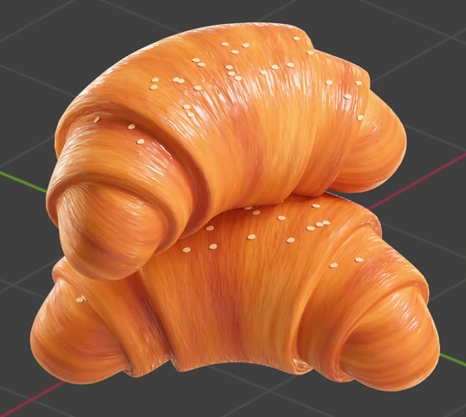
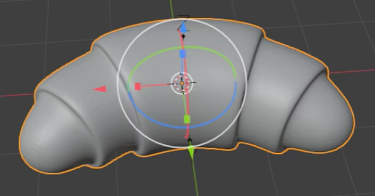
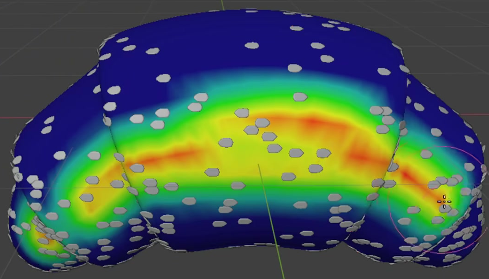

# Glazed Sesame Croissant

Create one editable croissant with a plump crescent body, rounded rolled layers, a golden baked crust with fine directional texture, and pale sesame seeds scattered over its upper surface.

## Starting Scene

Use Blender 5.1.2 and Cycles with GPU rendering. The `input/` folder is empty. Start from an empty scene and construct the croissant and sesame geometry from native Blender primitives or equivalent generated geometry. Build one croissant; the stacked arrangement in the appearance reference is not required. No external model, texture, or environment image is needed.

## 1. Crescent Body

The body must have real volume, with a broad, inflated center that narrows progressively into two rounded tips. Its length follows an open crescent: the tips turn toward the same side, leaving a clearly concave inner edge and a broad convex outer edge. Maintain an approximately balanced silhouette without making the center flat or the tips needle-sharp. The underside should complete the volume.

## 2. Rolled Layers and Finish

Model distinct rounded bands that read as overlapping rolled dough. Broad central bands transition into smaller bands near both ends, with recessed channels separating adjacent sections. These transitions must affect the actual surface and silhouette, including when the body is viewed without its material.

Keep the band shoulders inflated and the channels readable. Smooth the major curved surfaces while preserving their intentional separations. The visible body must be free of open tears, accidental sharp creases, conspicuous faceting, and severe pinching at the tips or center.

## 3. Baked Crust Material

Use an editable procedural crust material. Combine warm golden and amber areas with darker toasted variation so the body reads as baked dough. Cover the center and both tapered sides with coherent variation; avoid a flat single color or isolated decorative color patches. The surface is opaque and nonmetallic.

Use an editable UV layout to guide irregular elongated streaks from the inner edge, over the rounded bands, toward the outer edge. Their direction should follow each section of the bent body. Avoid obvious square patches, abrupt direction changes, and stretched smears across the visible upper surface. Editing the UV orientation must affect the direction of the applied texture.

Give the crust a lightly glazed appearance with spatially varied roughness. Broad illumination should produce highlights that break into fine streaks instead of a uniform plastic shine. Add subtle irregular relief at a finer scale than the modeled rolled bands. This detail should catch grazing light while preserving the smooth inflated volume. Color variation, roughness variation, and fine relief must remain editable in the submitted material.

## 4. Sesame Geometry

Create an editable sesame source shape with a flattened, elongated oval or soft teardrop outline, a broader middle, gently tapered ends, and visible thickness. Repeated seeds must retain that shape in close views. Keep them small relative to the body bands and give them a pale ivory surface that contrasts with the crust without becoming metallic or strongly emissive.

## 5. Surface Scatter and Controls

Distribute the sesame geometry procedurally over the upper central region of the croissant. Use a sparse, irregular arrangement with clear exposed crust between seeds. Density should fall toward the tips and side edges, and the underside should remain bare. Seeds should sit on the crust, with varied positions and in-plane angles, without a visible grid, widespread collisions, floating clusters, or deeply buried shapes.

Retain an editable surface density mask or field, an overall amount control, and a random arrangement control. The mask must actually restrict where seeds appear. Changing the amount must alter the population in the eligible region; changing the random control must rearrange it while preserving the density region and surface contact. The same settings must reproduce the same distribution. Keep the source shape editable so a change to it propagates through the scatter. Equivalent procedural implementations are acceptable.

## 6. Presentation

Present the complete croissant in a static three-quarter view that exposes its crescent shape, rolled bands, glazed streaks, and seed placement. Use illumination that preserves both golden midtones and readable highlights. Keep the entire pastry within the image, against a simple background, with enough detail to inspect the surface. Render the actual submitted scene.

## Deliverables

- `submission.blend`: the editable croissant scene with its geometry, UV layout, procedural material, sesame source, functioning scatter controls, and render setup.
- `build.py`: a script that recreates the scene from an empty Blender scene and explicitly saves the reconstructed result as `submission.blend`. It must run without private files or manual edits and preserve the material and scatter behavior described above.
- `B109_Glazed_Sesame_Croissant.png`: the final still rendered from the actual submitted scene. Do not substitute a reference image, viewport screenshot, or externally generated image.
