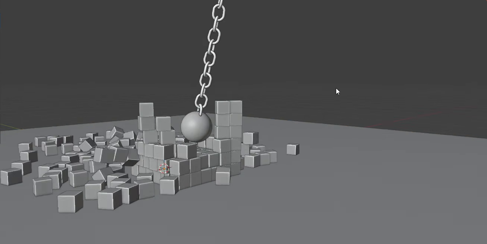
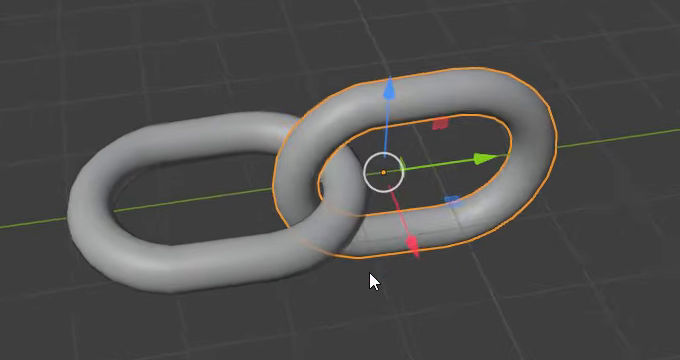
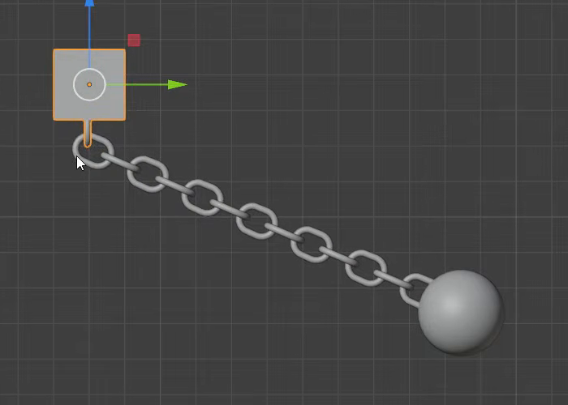
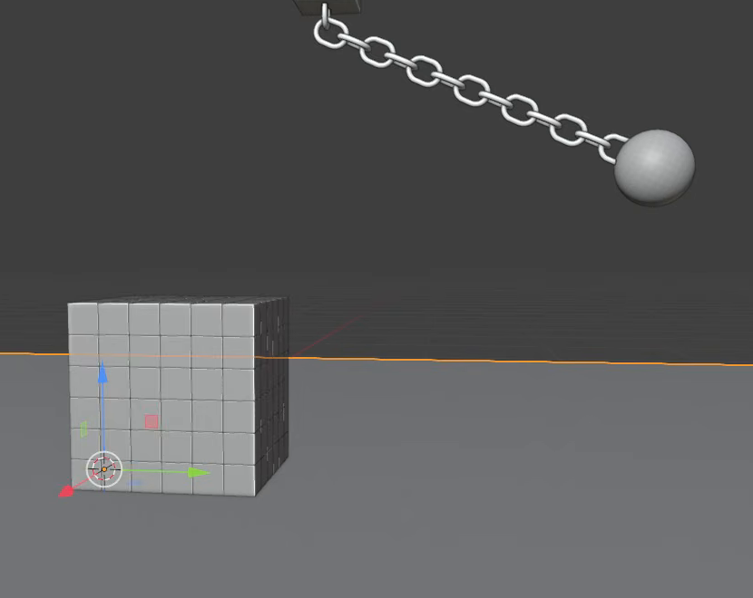
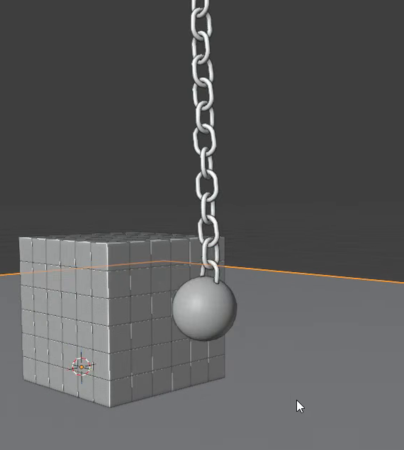

# 链条重球碰撞动画

用代码创建一个可以重新计算的刚体拆毁场景：重球通过真实穿套的链环悬挂在固定方形锚块下，从抬起的位置释放，向下摆动并击散地面的立方块堆。链条在运动中保持连接，撞开的方块各自平移、翻滚并与地面接触。

图 1：重球经过堆体后留下缺口与散落方块，链环仍连成一条。灰模即可满足外观目标。

## 起始条件

- 使用 Blender 5.1.2，从空场景开始。`input/` 为空，无需外部模型、贴图或第三方插件。
- 动画范围为第 1 至 250 帧，24 fps。以第 1 帧作为未释放的初始状态，重力方向为 `-Z`，水平地面表面位于 `Z=0`。
- 以方块堆单个立方体的边长 `B=1 m` 作为尺度基准。所有长度关系均按实际求值几何衡量。
- 不要求制作材质或灯光风格。若输出展示渲染，使用 Cycles GPU；评测环境提供 GPU 渲染能力。

## 1. 链环与承重装配

链条由至少 10 节可辨认的闭合椭圆链环构成，形成从锚块到重球的连续路径。链环是有圆润管截面的真实三维实体，孔洞贯通；长宽比为 1.2 至 1.5，外宽为 `0.8B` 至 `1.1B`。链环外形一致，表面平滑，无裂口、尖刺或明显扁塌。

相邻链环的环面交替接近垂直，互相穿过对方孔洞；不能仅仅首尾相接、重叠轮廓或依靠相交的实体假装连接。第 1 帧中，各相邻环之间都应真实穿套，环管之间没有明显的体积穿插，仍有相对转动的空间。

图 2：两环交替朝向，实心环管穿过另一环的孔洞。

上端连接一个边长为 `1.5B` 至 `2.5B` 的方形锚块，下端连接直径为 `2B` 至 `3B` 的平滑球形重物。端部链环分别进入锚块和球体，形成清晰的牢固连接，不留下悬空断口。端部可以与锚块或球体作为同一刚性装配，中间链环应保持可独立转动的几何结构。

图 3：锚块固定在高处，链条伸向抬起的重球。图中链环数量与具体摆放距离不要求逐一复制。

## 2. 完整方块堆与碰撞地面

用同样大小的独立实心立方体组成紧密、规则的三维方块堆。三个方向各排列 5 至 7 个单元，形成完整的近立方体体积，内部也填充单元，不能仅做外壳或一片墙。单元之间保留细小缝隙，缝隙不超过 `0.03B`，初始实体不互相穿插，底层落在地面上。

方块堆位于重球摆动路径中，重球应能从侧面撞入堆体。地面保持静止，覆盖初始方块堆并至少向四周各延伸 `B`。可以继续加大地面；若采用有限地面，方块越过实际边缘后坠落是允许的。

图 4：初始堆体完整，重球悬在侧上方，重球与堆体之间留有释放后的摆动距离。

## 3. 起始状态与重力摆动

第 1 帧时，锚块位于高处，链条主体大致拉直，向重球一侧下倾，与水平面的夹角为 20 至 30 度。重球与方块堆初始分离，从静止释放后依靠重力下摆。重球应在第 25 至 60 帧之间首次撞到方块堆，而不是开场就压在堆体内。

锚块在第 1 至 250 帧中保持原位，位置漂移不超过 `0.01B`，方向变化不超过 1 度。重球始终牢固连接在链条下端，并有足够的悬挂高度，使球体在整个运动范围内不接触或穿过地面。链条能逐环改变方向，不能整条保持刚直。

物理对象的运动来自可重算的刚体模拟。不得用逐帧摆姿、路径驱动、顶点缓存动画或预制关键帧替代重力摆动与撞击响应；相机等展示对象不受此限制。质量、摩擦、碰撞表示与求解精度自行选择，以实际运动结果为准。

## 4. 链环接触与动力学

链环之间的承重必须来自真实孔洞与环管的接触，不能靠隐藏的跨环支撑维持外观。正常重算时，整条链在前 10 帧的释放阶段、撞击期间及之后都保持穿套，不脱环、不拉伸成橡皮带，也不发生明显穿透、突然炸开或持续抖动。允许很小的接触误差，但不能改变链条连接关系。

在文件副本中，去掉链条中部一节链环的几何及其物理作用，清除原缓存并从第 1 帧重新计算。缺口下方的一段链条和重球应失去与锚块的支撑，在前 60 帧内可见地向下落下；缺口不能被不可见连接继续承重。此测试只需证明交付物的行为，无需另交测试场景。

## 5. 撞击与散块行为

发生任何实际接触之前，堆体保持安静完整：各方块相对第 1 帧的中心位移不超过 `0.02B`，方向变化不超过 2 度。重球到达后，应通过碰撞把堆体撞开，形成清楚的局部缺口和外散运动。链条提前轻微触碰堆体可以接受，但主要破坏应由重球到达引发。

图 5：重球已经下摆至堆体侧面，链条仍保持连续。此图用于观察接触关系，不要求复制该帧的精确位置。

在第 80 至 160 帧之间应能找到一个明显撞散状态：至少四分之一的方块中心相对初始位置移动超过 `0.5B`，并且受击区域的完整堆面被打开。方块不能始终作为整块刚体平移，也不能在重球到达前自行散开。

撞击后，各方块具有独立的刚体运动：至少十分之一的方块相对初始方向转过 15 度以上，能观察到翻滚或倾倒。处于地面覆盖范围内的方块应受到阻挡并在其上碰撞、滑动或堆积，不能穿地而过。接触产生的短暂轻微抖动允许存在，但不能出现无接触的突然加速、持续振动或明显体积穿透；碎块保持原来的立方体尺寸和形状。

## 6. 交付与重复播放

提交 `submission.blend` 与 `build.py`。`build.py` 应能在 Blender 5.1.2 的空场景中建立并保存该场景，同时提供生成第 1 至 250 帧模拟缓存的运行方式。脚本开头写明构建和重算方法；资源不得依赖本机绝对路径或联网下载。

保存完整的物理初始状态与可重算设置。缓存应覆盖整段动画，并随交付文件保存或使用包内相对路径。复制交付目录到新位置后，应能加载缓存逐帧播放，也能清除缓存、从第 1 帧顺序重算得到同样的摆动、撞击和散落阶段；不要求每个方块轨迹逐位一致。重新构建得到的场景也应满足同样的运动目标。

文件内保留简短说明，标出锚块、链条、重球、目标堆和地面的用途，以及缓存位置和恢复初始状态的方法。以第 1 帧保存，提供能够查看整体装配与撞击区域的视图。无需提交测试副本。

图片均为实际参考视频画面的裁切。尺寸范围、链环最低数量、堆体单元范围、测试幅度与运动容差是本任务公开的验收约定。

## 渲染效果交付

在原有交付文件之外，另提交 `B10_链条重球碰撞动画_动态.mp4`。视频采用 MP4 格式，按本题规定的完整时间范围和帧率，从实际交付工程渲染动画，清楚展示动作与效果变化。使用本题规定的渲染环境；若原题没有指定展示相机，可设置能完整观察主体的相机。该文件应与 `submission.blend` 中的结果一致，不以参考图、视口截图或外部素材代替实际渲染。
