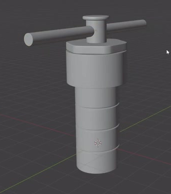
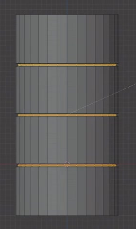
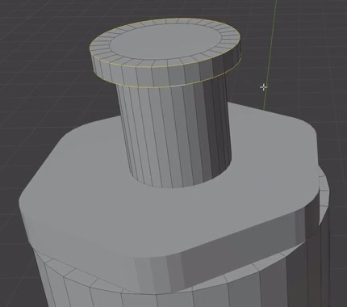
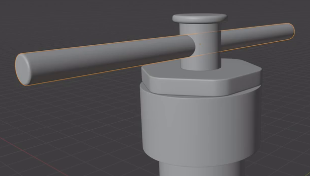
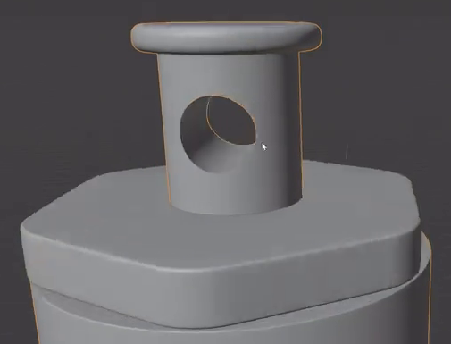

# Hydrothermal Reactor Vessel

Create an editable model of a compact hydrothermal reactor vessel: a tall ribbed barrel, a wider upper housing, a thin hexagonal lid, and a flanged center post carrying a horizontal handle through a real hole.

## Starting Scene

Use Blender 5.1.2 and start from an empty scene. The input folder is empty; no external model, texture, or image asset is required. Build the vessel from native geometry. Use Cycles with GPU rendering for the final image. The reference images define the form; absolute dimensions and construction methods are free.

## 1. Ribbed Vessel Body

Make a straight, upright circular barrel whose exposed lower portion is clearly taller than its diameter. Give it a closed bottom and a consistent main diameter.

Add exactly three narrow raised rings around the lower barrel. Each ring must wrap continuously around the circumference, project only slightly from the main wall, and remain distinct from its neighbors. Distribute the rings at approximately even intervals, with visible barrel wall between them and space above the base.

## 2. Upper Housing and Hexagonal Lid

Place a shorter, wider circular housing above the narrow barrel. Its lower edge must form a clear shoulder, and the two cylindrical regions must share a vertical centerline.

Seat a thin hexagonal lid on the housing. Preserve six recognizable sides and softened corners when viewed from above. The lid must cover the housing opening, remain much thinner than the housing, and align with the same centerline. A visible seam should distinguish the lid from the housing without making it appear to float.

## 3. Center Post and Transverse Handle

Raise a narrow cylindrical post from the center of the lid. Finish its top with a thin circular flange that extends beyond the post but remains much smaller than the lid.

Add a straight round handle that passes horizontally across the post below the flange. Both ends must extend well beyond the post, with approximately balanced lengths on either side. Keep the handle thinner than the post, give it closed ends, and leave a readable gap between the handle and the lid below.

## 4. Through-Hole and Editable Parts

The handle must occupy a genuine circular bore through the center post. Temporarily hiding the handle must reveal two opposite openings connected by a continuous empty passage. The bore must fit the handle closely without a visible solid plug or a broad gap around it. It must remain within the post below the flange.

Keep the vessel body, lid, and handle independently editable so that the handle can be hidden or moved without changing the post. The bore may use editable operations or finished mesh geometry, provided the submitted scene evaluates to the required hole.

## 5. Geometric Finish and Presentation

Round exposed edges enough to produce narrow, soft transitions while retaining the thin rings, wide shoulder, six-sided lid, and flange profile. The barrel, housing, post, and handle should read as smooth circular forms. Avoid coarse silhouette facets, pinched faces, unintended holes, dark shading creases, and duplicate surface flicker.

Present the complete assembled vessel in a clear three-quarter view with a neutral surface treatment and unobtrusive background. Keep the base, all three rings, lid, flange, and both handle ends inside the image. Lighting must reveal the modeled edge transitions and the upper assembly clearly.

## Deliverables

- `submission.blend`: the editable completed scene, saved with its render camera and Cycles GPU configuration.
- `build.py`: a Blender Python script that recreates the complete scene from an empty scene and saves the result as `submission.blend` beside the script. The recreated saved file must contain the vessel geometry, editable parts, bore, and render setup; a scene that exists only in memory is insufficient.
- `B110_Hydrothermal_Reactor_Vessel.png`: a PNG rendered from the actual scene in `submission.blend`, using the complete-vessel view described above. Do not substitute a reference image, viewport screenshot, or externally generated image.
