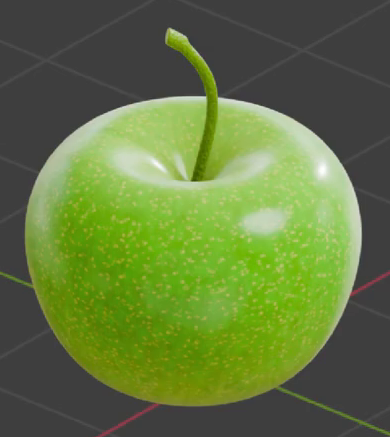
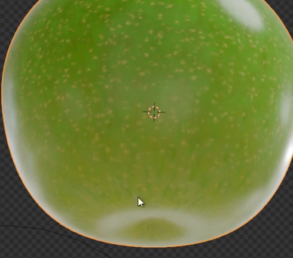

# Green Apple

Create an editable green apple with a softly indented body, a curved green stem, and glossy skin combining gentle color variation with fine pale speckles.

## Starting Scene

Use Blender 5.1.2 and Cycles with GPU rendering. Start from an empty scene and construct the apple and stem from native Blender geometry. No input assets are provided; `input/` is empty. Use procedural materials without external image textures.

## Apple Form

Build a plump, slightly squat body that is approximately round from above. Its upper shoulders should be broad and rounded, with a modestly narrower lower half and continuous curvature between them.

Form a shallow, rounded recess at the top center for the stem. Shape a smaller inward depression at the bottom center, with the surrounding lower body smoothly turning into it. Both depressions must be real geometry and remain legible when viewed from above and below.

## Stem and Assembly

Add a slender stem rising from inside the top recess. It should bend gently to one side, have a rounded cross-section, and end in a closed, slightly shaped tip. Keep its visible length clearly shorter than the apple body height. Seat its base inside the recess so there is no floating gap or exposed intersection across the outer shoulder.

The body and stem must remain editable. Their evaluated surfaces should have smooth silhouettes without visible faceting, holes, or severe pinching. Preserve the apple's rounded shoulders, localized depressions, and the stem's curved profile.

## Procedural Skin Pattern

Make the skin predominantly fresh green with softly blended yellow-green and lighter green variation. Combine broad, low-contrast mottling with many small, irregularly spaced pale yellow-green speckles. The speckles should remain subordinate to the green skin and cover the body around its sides, top shoulder, and lower surface.

Keep the color variation organic and continuous across the surface, without a visible mapping seam, repetitive bands, or large isolated patches that overwhelm the apple. Retain editable procedural controls for the broad color variation and for the speckle scale. Each control must visibly change its intended pattern while leaving the body geometry and the other pattern scale intact.

## Surface Finish

Give the skin a smooth, waxy gloss with broad readable highlights. Preserve the fine skin pattern through the lit and shaded regions; avoid mirror-like reflections or coarse, rocky relief.

Finish the stem in a darker olive green with subtle variation and a restrained fine surface texture. Its appearance must be independently editable without recoloring the body. The body and stem should remain visually distinct where they meet.

## Presentation

Present the complete apple from a slightly elevated three-quarter view against an unobtrusive background. Keep the entire stem and body inside the frame, make the top recess visible, and light the apple so its green variation, pale speckles, and rounded volume are readable. The bottom depression may be inspected separately in the saved scene.

## Deliverables

- `submission.blend`: the complete editable apple scene, with procedural materials, lighting, an active camera, and the stated render configuration saved.
- `build.py`: a reproducible Blender Python script that recreates the scene from an empty scene and saves the resulting scene as `submission.blend`. It must run without external assets or additional add-ons.
- `B111_Green_Apple.png`: a PNG rendered from the actual scene saved in `submission.blend`, using the presentation described above. Do not substitute a source image, viewport screenshot, or externally created image.
