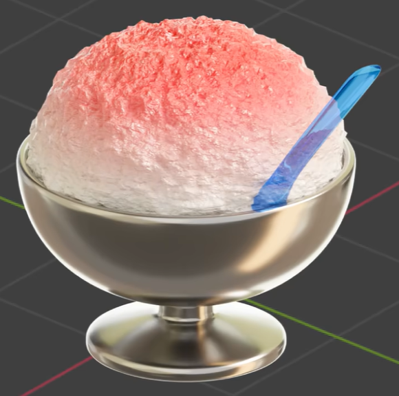
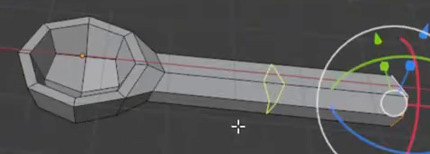
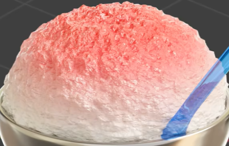

# Shaved Ice Dessert Cup

Create a polished metal dessert cup holding a rounded mound of strawberry-colored shaved ice, with a transparent blue spoon inserted diagonally into the ice. The ice should have a pale base, a pink-to-red crest, and dense crystalline relief at two visibly different scales.

## Starting Scene

Use Blender 5.1.2 and Cycles with GPU rendering. No external input assets are provided; `../input/` is empty. Start from an empty scene and create the cup, ice, and spoon with native Blender geometry. Keep these three parts independently editable and hideable. Materials and lighting must remain available when the saved scene is reopened.

## Cup Geometry

Model a broad, upward-facing hemispherical bowl that narrows into a short central neck and then flares into a low circular foot. The foot should be wider than the neck but narrower than the bowl, giving the vessel a stable pedestal silhouette.

The bowl must have an open cavity, a continuous rim with visible wall thickness, and a closed lower shell. The neck and foot should meet the bowl without accidental gaps. Keep the bowl, rim, neck, and foot smooth, with rounded transitions and no unintended holes, sharp shading bands, or visibly faceted curved surfaces.

## Ice Geometry

Create one closed, rounded mound of ice with a broadly hemispherical silhouette. Its lower edge should sit slightly inside the cup opening, while the dome rises clearly above the rim. Keep its width close to the cup opening, without a floating gap or a large overhang. The underside must be closed and contained by the vessel. Preserve this broad dome shape when adding crystalline relief.

## Spoon Geometry

Give the spoon a shallow concave bowl with a thickened rounded rim, joined to a much longer and narrower handle with a rounded tip. The bowl-to-handle transition should be continuous, and both parts must have real thickness and smooth finished edges.

## Ice Material

The ice must transition vertically from an almost white lower region through pale pink to a stronger pink-red crest. Keep the transition continuous and tied to height across the mound, without a hard painted dividing line.

Create dense, irregular crystalline surface relief with both broad uneven clumps and much finer detail layered over them. The relief must affect the actual rendered surface, including small irregularities along the silhouette. Preserve readable separation between the two scales. Keep the material procedural and editable so either detail scale can be varied while the other remains present.

Give the ice a wet, nonmetallic response: small bright highlights, some translucency, and soft light spreading through the pale regions. It should retain the body of packed shaved ice instead of becoming fully clear glass. The color gradient and the relief must remain visible under the final lighting.

## Cup and Spoon Materials

Cover the bowl, neck, and foot with a consistent polished silver-gray metal material. Reflections should describe the vessel's curvature, with broad highlights and enough surface roughness to retain readable form.

Give the spoon a transparent blue material with smooth highlights and visible edge definition. The ice or background must remain visible through exposed parts of the spoon, while the spoon itself remains easy to distinguish. Apply the material consistently to the bowl and handle.

## Assembly and Presentation

Seat the ice centrally in the cup and insert the spoon bowl into one side of the ice near the rim. Let the handle rise diagonally upward and outward, as in the finished reference. Avoid a disconnected spoon, accidental penetration through the cup wall, or an ice mound that appears to float.

Set up a clear three-quarter camera view that shows the ice crest, cup rim, full pedestal foot, and exposed blue handle without cropping any of them. Use a restrained background and lighting that reveal the crystal relief, reflective metal, and transparent spoon. The saved camera view and rendered image must show the same assembled scene.

## Deliverables

- `submission.blend`: the editable complete scene, with its materials, lighting, camera, and Cycles GPU settings saved.
- `build.py`: a Blender Python script that recreates the scene from an empty scene and saves the resulting scene as `submission.blend`. The saved result must reopen with the modeled parts, materials, placement, and camera intact; creating only an unsaved in-memory scene is insufficient.
- `B112_Shaved_Ice_Dessert_Cup.png`: a finished PNG rendered from the actual submitted scene and its saved camera, at least 1024 pixels on its shorter edge. It must not be a source image, viewport screenshot, or an external replacement.
