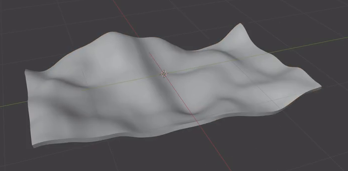
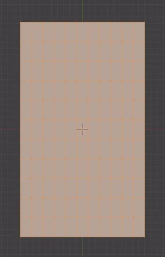
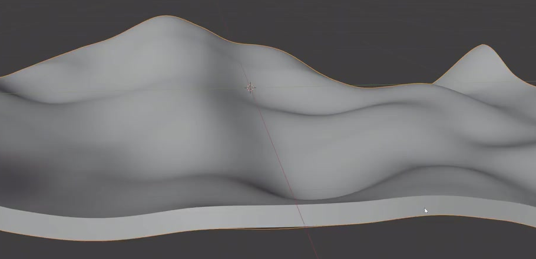

# Editable Wavy Sheet

Create a static rectangular sheet with broad, irregular hills and valleys, smooth flowing contours, and a thin continuous edge. Preserve procedural controls for the wave height, wave size, and sheet thickness.

## Starting Scene

Use Blender 5.1.2. No input assets are provided; `../input/` is empty. Start from an empty scene and create the sheet from a native rectangular plane. Use Cycles with GPU rendering for the final image.

## Rectangular Footprint

Keep the sheet recognizably rectangular when viewed along its average surface normal, with four corners and a length approximately 1.7 times its width. A length-to-width ratio of 1.5 to 1.9 is suitable. The deformation changes the height of the surface while preserving the elongated planar footprint.

## Broad Static Undulations

Form several broad, irregular peaks and troughs across the sheet. Include height variation in both planar directions, with larger raised regions joined by smooth low valleys. The perimeter should rise and fall with the same surface, including differently raised corners. Keep the wave heights subordinate to the sheet width so the result reads as a flexible sheet. The undulation must exist in the evaluated geometry and silhouette.

This is a static asset. No timeline animation or physical simulation is required.

## Thin Closed Edges

Give the entire sheet real thickness, with an upper surface, an underside, and a continuous rim joining them. Keep the thickness approximately uniform along the local surface normal and small relative to the sheet width; a nominal thickness of about 1% to 4% of the shorter footprint dimension is suitable. The rim must follow the bends without separating from the upper surface or filling the valleys into a solid block.

## Smooth Geometry

Use sufficient evaluated surface resolution for the broad curves and perimeter to remain smooth at the final viewing distance. Avoid visible polygon steps, unintended sharp folds, or shading breaks across the broad upper surface. Keep the thinner side rim readable as a separate edge of the sheet.

The evaluated sheet must form one connected closed shell, without holes, detached fragments, duplicate overlapping surfaces, or self-intersections. Inspect the underside and corners as well as the upper surface.

## Editable Procedural Controls

Keep the deformation and thickness editable in the saved scene. Native modifiers, a procedural geometry setup, or an equivalent reusable implementation are acceptable. Clearly identify the following controls through their labels or a short scene text note:

- **Wave height:** reducing this control decreases the peak-to-trough distance; zero produces a flat sheet while retaining thickness and footprint. Restoring it recovers the saved wavy shape.
- **Wave size:** adjusting this control changes the spatial size and spacing of the hills and valleys across the same footprint, without changing the sheet dimensions or nominal thickness. The saved setting must produce the broad undulations described above.
- **Thickness:** adjusting this control changes the rim depth throughout the sheet while preserving the upper surface wave pattern and footprint. Reducing and restoring it must not require rebuilding the mesh by hand.

Leave all three controls at the completed reference-like state when saving.

## Deliverables

Deliver the following files together:

- `submission.blend`: the complete editable scene, saved at the final static state with the procedural controls, a renderable camera view, and lighting that reveals the waves and rim. Use a restrained neutral surface appearance, and frame the complete sheet without cropping its corners.
- `build.py`: a Blender Python script that recreates the complete scene from an empty scene and explicitly saves the result as `submission.blend`. The saved file must reopen with the geometry, editable controls, and render setup intact. It must not depend on unavailable external assets or an existing solution file.
- `B113_Editable_Wavy_Sheet.png`: a PNG rendered from the actual submitted scene with Cycles GPU. Show the complete sheet from an oblique angle that reveals both its broad upper surface and a continuous section of the thin rim. Do not substitute a source image, viewport screenshot, or externally generated image.
