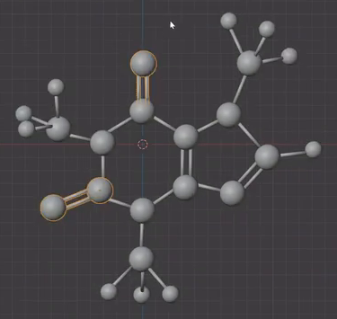
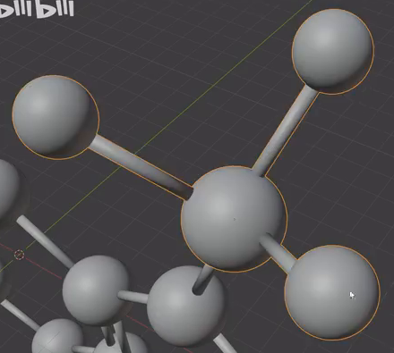
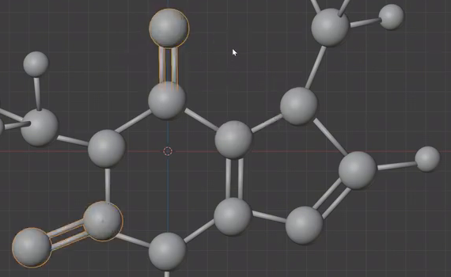

# Fused Ring Ball and Stick Molecule

Create an editable, static ball-and-stick molecule with a fused pair of rings, three outward three-tip groups, and clearly distinguishable single and double bonds. Match the structural arrangement in the references using round atom spheres and slender cylindrical bonds.

Overall arrangement of the central rings, terminal atoms, and three peripheral groups.

## Starting Scene

Use Blender 5.1.2 and Cycles with GPU rendering. Start from an empty scene. No external input assets are provided or required; `input/` is empty. Create the geometry with native Blender data. The reference images define the model's proportions and connectivity; no chemical labels or element-specific colors are required.

## Atom and Bond Shapes

Use solid, round spheres for the atoms. Keep the backbone spheres and peripheral group centers in a consistent larger size family. The three tip atoms of each peripheral group and the single far-right terminal atom must be visibly smaller.

Make the bonds straight cylindrical rods with a consistent slender thickness, clearly narrower than even the small atom spheres. Leave enough exposed rod length between neighboring atom surfaces for the ball-and-stick structure to remain legible.

## Fused Ring Backbone

Build a six-atom ring on the left and a five-atom ring on the right. The two rings share the two central atoms and the bond between them, producing nine distinct backbone atoms. Each ring must enclose a clearly visible opening.

Keep this backbone approximately planar, with the shared edge running roughly vertically in the main view. Preserve the broader six-sided left ring and the smaller five-sided right ring. Use the overall reference to place the remaining atoms around the two openings.

## Peripheral Groups

Attach three outward-facing groups: one to the upper-left atom of the six-atom ring, one to its bottom atom, and one to the upper outer atom of the five-atom ring. Each group has one large center connected to the backbone by a single bond, plus three smaller terminal spheres on three separate outward rods. Spread the tips into a readable fan with modest spatial depth, keeping the center and all three tips distinct.

Add three further terminal atoms: a large atom above the top of the six-atom ring, a large atom extending diagonally out from its lower-left corner, and a small atom extending rightward from the outermost atom of the five-atom ring. These are separate from the three-tip groups.

Oblique detail showing a group center, its three smaller tips, and its connection toward the backbone.

## Bond Order and Connections

Represent each single bond with one rod and each double bond with two visibly separate, parallel rods connecting the same pair of atoms. Include four double bonds: the shared central edge of the rings, the lower-right outer edge of the five-atom ring, the upward terminal connection, and the lower-left diagonal terminal connection. All other connections use single rods.

Every rod must enter both intended atom surfaces in three dimensions. Keep the exposed portions of double-bond rods parallel and spaced apart, with their ends contained by their two atom spheres. The complete molecule must form one connected assembly with no floating rods, isolated atom templates, accidental cross-links, or rods passing through unrelated atoms. Preserve the open spaces inside both rings.

Closer view of the two ring openings and all four double-bond locations.

## Finish and Editability

Give the atom silhouettes a rounded appearance and the cylindrical sides continuous shading, without conspicuous faceting, holes, inverted faces, duplicate surface flicker, or broken sections. Use a restrained neutral appearance so the geometry stays easy to inspect.

Keep the atom and bond geometry editable. Individual atoms and bonds must remain selectable as objects, mesh islands, or an equivalent editable representation. Each three-tip group must also be identifiable as a local set so it can be selected and moved together without changing its internal arrangement. A single joined mesh is acceptable when its parts remain accessible; rigid object-count or naming conventions are not required.

## Deliverables

Submit these three files together:

- `submission.blend`: the complete editable molecule, with a saved camera and render configuration that clearly shows both ring openings, all peripheral groups, and the four double bonds.
- `build.py`: a self-contained Blender Python script that recreates the scene from an empty scene and saves the recreated result as `submission.blend`. It must run without missing external resources and preserve the editable components and render setup in the saved file.
- `B114_Fused_Ring_Ball_and_Stick_Molecule.png`: a PNG rendered from the actual scene saved in `submission.blend`, at least 1200 pixels on its longer side. Frame the entire molecule with clear margins, use lighting that reveals the sphere and rod forms, and keep the key connections readable. Use the submitted scene itself rather than a reference image, viewport screenshot, or external replacement.
