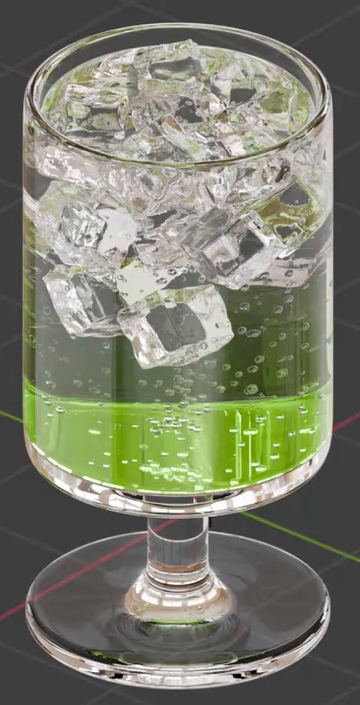
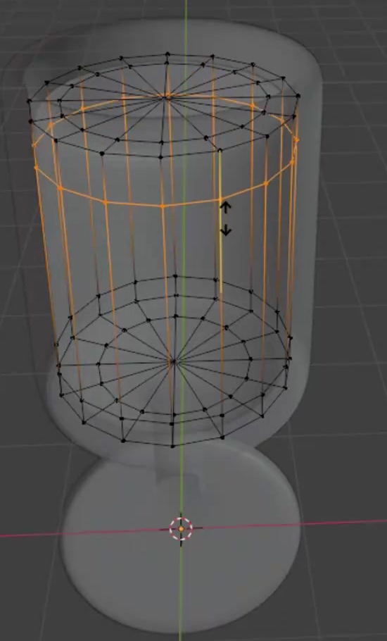
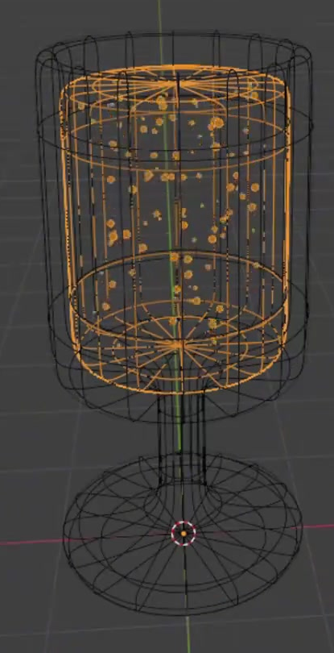
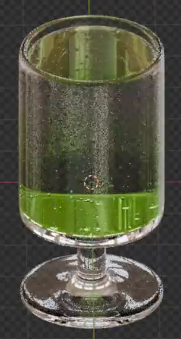

# Green Sparkling Water Goblet

Create a transparent stemmed glass filled with pale sparkling water. The drink has many small bubbles and a concentrated lime-green tint near the bottom that fades toward the top. Deliver a finished static scene with an editable bubble distribution.

The first reference includes ice from a separate example. Ice is optional and is not part of the required result.

## Starting Scene

Use Blender 5.1.2 and Cycles with GPU rendering. The input folder is empty. Start from a new scene and create the glass, liquid, and bubble geometry using native Blender geometry. No external models, images, textures, or add-ons are required.

## 1. Stemmed Glass Profile

Build an upright, rotationally symmetric glass. Its main cup body is approximately cylindrical and taller than it is wide. A short, narrow stem connects the body to a broad, low circular foot. Keep the body, stem, and foot centered on the same vertical axis, with rounded transitions at their junctions.

The cup body should dominate the silhouette. The foot should be close to the cup body's width and provide a visually stable base. Preserve these proportions at any practical scene scale.

## 2. Hollow Vessel and Fitted Liquid

Give the glass an open mouth, a visible rounded rim, finite wall thickness, and an inner bottom above the stem. The inner and outer surfaces must form a coherent glass shell. Keep the vessel surfaces smooth and correctly oriented, without visible faceting, pinched rims, open tears, or overlapping surface layers.

Create a separate, closed liquid volume fitted inside the cup cavity. Its sides and bottom should follow the inside of the vessel. Its level top surface must remain below the rim, leaving a visible clear band of glass above it. The liquid must not extend outside the cup or down into the stem.

## 3. Editable Bubble Distribution

Fill the liquid with a dense but individually readable field of small, round bubbles. Distribute them through the interior volume, including different heights and depths. Avoid a flat sheet, a regular grid, or bubbles confined entirely to the surface. The bubbles should be much smaller than the cup width, with visible size variation and enough clear space to read the liquid between them. Keep the bubble geometry inside the liquid boundary.

Retain a reusable procedural distribution with independently editable controls for bubble amount, typical size, and size variation. Changing amount must change how many bubbles appear; changing typical size must change their general scale; changing size variation must change the spread of sizes. These adjustments must preserve the fitted interior distribution without manually moving individual bubbles. The saved scene must open directly on the finished static state. Timeline animation and a physical simulation are not required.

## 4. Transparent Materials

Make the vessel read as clear polished glass, with transmitted light, refraction, and controlled highlights that reveal its rim, wall, stem, and foot. The liquid and bubbles must remain visible through the cup.

The liquid should also transmit and refract light. Its lower region is a bright lime green, fading vertically into a very pale, nearly clear upper region. Keep the color tied to height within the liquid, rather than painted onto the camera view. Retain editable colors and an editable transition height or range so the concentrated green region can be moved while the liquid stays in place.

Give the bubbles a clear, glossy appearance with small reflective or refractive rims. They should read as transparent inclusions within the drink, rather than opaque beads, flat dots, or emissive particles.

## 5. Final Presentation

Compose a three-quarter view showing the whole glass, including the mouth and foot. Use lighting and a restrained background that make the clear silhouette, green concentration, and small bubbles easy to inspect. Keep the vessel upright and the liquid surface level. Avoid cropping the glass or obscuring it with glare. Helper objects and any separate bubble source must not appear beside the drink in the final image.

## Deliverables

- `submission.blend`: the editable scene, saved on its finished static state with the required materials, procedural controls, camera, and lighting.
- `build.py`: a script that recreates the scene from a new Blender file and explicitly saves the recreated result as `submission.blend` beside the script. It must retain the editable distribution and material controls and cannot depend on an existing solution file or unavailable external assets.
- `B115_Green_Sparkling_Water_Goblet.png`: a finished PNG rendered from the actual submitted scene using its saved camera. It must show the required glass, liquid, and bubbles. A source image, viewport screenshot, or externally substituted image is not an acceptable render.
