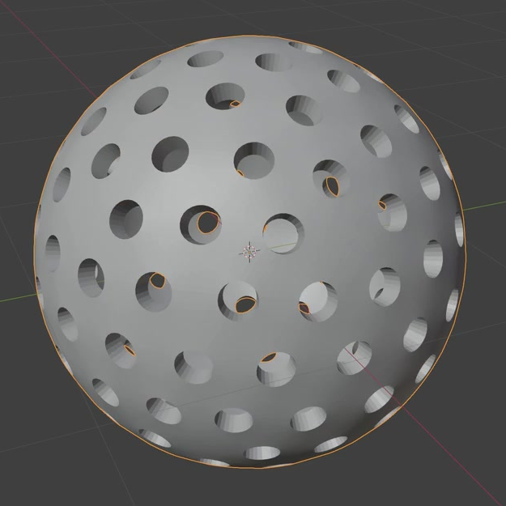
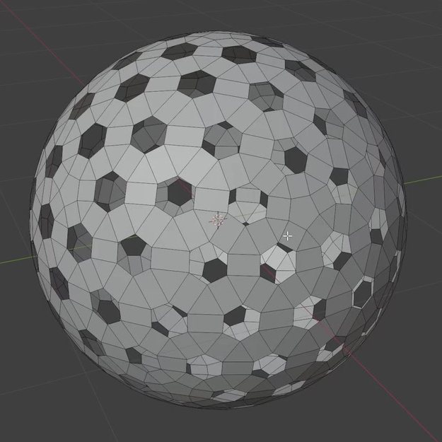
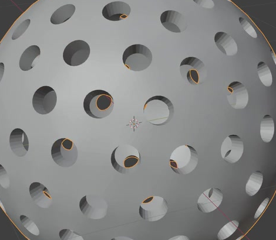

# Porous Nanoparticle

Create a hollow, nearly spherical particle covered with many separate, rounded through-pores. A continuous curved shell connects the openings, and each opening reveals a short wall leading into the shared empty interior. Keep wall thickness editable without rebuilding the pore layout.

## Starting Scene

Use Blender 5.1.2 and start from an empty scene. No input assets are supplied; `../input/` is empty. Build the particle from native Blender geometry. Use Cycles with GPU rendering for the final image. The particle may use any convenient overall scale.

## Spherical Form

Create one complete particle whose outer envelope is round from the front, side, and top. Its shortest overall dimension must be at least 90% of its longest dimension. Preserve a coherent spherical silhouette without broad flat areas, pointed poles, or large dents.

## Pore Layout and Shape

Provide at least 100 distinct through-pores distributed over the entire sphere, including the back and poles. Pores must occupy all eight octants around the particle center. Use a broadly regular distribution with comparable spacing, avoiding clusters separated by large unperforated patches. Occasional small solid sites are acceptable.

Most pore mouths should be round or softly rounded polygons, with their typical diameter about 5-9% of the particle's outer diameter. Inspect pore shape along its local outward direction rather than judging foreshortening at the silhouette. Neighboring mouths must remain separate, with visible shell bridges between them.

This reference shows the pore arrangement before final smoothing and thickening. The finished particle must have the rounded form and visible wall depth shown in the other references.

## Connected Hollow Shell

Make the particle one connected shell surrounding one common hollow interior. The shell must continue between pores across the whole particle, without disconnected fragments, accidental tears, loose geometry, or intersecting duplicate skins.

Give the shell a clear, broadly uniform wall thickness of about 3-5% of the outer diameter. Each pore must pass through the shell into the shared cavity and have a complete surrounding wall. Keep the cavity empty. The outer and inner surfaces must meet through the pore walls as a closed solid material volume, while the pores remain open passages.

## Editable Wall Thickness

Expose one clearly labeled wall-thickness control in the saved scene. It must change the actual shell and pore-wall geometry together. At 75% and 125% of the saved thickness, the shell must remain connected, the pores must stay open, and the outer silhouette and pore-center layout must remain essentially unchanged. Restore the saved thickness for delivery. A native modifier, node setup, or equivalent editable construction is acceptable.

## Geometry Finish and Presentation

Round the outer surface and pore mouths sufficiently that the main silhouette and most openings read as smooth curves. Surface normals must produce coherent shading on the exterior, interior, and pore walls, without broad faceting, black patches, or visible shading seams.

Use a simple opaque material and lighting that make the shell bridges, rounded mouths, and wall depth easy to inspect. Frame the whole particle with a small margin against a contrasting background. The final image must show the actual geometry clearly; color and decorative styling are unrestricted.

## Deliverables

- `submission.blend`: the complete editable scene, with the particle, working wall-thickness control, camera, lighting, and final render settings saved.
- `build.py`: a Blender Python script that recreates the complete scene from an empty scene and explicitly saves `submission.blend`. It must run without manual editing or external assets.
- `B116_Porous_Nanoparticle.png`: a PNG rendered from the actual submitted scene, showing the whole particle and readable pore depth. It must not be a source image, viewport screenshot, or externally substituted image.
