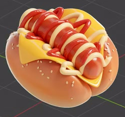
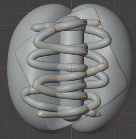

# Cheese and Sesame Hot Dog

Create a rounded, stylized hot dog with a split sesame bun, a central sausage, a draped cheese slice, and red and pale-yellow sauce strands. The result is a static, editable food asset with softly baked bread and glossy toppings.

## Starting Scene

Use Blender 5.1.2 and Cycles with GPU rendering. No external input assets are supplied; the `input/` folder is empty. Start from a clean scene and create all food geometry and materials with native Blender features. The reference images define the food's appearance and arrangement; they are not textures or render replacements.

## Bread and Sausage

Form two plump, elongated bun lobes with rounded ends and a continuous central channel. Keep their long axes aligned and their overall sizes balanced. The outer silhouettes should feel soft and inflated, with smooth shoulders and no sharp box-like corners.

Place a separate, solid sausage along the channel. Give it a thick, rounded cylindrical body with smooth closed ends. It should nest between the bread lobes while its upper surface and end caps remain visible. Keep the proportions compact and full, as in the references, and avoid floating gaps or large intersections that obscure the assembly.

## Draped Cheese

Place one broad, thin cheese sheet between the bread and sausage. It must bend down into the channel and drape over both inner bun shoulders, leaving exposed angular corners. Its folds should read as a flexible sheet resting on the food, with visible edge thickness that remains small relative to the bun. Keep the folds smooth and avoid torn surfaces, sharp spikes, or extensive intersections. This is a static shape; any modeling or deformation method that produces editable geometry is acceptable.

## Raised Sauce Strands

Add a red sauce strand and a pale-yellow sauce strand across the sausage. Both must have rounded three-dimensional cross-sections and continuous, repeated side-to-side bends extending along most of the sausage's visible length. Offset the two paths so their colors and individual loops remain readable.

Fit the strands closely to the upper food surfaces. They may cross and overlap locally, but must not hover as detached coils or disappear extensively inside the sausage. Use softly rounded or tapered terminations, and keep the sauce thin enough that the sausage and cheese remain visible. Preserve editable three-dimensional sauce geometry; curves or equivalent geometry are acceptable.

## Sesame Seeds

Scatter many small, raised sesame seeds across the exposed shoulders of both bun lobes, with multiple separated seeds on each side. Each seed should have a short, plump, tapered oval shape. Vary their orientations and spacing enough to avoid a rigid grid, while keeping their overall size coherent. Seat them on the bread surface and leave enough uncovered bread to read its rounded form.

## Food Materials

Give the bread a warm golden-brown baked appearance, with gentle lighter-to-darker variation and fine surface texture. Keep this variation subtle enough that the bun remains clean and soft rather than mottled, metallic, or visibly rocky. The existing bread surfaces must carry these materials in the final scene.

Use red-brown sausage, golden-yellow cheese, saturated red sauce, pale-yellow sauce, and light warm-colored seeds. Separate these materials so the food layers are distinguishable. Give the sausage and sauces soft, glossy highlights, the cheese a smooth surface, and the seeds a restrained matte-to-satin response. Avoid washed-out colors or highlights that erase the shapes. Use native materials without external texture files.

## Presentation

Show the complete hot dog from an elevated three-quarter view, with enough open space around its silhouette. Both bun lobes, the sausage, cheese corners, seeds, and both sauce colors must be visible. Use soft lighting and an uncluttered neutral background to reveal the rounded volume and layered construction. A simple ground or a floating presentation is acceptable. Keep the food large enough in the image for its seed and sauce details to be inspected.

## Deliverables

- `submission.blend`: the editable completed scene, including materials, camera, lighting, and render configuration.
- `build.py`: a Blender Python script that recreates the complete scene from a clean scene and explicitly saves the recreated result as `submission.blend`. Keep it self-contained and reproducible, with any randomness seeded. Include its invocation in a short comment at the beginning of the script.
- `B117_Cheese_and_Sesame_Hot_Dog.png`: a PNG at least 1200 pixels on each side, rendered from the actual submitted scene using its final camera. It must show the complete finished asset, not a reference image, viewport screenshot, or externally substituted picture.
