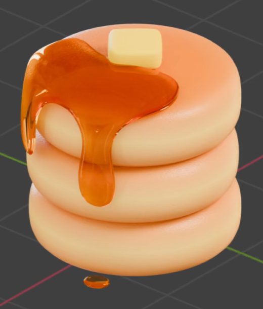
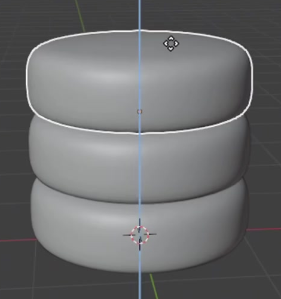
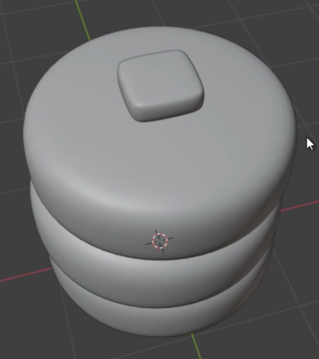
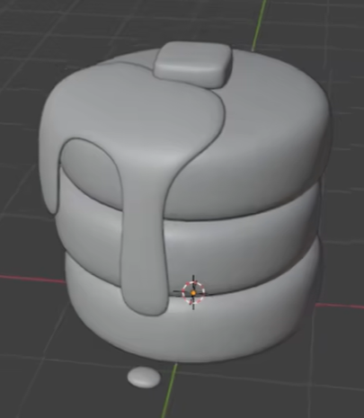

# Pancake Stack with Amber Syrup

Create a stylized stack of three thick pancakes topped with a small butter pat and glossy, translucent amber syrup. The syrup spreads across part of the top pancake, forms two unequal hanging drips, and has a small detached drop beneath the stack.

## Starting Scene

Use Blender 5.1.2 with Cycles and GPU rendering. Start from an empty scene and create the food geometry using native Blender tools. No external input assets are supplied; the input folder is empty. Use editable geometry and materials, with the pancakes, butter, syrup coating, and detached drop independently editable. This is a static scene.

## 1. Pancake Shape

Give the pancakes broad, filled circular bodies with substantially less height than width. Each should look thick and soft, with gently domed tops, rounded outer shoulders, and softly bulging sides. Keep the evaluated silhouettes smooth and the bodies closed, without a central hole, sharp cylindrical rims, or visible pinching. Use a consistent overall profile across the stack.

## 2. Three-Layer Stack

Arrange exactly three similarly sized pancakes in a compact vertical stack. Their centers should remain close enough that the stack feels balanced. Neighboring pancakes should touch or nearly touch while retaining three distinct horizontal layers. Avoid conspicuous air gaps or deep intersections that erase the layer boundaries.

## 3. Butter Pat

Place one small, squat butter pat on the top pancake, near the back of the syrup-covered area. It should retain a rounded rectangular outline, a broad upper face, softened corners, and visible thickness. Seat it convincingly on the pancake or syrup while leaving plenty of pancake visible around it. Give it a pale warm-yellow, opaque surface with soft highlights that remain distinct from the darker syrup.

## 4. Syrup Geometry

Create a thin, continuous syrup coating that follows part of the top pancake and leaves a substantial area of its upper surface exposed. Use an irregular, flowing boundary rather than a circular cap. Form two clearly separated, rounded hanging drips along the front and side: one longer and wider, reaching down over the middle pancake, and one shorter and narrower. Their tips should be smoothly rounded, and the coating should have visible thickness at its edge without looking like a rigid slab. Keep the syrup close to the pancake surface without visible clipping or an obvious hovering sheet.

Add one small, flattened, rounded syrup drop beneath and slightly in front of the stack, separated from the main coating. Treat it as a frozen static detail, consistent with the reference.

## 5. Food Materials

Give all three pancakes warm toasted orange-brown upper surfaces and a lighter creamy-yellow band around their sides. Blend these colors smoothly through the rounded shoulder so they read as baked food rather than painted stripes. Add fine, subtle, irregular surface grain that responds to light across the pancake surfaces. The grain should remain much smaller than the pancake thickness and should not break the soft overall form.

Give both the coating and detached drop the same warm amber syrup appearance. The syrup must show glossy highlights and partial transparency, allowing some underlying pancake color and form to remain visible through thinner areas. Preserve its visible tinted body and thicker rounded edges; it should not read as opaque orange plastic or disappear as an invisible sheet.

## 6. Presentation

Frame the whole food assembly from an elevated three-quarter view that clearly shows the top surface, butter, three pancake layers, both drips, and detached drop. Use a simple background and lighting that reveal the color transitions, fine grain, syrup highlights, and translucency. Keep every required part inside the image with clear separation from the background.

## Deliverables

- `submission.blend`: the complete editable scene, including geometry, assigned materials, lighting, and the final camera, ready to render in Blender 5.1.2 with Cycles GPU.
- `build.py`: a Blender Python script that recreates the complete scene from an empty scene and saves the resulting scene as `submission.blend`. It must recreate the geometry, materials, camera, lighting, and render settings without relying on an existing solution scene or unavailable files.
- `B118_Pancake_Stack_with_Amber_Syrup.png`: a PNG rendered from the actual scene saved in `submission.blend`, using the view described in Section 6. A source image, viewport screenshot, or externally substituted image does not satisfy this deliverable.
