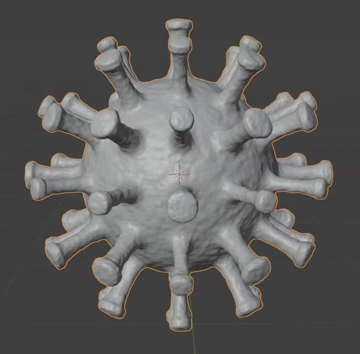
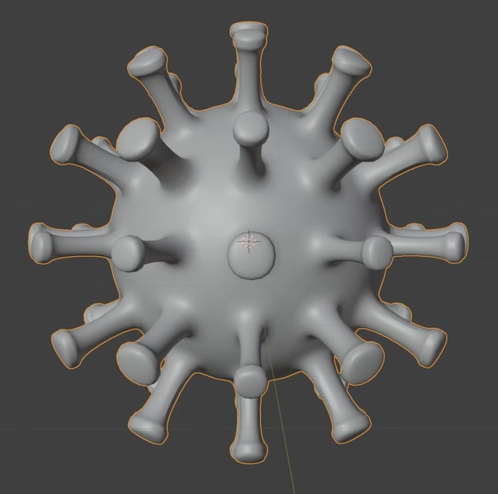
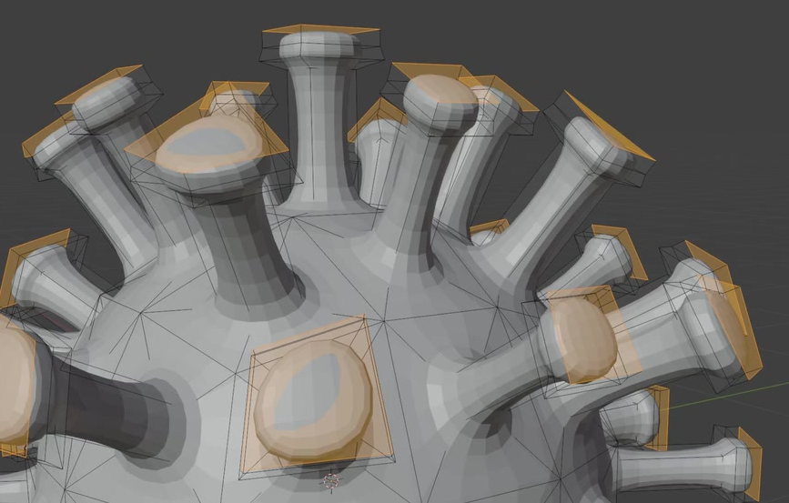

# Organic Virus Particle

Create a single stylized virus particle: a roughly spherical body surrounded by outward-growing stalks with rounded, flared tips. Give the complete surface fine organic unevenness while retaining a clear, editable underlying form.

## Starting Scene and Inputs

Use Blender 5.1.2 and start from an empty scene. The `input/` directory is empty; no external model, image, texture, or extension is required. Construct the body and its protrusions from native geometry. Use Cycles with GPU rendering for the final image. This is a static modeling task.

## 1. Spherical Body

Build a compact, rounded central body whose three principal dimensions are broadly similar. The body must remain a readable, continuous volume beneath the protrusions, with exposed surface between their roots. Its silhouette may be gently organic, but it must not become a flattened disc, a hollow ring, or a collection of separate lobes.

## 2. Radial Stalk Field

Cover the body with a repeated field of stalks extending away from its center. Populate the front, back, upper, lower, and lateral regions so that the result reads as a three-dimensional particle from every direction. Keep the spacing broadly even, with visible gaps between neighboring stalks; do not leave an entire hemisphere bare or confine the stalks to a single band.

Give the stalks substantial length relative to their width, while keeping them subordinate to the body. Each stalk should have a narrower middle and a gently widening root. The stalks should belong to a consistent family of lengths and thicknesses, with their individual directions following the local outward direction of the body. Preserve clear body, root, shaft, and tip regions.

## 3. Rounded Flared Tips

Finish the stalks with expanded terminal caps wider than the nearby shaft. The caps should have visible thickness, rounded shoulders, and a softly flattened or gently domed closed end. Their rounded square-to-circular outlines should create the characteristic club-like profile seen in the references. Keep each cap distinct from its neighbors and avoid needle points, open tubes, and thin sheets.

## 4. Connected Surface and Smooth Form

Make the body, stalk roots, shafts, and caps one connected closed surface. Roots should merge into the body without open seams, floating attachments, or overlapping internal shells. Keep caps closed and prevent foldovers and self-intersections.

With the fine relief disabled, the body and protrusions should have smooth silhouettes and continuous shading. Preserve rounded transitions at roots and cap shoulders without visible coarse facets, pinched creases, or collapsed shafts. Keep this underlying form inspectable in the saved scene.

## 5. Editable Organic Microrelief

Add fine, irregular relief across the body, roots, stalks, and caps. It must alter the actual evaluated surface geometry, including small silhouette variations in a close view. Use a dense, soft pattern of small bumps and shallow depressions, not large spikes or a regular tiled pattern. Keep its amplitude low enough that the spherical body, stalk gaps, and flared caps remain clearly recognizable.

Retain editable controls for relief amplitude and feature scale. Setting amplitude to zero must reveal the same smooth particle without removing its stalks or caps. Raising amplitude must increase the surface unevenness, and changing feature scale must change the size or density of the fine features without changing the underlying stalk arrangement. Save the scene with the intended subtle relief active.

## Deliverables

- `submission.blend`: the complete editable particle, its active relief, and a camera and lighting setup ready to render. Use a neutral clay-like surface and lighting that reveal the form without obscuring it in darkness or glare. Frame the entire particle with a margin around every tip.
- `build.py`: a script that recreates the complete scene in a clean Blender 5.1.2 session and saves `submission.blend`. The saved result must include the geometry, editable relief controls, material, camera, lighting, and render settings.
- `B119_Organic_Virus_Particle.png`: a PNG rendered from the actual scene saved in `submission.blend`, showing the whole particle clearly enough to assess the body, stalks, caps, and surface relief. Use a rendered scene image rather than a source image, viewport screenshot, or external replacement.
