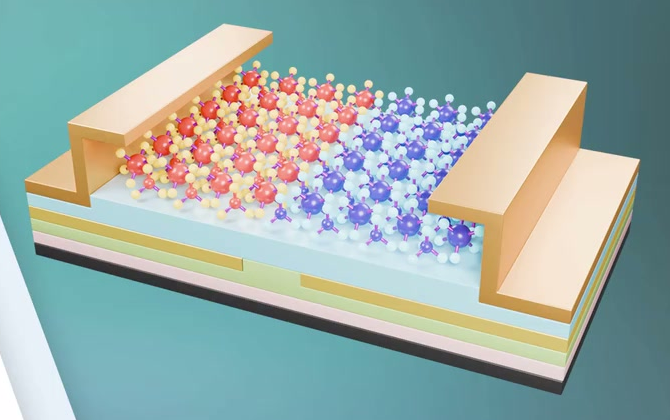
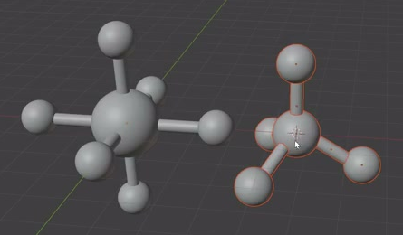
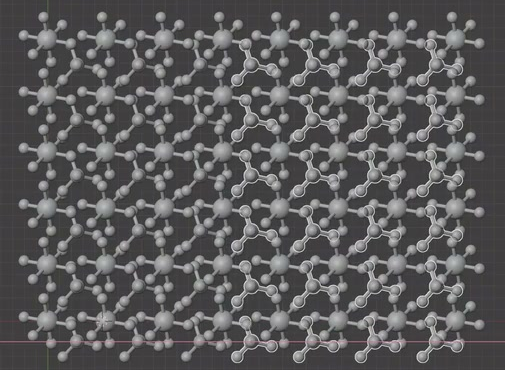
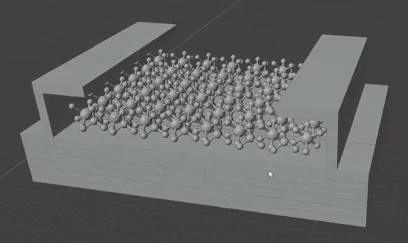

# 二维材料多层结构

用代码创建一件可编辑的二维材料示意模型：两种立体球棍单元在平面方向规则重复，置于多层薄板基底上，两侧有成对抬高并向内伸出的长条构件。成品用颜色区分原子区域、基底层和侧向构件。

图 1：完整的球棍阵面、多层基底和两侧折形构件。颜色用于区分结构，不要求对应特定化学元素。

## 起始条件

- 目标环境为 Blender 5.1.2，从空场景开始。
- `input/` 为空，不需要外部模型、图片、贴图或第三方插件。
- 本任务交付静态资产。整体尺度自行选择；如需渲染预览，使用 Cycles GPU。
- 参考图中的画面透视和界面不属于模型。形态与功能以以下要求为准。

## 1. 两类立体球棍单元

晶格内保留两种可辨认的单元：

- 第一类有一个较大的中心球，向三个近似正交的方向各伸出一对相反的键杆，共六个带端点球的分支。端点球明显小于中心球，六个分支在三维空间展开。
- 第二类有一个中心球和四个带端点球的分支，呈一个向上、三个向周围展开的立体布局。三个周向分支大致均匀分布；中心球不小于端点球。

图 2：两类单元的立体形态。某些分支会因视角被中心球遮挡，应能转动视角检查完整结构。

每根键杆是有圆形或近圆形截面的实体细杆，粗细均匀，且明显细于端点球。杆两端与所属球体接触或少量嵌入，没有可见缝隙、悬空末端或穿出球体另一侧的长刺。球体和杆体在正常近景下轮廓平滑，无明显分面、破损阴影或重面闪烁。

## 2. 规则的二维阵面

两类单元沿两个独立的平面方向重复，组成近矩形阵面；主中心球的位置至少形成六行、每行六个的规则分布。两类单元在阵面内部交错出现，第二类位于第一类之间的空隙区域，不能把两种中心球全部叠在同一格点。

图 3：两个方向的重复节距和交错关系。单元自身保留立体起伏，整体沿平面方向铺开。

同类单元的尺寸、朝向和重复节距一致，边缘排列整齐，没有随机漏掉的内部单元或孤立散件。相邻单元的端点可以靠近或共用；应保持各个球和杆清楚可辨，避免大面积重叠成实心块。

## 3. 多层基底与成对侧壁

阵面下方有一组平行的矩形薄板。正面和侧面至少能辨认四个真实有厚度的板层；各层主体平直、边缘规整，层叠紧密且轮廓对齐。顶层完整承托阵面的投影范围，球棍结构可贴近顶面，但不能埋入板内或穿出基底底面。相邻板层应由端面或材质边界清楚区分，不能用一块板上的条纹替代层叠几何。

两侧各有一条沿阵面边缘延伸的长构件，二者大小、长度和高度相称。每条构件由贴合基底的下部、竖直侧壁和向阵面内侧伸出的水平顶沿组成，端部可看出折形截面。侧壁高于球棍阵面，顶部保持平直；两侧之间留有足够开口，使中部晶格从斜上方可见。构件与基底接合处没有悬空断缝。

图 4：未着色状态下的整体几何。薄板层叠、侧壁和向内伸出的顶沿都应具有实际厚度。

## 4. 可编辑的二维重复

保留驱动两类单元重复分布的结构，使两个平面方向的重复数量和节距可以在 `.blend` 内调整。可使用原生阵列、实例系统、Geometry Nodes 或等效方式；单元可合并为一个网格，不限定对象数量、节点数量或控件名称。

在文件内简短标明两类单元的重复设置位置、两个方向对应的数量与节距，以及交付默认值。原生修改器字段可以直接作为编辑入口。

- 分别对两个方向增加一个重复位置时，相应阵面沿该方向扩展；既有内部单元的大小、形状、节距和另一方向分布保持不变。两类单元都应能通过各自或共同的重复设置产生这一变化。
- 分别将一个方向的节距设为默认值的 `1.2` 倍时，该方向中心格点间距相应增大，允许 `10%` 的相对误差。单元自身大小、分支形态、重复数量和另一方向节距保持不变。
- 调节后恢复默认值，应恢复交付布局，无需重新运行构建脚本或逐个移动副本。调整测试可以临时隐藏承托结构；基底和侧壁无需自动扩缩。

## 5. 可区分的材质

球棍阵面有并列的暖色和冷色区域，分别以红橙和蓝紫一类的颜色作为主中心球颜色；每个区域都保留两类球棍形态。端点球使用更浅的黄白或青白色，使大中心球、端点和细键杆容易分辨。色块不能仅来自视口随机颜色，必须由实际赋给几何的材质产生。

顶层基底呈浅青或近白色，相邻下层至少通过不同明度或色相形成清楚的层次；底层较深。两侧折形构件呈暖金色或浅黄色，与原子区域及基底可区分。材质不透明，表面保留柔和明暗变化；无需外部贴图，也不要求复刻背景、精确色值或金属参数。

## 6. 交付与重建

提交 `submission.blend` 和 `build.py`。脚本应能在 Blender 5.1.2 的空场景中重建并保存具有上述形态、材质和重复编辑能力的资产，运行方式写在脚本开头。所需资源由脚本生成或随文件保存，不依赖本机绝对路径或联网下载。

`submission.blend` 保存为正常可编辑状态，重复参数处于默认值，并保留前述设置说明。视口打开后能看到完整模型；相机、灯光和展示背景自行安排。

图片均为实际参考视频画面的裁切。本文的最少行列数、可辨板层数、调节幅度和误差范围属于本任务的验收约定。

## 渲染效果交付

在原有交付文件之外，另提交 `B11_二维材料多层结构.png`。图片采用 PNG 格式，从实际交付工程渲染，清楚展示主要成品及其形体或材质效果。使用本题规定的渲染环境；若原题没有指定展示相机，可设置能完整观察主体的相机。该文件应与 `submission.blend` 中的结果一致，不以参考图、视口截图或外部素材代替实际渲染。
