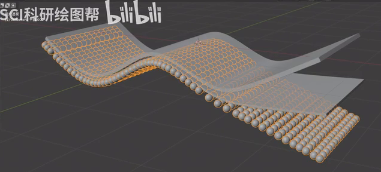
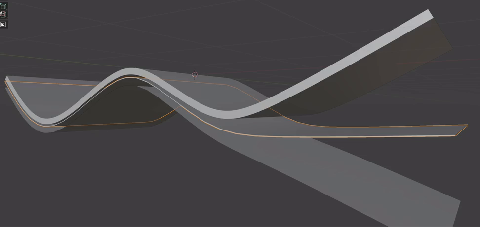
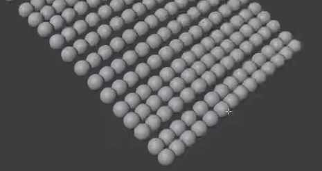

# Flexible Multilayer Wave Structure

Create a static, editable structure with two continuous solid wave films above a third layer made entirely of spherical beads. The three layers follow related bends along a common long axis and separate into a clearly fanned end.

## Starting Scene

Use Blender 5.1.2 and Cycles with GPU rendering. The input folder is empty. Start from an empty scene and construct the model with native Blender geometry; no external models, images, textures, or plugins are needed. This is a static asset, with no animation or physical simulation required.

## Two Solid Wave Films

Create two elongated, rectangular ribbon films. Each film must form a connected, continuous band with a clear crest and valley along its length. Keep the width direction broadly straight and the long edges approximately parallel, so the result reads as a bent sheet. Retain broad ribbon ends and smooth transitions through the bends.

Both films need real, thin solid thickness with continuous perimeter sidewalls. Their thickness must remain small relative to their width, and their broad faces must stay intact through the curved regions.

## Three-Layer Arrangement

Arrange the two films and one bead layer along the same long axis, with comparable widths and overlapping spans. Through the shared bends, the layers should follow related profiles and remain closely stacked but distinct. Toward one end, fan them apart: the top film rises, the middle film continues more nearly level, and the bead layer extends below them.

The final model has exactly these three visible structural layers. The bead carrier must not add a fourth visible continuous sheet. Keep the films above the bead layer and avoid layer crossings or penetrating surfaces. All three end regions must remain individually readable in an oblique view.

## Spherical Bead Layer

Fill the lower ribbon-shaped layer with a dense, two-dimensional array of equal-sized spheres. Their centers must follow its curved crest-to-valley profile. Arrange the spheres in coherent rows and columns across the width and along the length, covering the band from edge to edge and end to end.

Keep the spacing regular and compact, with each sphere individually recognizable. Avoid missing rows, isolated clusters, fused masses, or severe interpenetration. The outer rows should preserve the ribbon outline and the lower fanned tip.

## Editable Dependencies

Retain a live procedural relationship between the populated bead layer and an editable wave-shaped carrier or equivalent editable surface representation. Editing a local carrier region must move its corresponding bead rows automatically, preserve their ordering, and leave bead sizes and the two films unchanged. Keep the three layers independently editable.

Provide a single bead-size setting that updates the whole bead band while preserving the bead centers and carrier shape. Each film must also retain its own adjustable thickness, so its thickness can change without rebuilding its wave profile or modifying another layer. Equivalent live implementations are acceptable; the controls must operate on the submitted geometry.

## Geometry Finish

Give both films smooth broad faces and continuous curved silhouettes without conspicuous pinching, unwanted creases, or shading discontinuities. Keep their thin perimeter edges readable. Give the populated bead layer round sphere silhouettes and smooth surface shading. Avoid obvious faceting, inverted shading, or shading seams across the modeled surfaces.

Choose simple materials and lighting that make the sheet edges, bead shapes, and gaps between layers easy to inspect. No particular colors or decorative background are required.

## Deliverables

- `submission.blend`: the editable scene, including the three layers, their live dependencies, and the camera, lighting, materials, and render settings needed for the final image.
- `build.py`: a self-contained Blender Python script that recreates the scene from an empty scene and saves `submission.blend` when run in Blender 5.1.2. The saved result must retain the modeled geometry and live controls.
- `B120_Flexible_Multilayer_Wave_Structure.png`: a PNG rendered from the actual submitted scene. Frame the complete structure from an oblique angle so the films, bead rows, shared bends, and three diverging tips can be inspected. Use a clear background and do not replace the scene render with a source image, viewport screenshot, or external illustration.
