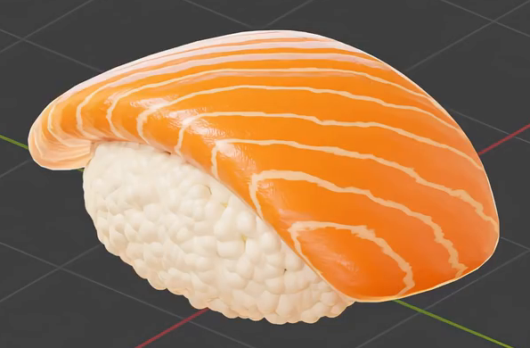
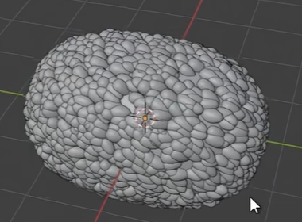
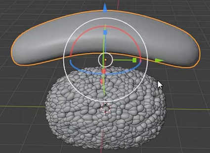

# Procedural Salmon Nigiri

Create one piece of salmon nigiri with a compact mound of individually modeled rice grains and a thin, gently arched salmon slice. The salmon should have warm orange flesh, narrow pale fat streaks, fine flesh relief, and a moist surface. Keep the rice distribution and fish material editable.

## Starting Scene

Use Blender 5.1.2 and Cycles with GPU rendering. The `input/` directory is empty; begin with a new scene and create the rice body, grain geometry, and salmon slice from native Blender geometry. Use procedural materials without external textures. Overall scale is free; preserve the proportions and visual relationships shown in the references.

## 1. Rice Form

Form a low, rounded oblong rice mound, longer than it is wide and wider than it is tall. Its silhouette should remain cohesive while the exposed sides and lower edge show many distinguishable grains.

Each grain must be a small solid oval with rounded sides and gently tapered ends. Give the grains smooth surfaces and enough volume to read as packed cooked rice, rather than flat flecks, sharp shards, or spherical beads. Small overlaps between neighboring grains are appropriate, but avoid prominent spikes or large gaps exposing the support body.

## 2. Editable Grain Distribution

Retain an editable instancing or generator relationship in the saved scene. Grains should follow the rice body's surface and cover the exposed mound densely, with modest variation in size and orientation. The result must consist of actual evaluated three-dimensional grains.

Editing the shared grain form must update the distributed grains. Provide editable amount or density and distribution-variation controls: changing density must repopulate the rice body, and changing the variation control must alter placement or orientation while preserving the mound's overall form. Keep the support surface and reusable grain form available for editing, with any isolated source grain excluded from the final image.

## 3. Salmon Slice

Create a broad, elongated, thin solid slice with rounded edges and a gentle central rise. Its ends should bend downward so the side profile forms a shallow arch. Maintain visible but small edge thickness, with a smooth continuous top and underside. Avoid a flat plate, paper-thin surface, deep block, sharp corners, or obvious faceting.

## 4. Salmon Surface

Apply an editable procedural material to the salmon itself. Orange flesh should dominate, crossed by repeated narrow cream-colored fat streaks. The streaks should run obliquely across the slice, with gently wavy boundaries and small natural variations in width and spacing. Continue the pattern over the curved top and visible edges without obvious seams or severe stretching.

Include two subordinate scales of flesh relief: a subtle directional variation associated with the larger streak pattern, and much finer elongated cellular or fibrous detail. Both must affect the surface's response to light while leaving the thin slice's silhouette intact. Keep the finer detail small enough that the larger fat streaks remain easy to read.

Give the flesh moist, nonmetallic highlights and a soft subsurface response, especially through thin edge regions. Preserve readable orange and cream colors; the salmon should retain its solid appearance without glass-like transparency or self-emission. Keep the meat and fat colors, streak spacing and direction, relief strengths, and subsurface amount editable.

## 5. Rice Surface

Apply a warm off-white material to the distributed grains, with restrained sheen and fine irregular surface relief. The texture must remain much smaller than a grain and should appear on neighboring grains throughout the visible mound. Preserve each grain's rounded shape and separation; avoid metallic reflections, chalky flat shading, or oversized crust-like bumps.

## 6. Assembly and Presentation

Place the salmon lengthwise over the rice. Its central underside should rest against the mound, with the curved ends and side edges extending slightly beyond the upper rice silhouette. Keep a substantial band of rice visible below the topping. The pair should read as one assembled piece, without a floating gap or deep penetration that hides most of either component.

Compose an elevated three-quarter view that shows the salmon's top, one long side, its drooping end, and the rice beneath. Use a restrained background and lighting that reveal both the fat streaks and individual grains. Keep the complete nigiri in frame, with enough detail and exposure to inspect the fine surface response. The scene is static; animation is not required.

## Deliverables

- `submission.blend`: the complete editable scene, including the working grain distribution, procedural materials, and final camera and lighting.
- `build.py`: a Blender Python script that recreates the complete scene from a clean Blender 5.1.2 session and saves the recreated result as `submission.blend`. It must not depend on a pre-existing finished scene or unavailable external assets.
- `B121_Procedural_Salmon_Nigiri.png`: a PNG rendered from the actual submitted scene using the final view. It must show the finished nigiri, rather than a source image, viewport screenshot, or external replacement.
