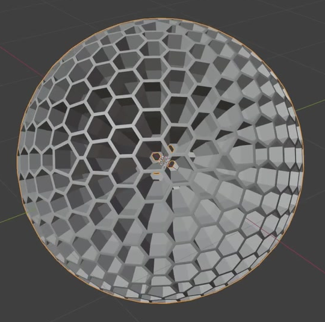
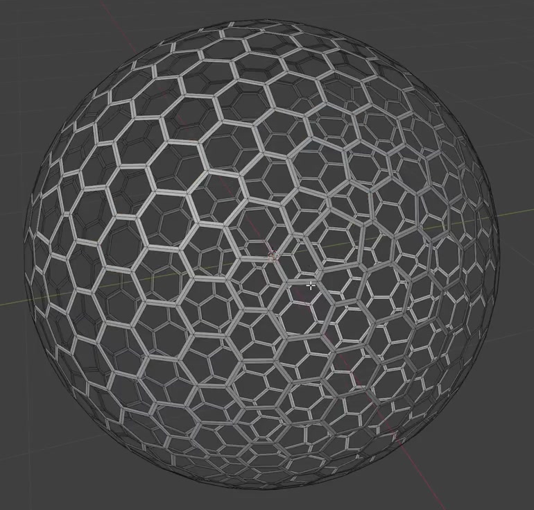
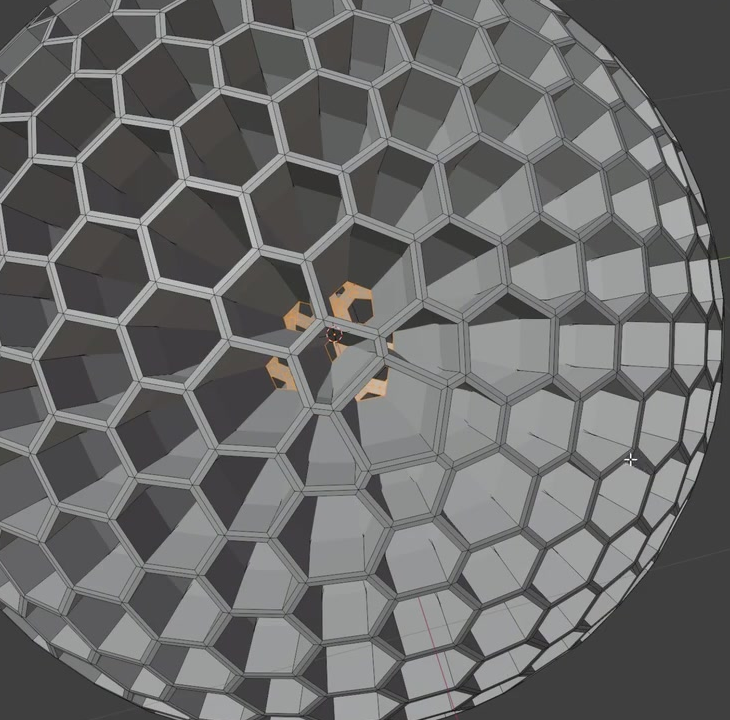

# Honeycomb Nanoparticle

Create a hollow spherical nanoparticle whose surface is a dense, continuous honeycomb web. The polygonal pores must pass through a thick shell, with inward-facing walls that make each pore read as a short tunnel. Preserve the rounded overall shape and the clear cell boundaries shown in the references.

## Starting Scene

Use Blender 5.1.2 and Cycles with GPU rendering. No input assets are supplied; the `input/` directory is empty. Begin with a clean scene and construct the particle from native Blender geometry. The subject is static, and its physical scale is unrestricted. Equivalent modeling methods are acceptable, provided the submitted result contains editable three-dimensional geometry.

## 1. Spherical Envelope

The particle must form a complete three-dimensional sphere, including its rear surface. Its silhouette should be approximately circular from three mutually perpendicular directions, without a flattened side, missing cap, or elongated axis. The outer rims of the pores should collectively follow the spherical envelope.

## 2. Honeycomb Layout

Cover the entire shell with closely packed polygonal cells. Six-sided openings should dominate, with occasional five-sided openings accommodating the spherical curvature. The pattern must remain dense and reasonably even around the particle: many dozens of openings should be visible in a straight-on view, and approximately ten to fourteen front-surface openings should span a central diameter. Preserve distinct polygonal corners and avoid large unperforated patches or abrupt changes in cell size.

## 3. Openings and Shared Web

Every pore must open into the central cavity. Looking through a suitably aligned pore should reveal the cavity and, where aligned, the rear shell or background. The pores must be actual geometric openings.

Neighboring pores must share narrow strips of solid material. These strips must connect continuously at their junctions and form one connected body around the sphere. Keep the strips comparatively even in width, with openings much wider than the surrounding web. Avoid isolated rings, floating fragments, and breaks between neighboring cells.

This reference establishes the cell layout and open passages. The final particle must also contain the deeper walls described below.

## 4. Inward Pore Walls

Extend the pore walls inward from the outer spherical envelope. A typical wall should reach roughly one quarter to two fifths of the particle's outer radius, leaving a substantial empty central cavity. The wall depth should be reasonably consistent around the shell, and the inner openings should narrow naturally as they approach the center.

Keep each passage open from its outer mouth to its inner mouth. The walls must have solid, closed edges and meet the shared web cleanly. They must not cross the center, intersect unrelated walls, or collapse into solid plugs. The result should remain a hollow perforated shell with deep polygonal tunnels.

## 5. Geometry Finish

Retain a clean, editable surface across the outer web, wall faces, inner rims, and cell junctions. Solid parts of the shell must be closed, with no unintended open seams, overlapping duplicate faces, inverted patches, or self-intersections.

The rounded envelope should shade continuously while pore corners and intentional planar wall faces remain clearly defined. Avoid distracting normal discontinuities, black shading wedges, or a softened appearance that erases the honeycomb pattern.

## 6. Presentation

Present the entire particle with comfortable space around its silhouette. Use a simple opaque neutral surface, an uncluttered background, and lighting that separates the narrow outer web from the darker inward walls. Show enough of the cavity to make the openings and wall depth readable. The PNG must be at least 1024 pixels on its shorter side.

## Deliverables

- `submission.blend`: the completed editable particle and the scene used for the final image, with the intended camera and render settings saved.
- `build.py`: a Blender Python script that recreates the complete scene from a clean start and saves the recreated result as `submission.blend`. The script must not depend on an existing finished scene or unavailable external assets.
- `B122_Honeycomb_Nanoparticle.png`: a PNG rendered from the actual submitted scene. It must show the completed particle described above; reference images, viewport screenshots, and external replacement images are not acceptable.
