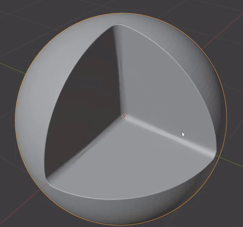
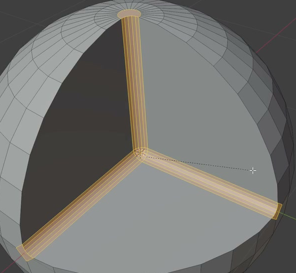
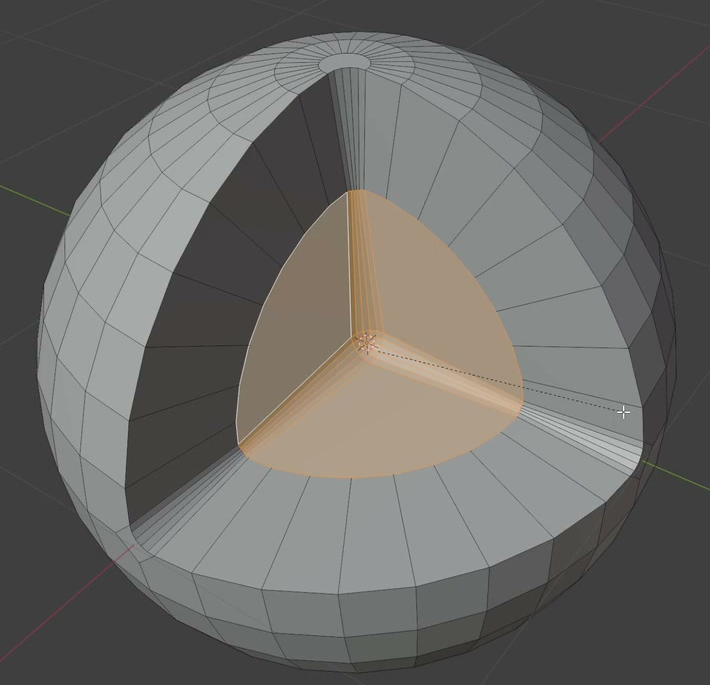

# Three-Direction Nanoparticle Cutaway

Create a static, editable spherical nanoparticle with a deep three-direction cutaway. Three broad interior section surfaces meet near the sphere's center, while narrow rounded transitions soften the central junction and the curved opening perimeter.

Reference form: a nearly spherical body with a rounded triangular opening and three clearly readable interior surfaces.

## Starting Scene

Use Blender 5.1.2 and Cycles with GPU rendering. Start with an empty scene and create the particle from native Blender geometry, such as a UV sphere. No external input assets are supplied; `input/` is empty. The particle's absolute size is unrestricted.

## Spherical Body and Opening

Keep a continuous, convex spherical exterior around the back and sides of the particle. The remaining exterior must read as part of one sphere, with comparable overall dimensions in all three directions.

Make one deep cutaway on the front-facing side. Its mouth has three broad curved boundary arcs that join at three rounded tips, producing the rounded triangular outline in the reference. The opening must expose the center of the particle and retain visible spherical exterior around it.

## Three Interior Sections

Fill the cutaway with three substantial, approximately planar section surfaces. Their main planes are approximately mutually perpendicular. Each surface extends from the central junction to one curved segment of the opening perimeter, forming a broad sector rather than a narrow strip.

The three surfaces must meet in a single recessed central junction. Their pairwise intersections extend outward in three directions, creating a readable Y-shaped arrangement when viewed into the opening. This is a solid cutaway: the section surfaces close the interior, with no view through the body behind them.

## Rounded Transitions

Give all three internal intersection branches a narrow, finite-width rounded transition. These transitions join smoothly at the central junction and extend toward the three tips of the opening without gaps or overlapping folds. Keep the broad section surfaces legible beyond the rounded strips.

Reference detail: the three interior branches carry continuous transition strips that meet at the center.

Round the entire outer mouth where the section surfaces meet the spherical exterior. This narrow lip follows all three curved arcs and the three tips continuously, with a visually consistent width. It must remain distinct from the internal Y-shaped transitions and must not swell into a thick raised frame.

## Editable Surface Structure

Retain an inspectable inner boundary around the central portions of the three section surfaces, with a connected band of faces between that boundary and the outer mouth. The boundary surrounds the central three-surface group as one region. The band may be coplanar with the corresponding section cores; it must not introduce an extra recess or separate raised panels.

Reference detail: the central section region remains connected, and a surrounding face band leads to the outer opening.

Save the particle as one connected, closed, editable mesh surface joining the spherical exterior, section surfaces, and rounded transitions. Avoid disconnected filler panels, internal duplicate faces, self-intersections, and unintended holes. Any retained modifiers must evaluate to the intended form; equivalent editable modeling methods are acceptable.

Use consistent outward-facing geometry and smooth shading on the curved exterior and rounded transitions. Existing surfaces should have clean silhouettes and coherent shading, while the broad cores of the section surfaces remain visibly planar.

## Presentation

Use a simple opaque neutral material and lighting that reveal the spherical exterior, all three interior sections, and both kinds of rounded transition. Frame the whole particle from an oblique view into the opening, with clear margins and without unrelated props or text. Keep the interior readable instead of losing it in darkness or clipped highlights.

## Deliverables

- `submission.blend`: the editable particle, materials, lighting, camera, and render settings needed to reproduce the submitted image.
- `build.py`: a Blender Python script that recreates the scene from an empty scene and saves the resulting `submission.blend`. It must create the geometry and scene setup itself without depending on an existing solution file or external assets.
- `B123_Three_Direction_Nanoparticle_Cutaway.png`: a still image rendered from the actual scene saved in `submission.blend`. It must show the complete particle with the presentation described above, rather than a source image, viewport screenshot, or externally replaced image.
