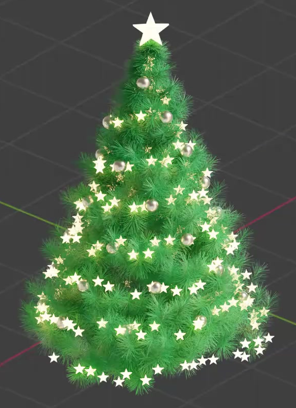
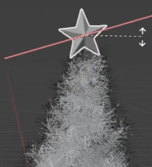
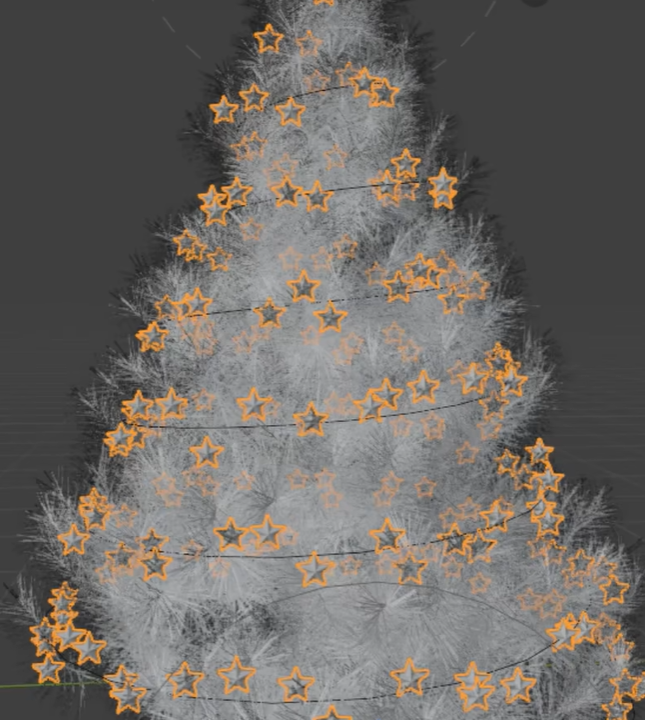
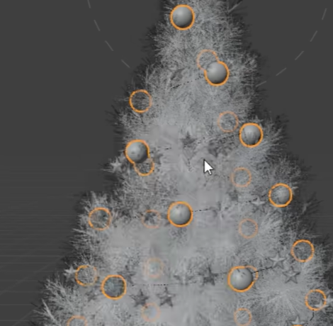

# Spiral Ornament Christmas Tree

Create an editable, dense green pine decorated with a large five-point star and two tapering spiral ornament arrangements: many small luminous stars and a sparser set of reflective spherical baubles. Deliver a static, fully decorated tree with the soft, finely needled silhouette shown below.

## Starting Scene

Use Blender 5.1.2 and Cycles with GPU rendering. No external input assets are supplied; `../input/` is empty. Begin with a clean scene and create the tree, ornaments, and procedural distributions from native Blender geometry or self-contained code. Equivalent tree-generation methods are allowed. The saved scene and rebuild must not depend on unavailable extensions, presets, image textures, or HDR images.

## Pine Structure and Foliage

Build a tall, upright pine with a broad lower canopy, progressively shorter upper branches, and a narrow tip. Its branching skeleton must include a central trunk, outward-reaching main branches, and finer offshoots that support the foliage throughout the tree's depth.

Cover those branches with dense clusters of slender needle-like geometry. The canopy should read as a full conical tree from the front and sides, while close views reveal individual needles and small gaps between clusters. Keep the irregular, feathery outer edge and branch-level depth; a smooth solid cone does not provide the required foliage. Maintain readable needle silhouettes without large bare patches or sheets of fused geometry.

## Dimensional Top Star

Place one prominent, upright five-point star at the tree tip. Give it real thickness and raised or faceted front and back surfaces, with softly finished edges that preserve the five sharp outer points. Center it over the tree and keep its lower point close to the tip so it reads as an attached topper. It must remain much smaller than the canopy width and clearly larger than the repeated star ornaments.

## Two Editable Ornament Spirals

Create two independently editable spiral distributions around the tree. Both should ascend through several complete turns from the lower canopy toward the tip, with the radius narrowing to follow the tree's outline. Ornament positions must occupy the tree's depth and continue around its back.

The first distribution carries many small, recognizable five-point stars. Arrange them densely enough to trace a winding garland while keeping individual silhouettes legible. The second carries a sparser set of round baubles. Keep both families near the outer branches, with enough exposure to remain visible among the needles; avoid detached rings far outside the tree or extensive burial inside it. The two ornament families should remain visually distinct.

Retain a functional relationship between each guide and its ornaments. Editing a guide's shape must reposition that family's ornaments, and changing its repetition density must update the distribution without manually relocating individual ornaments. Editing one family must leave the other unchanged. These controls may be stored in the scene or exposed as clearly labeled parameters in `build.py` that regenerate and save the scene. Use any equivalent procedural implementation that produces these behaviors.

Save a stable, fully populated decoration arrangement that is present immediately when the file opens and remains available after reopening. A particle-based implementation may freeze or bake its chosen arrangement, but must retain the editable regeneration behavior described above. This is a static scene; no timeline animation is required.

## Surface Treatment

Give the needles a rich green surface, with sufficient light and shadow variation to reveal their fine structure. Keep the foliage visually distinct from the decorations.

Use a warm pale-yellow emitting surface on the topper and repeated stars. Their brightness should read as self-illumination while preserving the star silhouettes. A subtle surrounding glow is optional.

Give the baubles a light metallic finish with broad, readable reflections and moderate softness. They should read as smooth reflective metal spheres against the green foliage, with visible tonal variation rather than flat white disks.

## Presentation

Frame the complete decorated tree in a front three-quarter view with margin around the topper and lowest branches. Use a restrained background and self-contained scene lighting or a procedural World. Make the foliage depth, warm stars, and reflective baubles readable together. Keep source objects, guide curves, and construction helpers out of the final image unless they are intentional visible parts of the decoration.

## Deliverables

- `submission.blend`: the complete editable scene, saved in its fully decorated static state with the intended camera, materials, lighting, and procedural controls available.
- `build.py`: a self-contained Blender Python script that recreates the scene from a clean starting state and saves the resulting `submission.blend`. Clearly expose any script-based ornament controls and identify the save location in the script.
- `B124_Spiral_Ornament_Christmas_Tree.png`: a Cycles GPU render from the actual submitted scene and its intended camera. The image must show the final tree, not a viewport screenshot, reference image, or external replacement.
