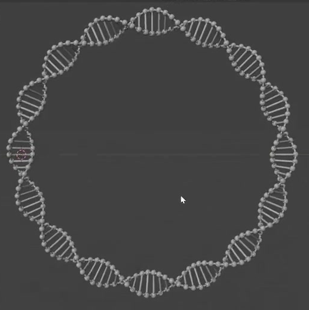
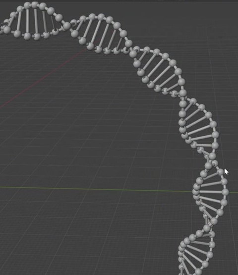
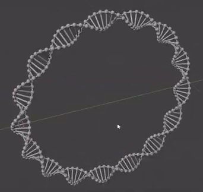

# Procedural Ring DNA

Create an editable ball-and-stick DNA double helix that follows a closed circular path. The result should have a large open center, repeated twisting rungs, rounded joints, and a live geometric construction that remains coherent when its proportions change.

## Starting Point

Use Blender 5.1.2 and begin with an empty scene. The input directory is empty; no external assets are provided or required. Build the structure from native geometry. Use Cycles with GPU rendering for the final image.

## Closed Double Helix

The default result is one complete circular DNA ring with two distinct backbones winding around a common circular centerline. Each backbone makes eight complete helical turns during one traversal of the ring. A turn means a full rotation around the local centerline, not one lens-shaped region in the front projection.

Keep the ring's outer diameter approximately 8 to 14 times the maximum separation of the backbone centerlines. The center must remain clearly open. The two backbones should stay opposite one another around the local centerline, with consistent twist direction and an even progression of turns. They pass in front of and behind one another in three dimensions rather than meeting at the apparent crossings of a flat drawing.

Both backbones must close smoothly. The join must have the same spacing and twist phase as the surrounding structure, without a gap, an overlapping duplicate section, an abrupt kink, or an extra bead cluster.

## Beads and Rods

Represent each backbone as regularly spaced spherical joints connected by round rods. Pair corresponding joints across the two backbones with repeated transverse rungs. The rungs rotate with the helix and remain distributed around the entire ring. There should be several clearly separated rungs within every full turn; preserve the dense, orderly rhythm in the references without turning the structure into a continuous sheet.

Use a consistent bead size and a consistent rod thickness across the ring. Bead diameter should be approximately 2 to 3.5 times rod diameter. Rods must extend into their joint spheres, leaving no visible air gaps. Along the backbones, neighboring spheres must remain individually readable with a visible rod span between them. Avoid unrelated floating beads, unsupported rods, and filled surfaces between the rungs.

## Live Geometric Controls

Retain a live construction in the saved scene that derives the bead positions and rod connections from the same editable double-helix structure. The evaluated result must update inside Blender without rerunning the delivery script or manually repositioning repeated pieces. Equivalent native implementations are acceptable.

Provide identifiable controls for ring size, backbone separation, whole helical turn count, bead radius, and rod radius. The ring-size control must change the circular centerline size while preserving bead and rod radii. Changing ring size or backbone separation by approximately 20%, or changing the turn count from eight to six and then ten, must preserve a closed ring and keep the joints and connecting rods attached. The number or placement of repeated elements should adapt as needed to maintain readable rungs.

Bead radius and rod radius must also be independently editable. A 20% change to either must update that component throughout the structure while leaving the other component's radius and the underlying joint-center arrangement unchanged. These thickness adjustments must preserve bead-to-rod contact. Restore the default eight-turn ring and reference proportions before saving the final submission.

## Geometry Finish and Presentation

Use rounded bead silhouettes and circular rod cross-sections with smooth shading. On a close view of a populated curved section, both the beads and the rods should read as rounded solids without obvious low-sided silhouettes, broken normals, or shading seams. Keep the intended distinction between the spherical joints and cylindrical rods.

The presentation may use a simple neutral surface. Frame the entire ring against an uncluttered background from a near-frontal or mildly oblique angle that makes the open center and the twisting rungs easy to inspect. Use lighting that reveals the rounded forms. The final image must not crop the ring, collapse it to an edge-on line, or hide its construction with blur or heavy effects.

## Deliverables

- `submission.blend`: the saved, self-contained scene with the default eight-turn ring, working geometric controls, and a render-ready camera and lighting setup.
- `build.py`: a script that recreates the scene from an empty Blender scene and saves the resulting scene as `submission.blend`. It must require no unavailable external assets or manual construction steps.
- `B125_Procedural_Ring_DNA.png`: a finished still image rendered from the actual submitted scene. Do not substitute a reference image, viewport screenshot, or externally assembled depiction.
