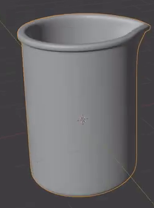
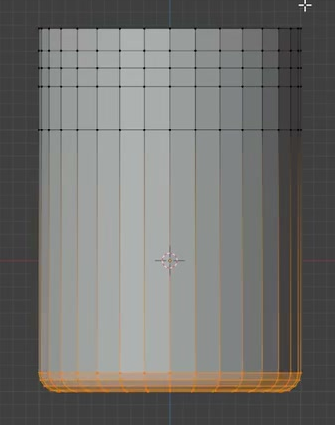
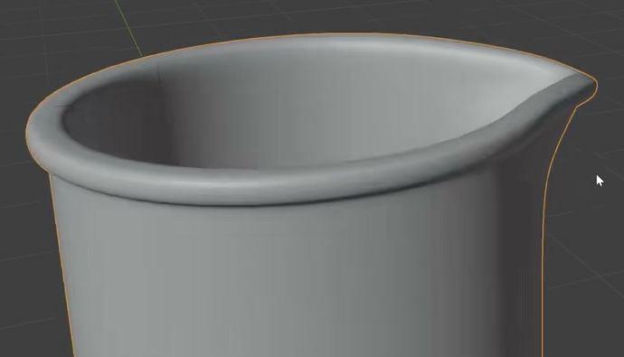

# Beaker with Pouring Spout

Create an editable laboratory beaker with a tall cylindrical body, a deep open cavity, real wall thickness, a rounded base, and a continuous thick rim that follows a single pouring spout.

## Starting Scene

Use Blender 5.1.2. Start with an empty scene and create the beaker from a native cylinder or equivalent mesh geometry. No external assets are required; the `input/` folder is empty. This is a static geometry task. Use a neutral, opaque material and Cycles with GPU rendering so the form is easy to inspect.

## 1. Body and Open Cavity

Make the main body upright and approximately circular in horizontal cross-section. Its height should be moderately greater than its body diameter, matching the reference's tall, compact proportions. The long sidewalls should stay nearly vertical, with the outward deformation concentrated near the spout.

Leave the mouth fully open. A continuous interior should extend down into a deep cavity and terminate in a closed interior floor near the bottom. The result must read as a usable empty vessel, with no cap, filler, or unrelated geometry hiding the cavity.

## 2. Wall Thickness and Rounded Base

Give the vessel distinct inner and outer surfaces with visible, modest wall thickness. Continue that thickness around the body, across the bottom, and into the spout. Keep the walls thin relative to the body diameter and reasonably even through the main cylindrical region, without collapsed or crossing inner and outer surfaces.

Provide a broad, flat support area on the underside. Join it to the sidewall through a narrow rounded transition around the lower perimeter. The bottom should look stable while retaining a softened edge.

## 3. Pouring Spout

Extend one localized region of the mouth outward to form a clearly identifiable pouring tip. The opening and inner wall must continue into this extension. Shape a gently pointed, rounded tip with smooth shoulders returning to the circular mouth on both sides.

The spout should blend into the upper wall. Preserve the nearly cylindrical lower body and avoid turning the entire opening into an oval or stretching the full height of the vessel toward the tip.

## 4. Continuous Thick Rim

Form a rounded band around the entire mouth. It should project slightly beyond the wall and be visibly thicker than the adjacent wall section while keeping the opening generous.

Continue this band along both shoulders and around the spout tip without breaks, abrupt steps, or a detached ring. Maintain a consistent rounded profile through the ordinary circular region and a smooth transition through the spout.

## 5. Smooth Editable Geometry

Use smooth curved geometry and consistent surface orientation on the outer wall, inner wall, lower transition, and any completed rim and spout. Preserve the intended tip and rim profiles without coarse facets, unintended dents, pinched highlights, or abrupt shading seams.

Keep the vessel as coherent editable geometry. The body, interior, rim, and spout should remain locally editable, including the ability to adjust the spout profile without rebuilding the whole container. Direct mesh editing and equivalent non-destructive constructions are acceptable; no particular modifier or construction history is required.

## Deliverables

- `submission.blend`: the complete editable beaker scene, including the materials, lighting, and camera used for the image.
- `build.py`: a script that recreates the complete scene from scratch in Blender 5.1.2 and saves `submission.blend`. The saved file must contain the finished scene and remain usable after reopening.
- `B126_Beaker_with_Pouring_Spout.png`: a PNG rendered from the actual submitted scene using Cycles with GPU rendering. Show the whole beaker from slightly above at a three-quarter angle so the cavity, rim, spout, and rounded bottom edge are visible. Use clear lighting and a simple background. The image must be a scene render, not a reference image, viewport screenshot, or external replacement.
