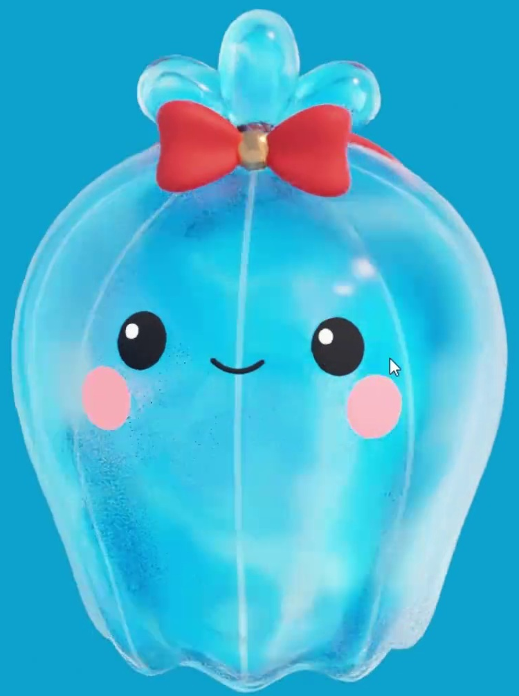
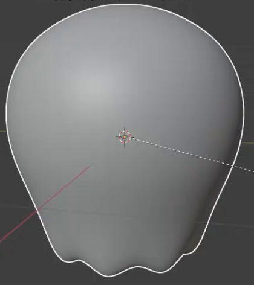
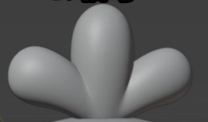
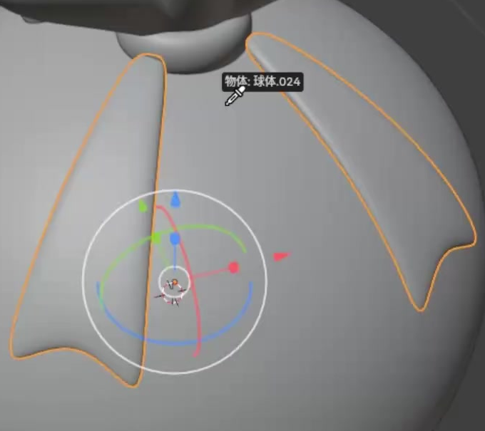

# Translucent Water Character

Create a small, cheerful water character with a rounded scalloped body, a glasslike outer shell, a blue three-lobed crest, and red ribbon accessories. The finished model should retain a clear face while showing layered, translucent water surfaces.

The reference establishes the silhouette, facial proportions, water appearance, and accessory colors.

## Starting Scene

Use Blender 5.1.2 with Cycles GPU rendering. The `input/` folder is empty. Start from an empty scene and construct the character from native Blender geometry and procedural materials. No starter model, texture image, or external add-on is required. The result is a static character; choose a consistent scale.

## 1. Body Shape and Layers

Make a rounded body with a broad domed upper half and a gently narrowing lower half. Its lower rim should undulate into several broad, soft scallops, with at least three rounded low points visible from the front. Give the body substantial depth and smooth curved surfaces.

Use two separately editable, closely nested body shells: an inner water body and a slightly larger outer shell. Both should follow the same domed and scalloped shape and have real wall thickness at their lower rims. Keep a small, consistent separation so the outer layer reads as a surrounding shell, without intersecting the inner surface or producing coincident-surface artifacts.

This body view isolates the main shape before the face and crest are added.

## 2. Face Geometry

Place two small oval eyes on the upper front of the body, each with a smaller raised highlight. Add two oval cheek patches below and outside the eyes, plus a short upward-curving smile between them. Use native geometry with visible depth for these details, fitted closely to the curved body surface. Keep the left and right features balanced, the smile centered, and all seven facial elements distinct.

## 3. Crest and Bow

At the top center, create a water-splash crest with exactly three plump teardrop lobes joined at a common base. The central lobe rises highest; the two shorter side lobes lean outward. The crest should have rounded depth and smoothly blended junctions.

Place a small bow in front of the crest base. It needs two padded wings that narrow toward a rounded central knot and widen toward their outer ends. Add a thin collar band around the crest base behind the bow. The bow must leave all three crest tips visible and attach naturally to the top of the body.

## 4. Rear Ribbon Strips

Extend two thin, broad ribbon strips from near the crest collar down the back of the body, one on each side. Follow the body's curvature, keep the strips slightly raised from its surface, and give them gently flared free ends with shallow concave cuts. Both strips need real thickness and should be recognizable from a rear or oblique view.

The rear view establishes the strips' placement, width, curvature, and shaped ends.

## 5. Water Surfaces

Give the outer shell a working transparent, glasslike material. The inner body must remain visible through it, while highlights and refraction reveal the shell and its lower rim. Its appearance should respond to the viewing angle. Keep the face readable through the complete layered result.

Give the inner body a live procedural water material with broad, irregular patches ranging from cyan-blue to pale icy blue. The pattern should cover the curved body continuously and remain visible through the outer shell. Retain a working pattern-size control and an editable two-color palette: changing the pattern size must change the visible patch sizes without changing the geometry.

Apply a matching translucent blue water finish to the crest. Its three lobes should remain identifiable within the highlights, and the crest's transparency must be adjustable independently of the body's materials.

## 6. Color and Presentation

Use dark eyes and a dark smile, bright white eye highlights, and pink cheeks. Color the bow wings, collar band, and both rear ribbon strips red. Give the central knot a warm golden color with a metallic sheen. Keep the accessories sufficiently opaque to contrast with the water surfaces.

Present the character against a simple cyan or blue background, with lighting that reveals transparency and soft highlights without washing out the face. Frame the whole character from a front or gentle three-quarter view, including the complete crest and scalloped rim.

## Deliverables

- `submission.blend`: the editable native scene, including geometry, working materials, camera, lighting, and render settings.
- `build.py`: a script that recreates the scene from an empty Blender scene and saves the result as `submission.blend`, including the procedural materials and their controls. It must work without unprovided external assets.
- `B127_Translucent_Water_Character.png`: a Cycles GPU render of the actual submitted scene, at least 1200 pixels on each side. Use the saved scene's geometry and materials for the image.
