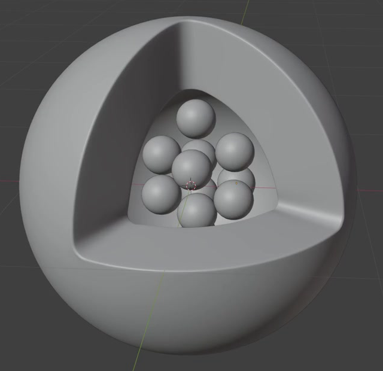
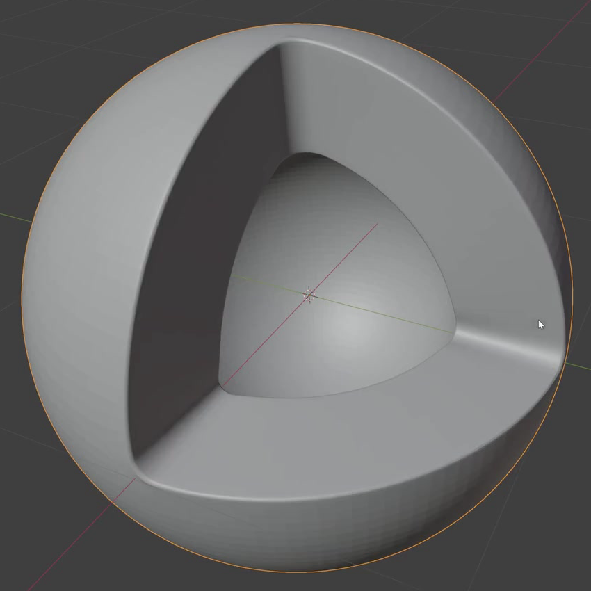
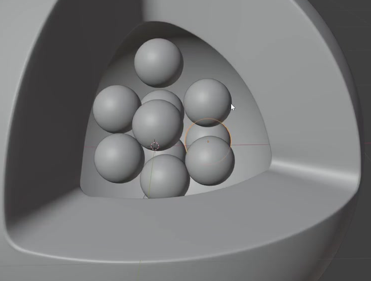

# Cutaway Drug Carrier Nanoparticle

Create a smooth, hollow spherical nanoparticle with one octant opened to reveal a compact group of spherical cargo particles. The shell should retain its rounded outer silhouette, show substantial wall thickness at the opening, and clearly contain the cargo within a curved inner cavity.

## Starting Scene

Use Blender 5.1.2. Start from an empty scene and create the geometry with native Blender tools. No input assets are supplied; the `input/` folder is empty. Any modeling method that produces the required editable geometry is acceptable.

This is a static modeling task. Use Cycles with GPU rendering for the final image. Simple neutral materials are sufficient.

## Spherical Shell and Octant Window

Make the main body spherical in three dimensions, with an evenly rounded exterior substantially larger than any individual cargo particle. Preserve the outer surface of approximately seven eighths of the sphere.

Open one octant: the missing region is bounded by three mutually perpendicular planes passing through the sphere's center. In an oblique view into this opening, its outline should read as a rounded triangular window. Keep the opposite side of the sphere intact, so the cavity has a curved back and the opening does not continue through the whole body.

## Hollow Wall and Rounded Rim

Give the shell a continuous inner spherical surface and a clearly separated outer surface. Join them around the entire opening with three broad rim bands. These bands occupy the wall thickness between the inner and outer surfaces; the central cavity remains open.

Keep wall thickness approximately uniform away from rounded transitions. The cavity must remain large enough to hold the cargo cluster, with a clear curved back visible between particles. Close the wall volume without cracks, missing rim segments, overlapping inner layers, or accidental internal partitions.

Round the inner and outer rim edges and the three corner transitions. The rounding should soften the edges while preserving the three-sided opening and visible wall thickness.

## Spherical Cargo

Create a group of distinct, similarly sized spheres, each visibly smaller than the shell cavity. Their round silhouettes should remain recognizable from different viewing directions. The exact total count is flexible; include enough particles for the cavity to read as carrying a populated cluster rather than a single token object.

Keep the cargo and shell separately editable. Each particle's placement must remain individually adjustable, either as a separate object or through equivalent editable instance or procedural data.

## Cluster Arrangement and Containment

Arrange the particles in an irregular compact group with at least two depth layers. Distribute visible particles through the upper, middle, and lower portions of the cavity. Use staggered centers and partial occlusion so that the group reads as three-dimensional rather than a flat row or a flat triangular pattern. Preserve recognizable individual spheres instead of merging them into one lumpy mass.

Place the full cluster inside the inner spherical envelope, with the spheres clear of the shell material. Light contacts between cargo particles are acceptable, but deep intersections should not destroy their separate round forms. Keep the three rim bands readable and allow the opening to reveal several particles at different depths.

## Surface Finish

Give the existing shell exterior, cavity, rim transitions, and cargo spheres clean curved silhouettes and consistent smooth shading. Avoid conspicuous faceting, spikes, pinching, inverted patches, and shading seams. Preserve the intended geometric transitions at the rim instead of smoothing the opening into an indistinct dent.

## Deliverables

- `submission.blend`: the complete editable scene, including the shell, adjustable cargo placement, materials, lighting, camera, and render settings.
- `build.py`: a self-contained Blender Python script that recreates the scene from an empty scene and saves the resulting scene as `submission.blend`. Reopening that saved file must retain the modeled result and its render configuration.
- `B128_Cutaway_Drug_Carrier_Nanoparticle.png`: a PNG rendered from the actual submitted scene. Use an oblique view into the opening that includes the full shell silhouette, the three rim bands, and the cargo's depth arrangement. Use lighting and a background that make the curved surfaces and cavity readable. The image must not be a reference image, viewport screenshot, or externally substituted result.
