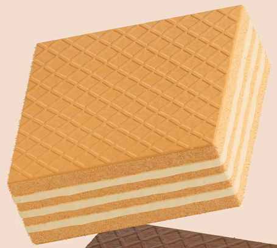
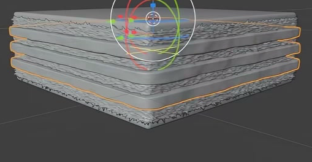
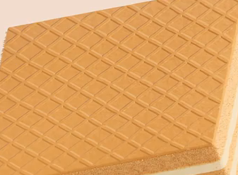

# Golden Cream Wafer

Create one square golden wafer with a shallow embossed lattice, crisp baked edges, and three pale cream bands. The finished asset should remain editable and read clearly as a compact, layered biscuit.

## Starting Scene

Use Blender 5.1.2 and Cycles with GPU rendering. The `input/` directory is empty; no external model, texture, or environment asset is provided or required. Begin with an empty scene and create the wafer from native geometry. Choose a convenient overall scale while preserving the proportions in the references.

## 1. Layered Wafer Geometry

Give the wafer a near-square footprint and a low, broad profile. The top and bottom should be matching thin outer sheets with subtly rounded edges and corners. Keep the major faces flat enough to read as pressed wafers, rather than inflated cushions.

Three continuous cream layers should divide the visible sides into four golden baked bands. Keep these bands parallel and regularly spaced, with aligned footprints and complete corners. The cream should reach the side surfaces so that the alternation remains readable around the wafer. The baked bands may belong to one continuous core or several pieces; the visible result must have no open gaps, flickering overlaps, or abruptly truncated filling strips.

## 2. Crisp Edge Character

Give the exposed baked sides fine, irregular crumb-like contours that affect their actual silhouette. Their roughness should be small relative to the wafer thickness and should preserve the square outline. Keep the thin outer sheets more orderly than the coarse baked core.

The cream layers should have gentler, rounded undulations along their edges. Avoid large spikes, torn corners, conspicuous facets, or shading breaks that overwhelm the small-scale texture. The baked and cream edges must remain visibly different in character.

## 3. Editable Filling Repetition

Build the three filling layers from a shared editable definition. A change to the source filling footprint or shape should propagate to every repeated layer. Provide one editable vertical-spacing setting that changes the intervals between the layers together, without introducing lateral drift or changing individual footprints. Preserve the intended three-layer appearance in the saved scene.

## 4. Wafer and Cream Surfaces

Cover the top sheet with a dense field of repeated, approximately square cells oriented diagonally to the wafer edges. The lattice should read as shallow pressed relief, with connected narrow ridges and lower cell interiors across most of the top. Introduce slight natural variation without losing the overall regular pattern. Surface shading, geometry, or a combination may create this relief; a flat color-only grid is insufficient.

Use a warm golden-orange color for the outer wafers and a related, slightly lighter baked tone for the exposed inner body. Give the baked surfaces fine granular texture and broad, soft highlights. The grain should remain smaller and subtler than the lattice, without overwhelming its cell boundaries.

All three cream bands should share a pale warm-yellow material that is clearly lighter than the baked body. Give the cream subtle fine surface variation and soft highlights, with a smoother appearance than the crumb-like baked sides. Keep the materials editable and applied to the intended visible surfaces.

## 5. Presentation

Compose a still image of the single wafer from above at an oblique angle, showing the top lattice and two adjacent layered sides. Keep the entire wafer inside the frame against a simple background. Lighting should reveal the shallow relief and distinguish the cream bands without clipping the pale highlights or burying the baked edges in shadow.

## Deliverables

- `submission.blend`: the complete editable wafer scene, materials, camera, lighting, and render settings.
- `build.py`: a Blender Python script that recreates the scene from an empty scene and saves the completed result as `submission.blend`. The saved file must retain the filling repetition and material editability described above.
- `B129_Golden_Cream_Wafer.png`: the final still rendered from the actual submitted scene. It must show the completed wafer, not a source image, viewport screenshot, or external replacement.
