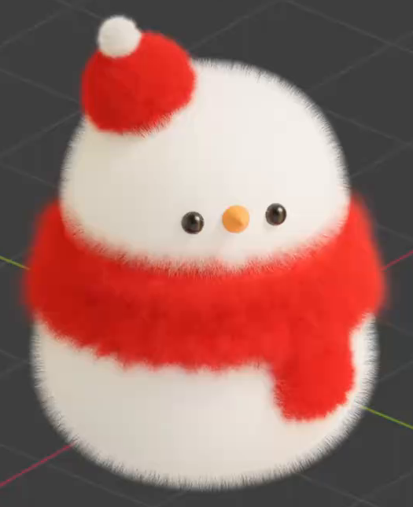
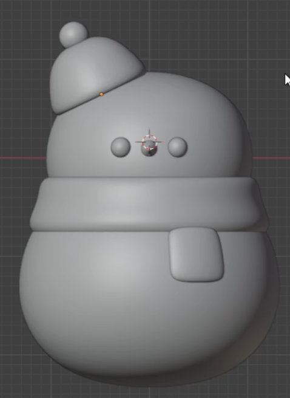
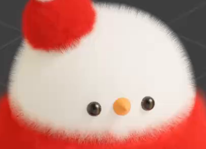

# 毛绒小雪人

用代码制作一个圆润的毛绒小雪人：较小的白色头部叠在饱满的身体上，戴一顶向侧面倾斜的红色小帽，帽顶有白色绒球；红围巾环绕颈部，并在正面一侧垂下一条短片。两只黑眼睛和一个短橙鼻从细密绒毛中清楚露出。

## 输入与交付

- 使用 Blender 5.1.2，从空场景开始；没有外部输入素材，`input/` 为空。
- 交付 `submission.blend` 和可从空场景重建结果的 `build.py`。脚本内说明运行方式；外部依赖应随交付提供，并使用相对路径或打包进工程。
- 使用 Cycles GPU 呈现最终材质，保存能完整查看成品的视角。使用能辨认白色、红色、黑色和橙色的中性照明；相机与灯光布置自由。
- 整体尺寸、世界朝向、对象名称和实现方法自由。参考图中的网格线、操作提示和界面元素不是模型内容。

## 1. 圆润的头身比例

雪人由上下叠放的两个圆润体量构成，头部明显小于身体，横向基本居中。身体饱满、略扁，下半部宽厚；头部也呈柔和的扁圆形。两者在颈部自然衔接，不悬空，不形成上下两球相互分离的效果。

暂时隐藏绒毛后，头身仍须是完整的三维形体，轮廓平滑，无明显折面、尖刺、破洞或异常凹陷。

## 2. 围巾与偏戴小帽

围巾是围绕颈部的宽厚环带，上下边缘柔和，贴合头身交界。一条有厚度的短垂片从环带正面一侧延伸到身体前方，末端圆钝，能与环带辨认出连接关系。围巾不能只是一块涂在身体上的红色区域。

小帽为有体积、向顶部收拢的圆顶帽，明显偏向头顶一侧，帽沿顺着头部贴合。帽顶连接一个小圆绒球。保持参考中紧凑、柔软的造型，帽体与绒球不悬空；灰模状态下，围巾与帽子的边缘也应圆润平滑。

## 3. 简洁立体五官

面部有两只大小相近、位置基本对称的小圆眼睛，以及位于两眼之间的短鼻子。眼睛贴在头部前侧，鼻子为朝前突出的圆钝锥形，侧面能辨认出其长度和收尖趋势。五官保持小巧，不能变成覆盖脸部的大块装饰。

眼睛与鼻子均为可从侧面确认的立体部件，外形平滑，与脸部合理接触。

## 4. 分区配色与毛绒质感

头部、身体和帽顶绒球为白色；帽体、围巾环带及垂片为红色；眼睛为黑色，鼻子为橙色。颜色须实际分配给相应部位，绒毛颜色与其覆盖区域一致。眼睛呈光滑、略有高光的质感，与周围柔软的毛绒形成区别。

白色和红色区域都具有细密、短而蓬松的纤维覆盖。近看能分辨绒毛的方向变化，沿轮廓能看到轻柔的毛边；远看仍保留头身、帽子与围巾的清晰体量。允许采用毛发曲线、几何或其他等效实现，但须在转动视角后继续呈现毛绒体积与轮廓，不能仅靠平面噪点或模糊图像伪装。

## 5. 面部可读性与绒毛边界

面部绒毛应避让眼睛与鼻子：在正面和略侧面的成品视图中，两只眼睛及橙鼻都清楚可辨。五官之间仍保留连续的白色毛绒，不出现大片剃光般的裸露区域，也不让长毛跨过眼睛、缠成团块或连成遮挡五官的毛帘。

## 6. 可编辑结构与复现

头部、身体、围巾、帽子与五官应有明确可选择的编辑范围。能单独改变围巾颜色，也能调整帽子与其绒球的摆放，而不会意外改变头身或五官；允许用独立对象、可选择网格区域或有效参数实现。

`build.py` 应在空场景中重建这些形体、配色和绒毛效果，并保存 `submission.blend`。若使用随机分布，固定随机种子或等效方式，使重建后保留相同的主要轮廓、毛绒覆盖和面部可读性。工程移动到其他目录后仍能解析所需资源。

## 渲染效果交付

在原有交付文件之外，另提交 `B12_毛绒小雪人.png`。图片采用 PNG 格式，从实际交付工程渲染，清楚展示主要成品及其形体或材质效果。使用本题规定的渲染环境；若原题没有指定展示相机，可设置能完整观察主体的相机。该文件应与 `submission.blend` 中的结果一致，不以参考图、视口截图或外部素材代替实际渲染。
