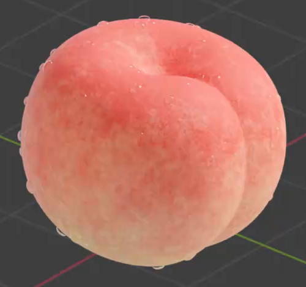
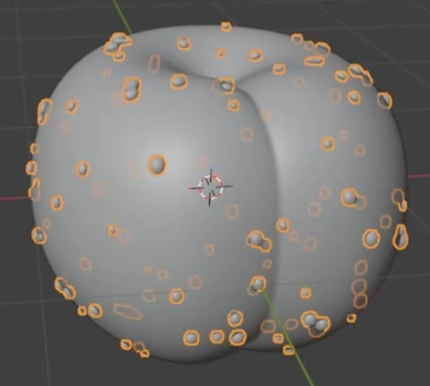

# Peach With Water Droplets

Create a softly rounded peach with a recessed crown, a continuous vertical seam, irregular pink-red and pale yellow skin, and clear water beads resting on its surface. The result is a static, editable asset presented in a close three-quarter render.

## Starting Scene

Use Blender 5.1.2 with Cycles GPU rendering. No input assets are provided; `../input/` is empty. Start from an empty scene and build the peach and droplets from native Blender geometry. Create the skin appearance with editable materials. Choose any convenient overall scale and preserve the reference proportions.

## 1. Peach Body

Make one continuous, closed, volumetric peach body. Give it a broad, full middle, rounded shoulders, and a gently narrowing lower region. Its overall proportions should be approximately as tall as it is wide, with enough depth to read as a fruit from a side view.

Form a localized depression in the crown and a recessed seam that descends from it along a visible side toward the base. The seam should separate two softly bulging lobes without splitting the body into detached pieces. Keep the large surfaces and silhouette smooth while preserving the crown and seam as geometric features.

## 2. Surface Droplets

Distribute multiple small water beads over the crown, broad front flank, and lateral sides. Vary their sizes, spacing, and round-to-oval outlines. Include some gently elongated or merged bead shapes among the smaller rounded ones, while leaving ample visible peach skin between them.

Each bead should be a raised, smooth volume with a convex cap and a flatter contact region against the local peach surface. Keep the beads seated on the curved skin, with no obvious floating gaps or detached source droplet beside the fruit. Beads should remain small relative to the peach and should not obscure the main seam. Their geometry must remain editable; either direct geometry or an editable distribution is acceptable.

## 3. Peach Skin

Use a warm coral-red and pink blush over the crown and upper flanks, blending irregularly into pale peach and yellow lower areas. The transitions should be broad and uneven, with finer mottling across them, rather than flat stripes or a single uniform color.

Give the skin a soft, mostly matte response with restrained highlights and fine, shallow surface relief. The detail should read as peach skin on curved regions at close range without becoming large lumps, deep cracks, or a glossy plastic shell. Keep the surface appearance continuous across the lobes and seam.

## 4. Water Material

Assign the visible beads a clear, nonmetallic water material. Peach color must remain visible through them, with localized refraction and small reflective highlights making the cap volumes legible. Avoid opaque white beads, solid dark spots, or a uniform glossy coating over the whole fruit. The skin and water must retain visibly different surface responses.

## 5. Editable Surface Controls

Preserve effective material parameters in the saved scene for the skin palette, the location or spread of the red-to-yellow transition, the scale of the fine surface detail, and its relief strength. Each control must visibly affect its intended property on the peach without changing the main fruit geometry. Existing shader parameters are sufficient; a custom interface is not required. Leave the saved scene in the reference-like appearance described above.

## 6. Presentation

Frame the complete fruit in a close three-quarter view that exposes the crown depression, the descending seam, and beads on both the front and side. Use a quiet background and soft, warm illumination that models the fruit volume while preserving the lighter skin tones. Keep enough highlight contrast to reveal the transparent beads without washing out the skin texture. The peach should be the clear focus of the image, with comfortable margins and no visible construction objects.

## Deliverables

- `submission.blend`: the complete editable scene, including the peach, water beads, effective surface controls, camera, lighting, and render settings.
- `build.py`: a script that recreates the complete scene from an empty Blender file and saves it as `submission.blend`. Reopening that saved result must reproduce the scene and its editable controls without missing external assets.
- `B130_Peach_With_Water_Droplets.png`: a static PNG rendered from the actual scene saved in `submission.blend`, using the presentation above. A source image, viewport screenshot, or externally substituted image is not a render submission.
