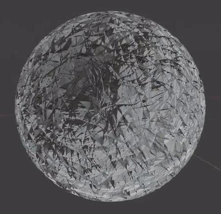
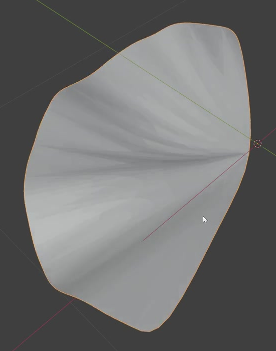
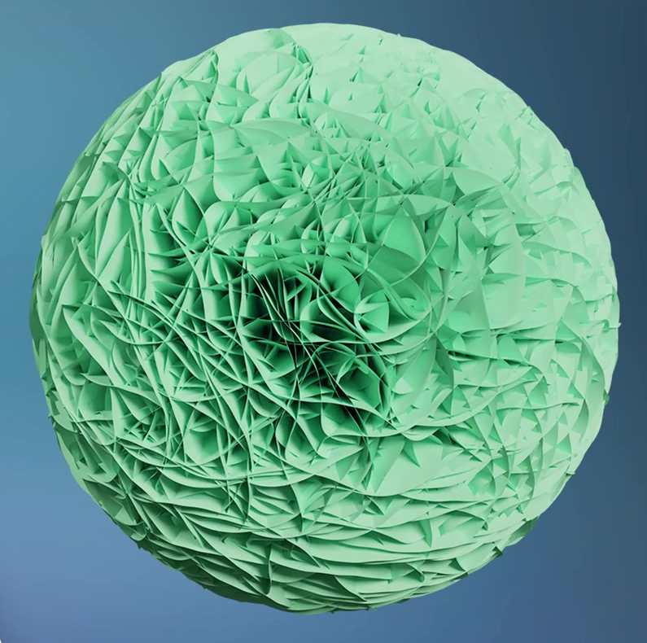

# Procedural Nanoflower

Create an editable spherical nanoflower made from densely overlapping, thin, wrinkled fan-shaped sheets. The result should read as a rounded three-dimensional aggregate at a distance and reveal intersecting layers and narrow recesses in a closer view.

## Starting Scene

Use Blender 5.1.2. The input folder is empty; create the model from native Blender geometry in a new scene. Keep the sheet source and its reusable distribution available in the saved file. Use Cycles with GPU rendering for the final still. This is a static modeling task; a particular material color, animation, or simulation is not required.

## 1. Thin Fan-Shaped Sheets

Create a sheet with a narrow root that opens into a broad fan. Its boundary should have two sides converging toward the root and a continuous rounded outer edge. Preserve the thin sheet character throughout the distributed model; the root and outer rim must remain distinguishable.

Give the sheet genuine three-dimensional folds. Broad crests and valleys should travel from the root toward the outer edge, with mild irregularity in the rim. The folded surface should remain a coherent fan with visible width and open space on either side of its boundary.

## 2. Spherical Nanoflower

Arrange the sheets around a common central region to make one complete, approximately spherical aggregate. Its width, height, and depth should be comparable, and its outline should remain rounded when inspected from several directions.

Build dense coverage over the top, bottom, and sides. Overlapping sheets should define most of the visible surface and silhouette. Small recesses between layers are appropriate; avoid large unpopulated wedges or broad exposed areas of a smooth central support.

## 3. Layered Surface Structure

Orient the narrow sheet roots toward the inner region and let the broader portions project outward. Vary neighboring sheets' rotation around their outward directions so their edges cross and overlap throughout the aggregate. Keep individual broad sheet surfaces and their thin edges legible in close views, with depth between successive layers.

The structural reference below clarifies the layered form. Its green material and background are optional.

## 4. Editable Distribution

Retain a reusable native Blender generator that distributes the sheet geometry. Equivalent native implementations are acceptable. Preserve these functional relationships in `submission.blend`:

- Editing the shared sheet source changes the geometry of distributed sheets across the aggregate after reevaluation.
- A population or density setting can increase and decrease the sheet population while preserving spherical placement and the same sheet source.
- A sheet scale or reach setting changes how far the sheets extend and overlap without changing the population setting.
- An angular-variation setting changes the variation in neighboring sheets' orientations while retaining their outward arrangement around the central region.

Keep the finished dense state as the saved default. The independent sheet source must remain available for inspection and editing without appearing as a loose extra object in the final image.

## 5. Geometry Finish

Use sufficient geometry and consistent surface orientation for the broad folds to shade continuously. Intentional sheet boundaries and creases may be sharp. Avoid tears through sheet interiors, duplicated coincident faces, unstable flickering surfaces, and isolated spikes that obscure the intended fan form. Intersections between separate overlapping sheets are part of the structure.

## Deliverables

- `submission.blend`: the finished editable scene, including the shared sheet source, functional distribution, and final render setup.
- `build.py`: a script that recreates the scene from the stated starting scene and saves the resulting scene as `submission.blend`. The saved result must reopen with the geometry, generator relationships, and render setup intact.
- `B131_Procedural_Nanoflower.png`: a PNG rendered from the actual submitted scene. Frame the complete aggregate with space around its silhouette, and use lighting and shading that make the sheet layering readable. Keep the sheet source out of this final composition. The PNG must be a scene render, not a source image, viewport screenshot, or external replacement.
