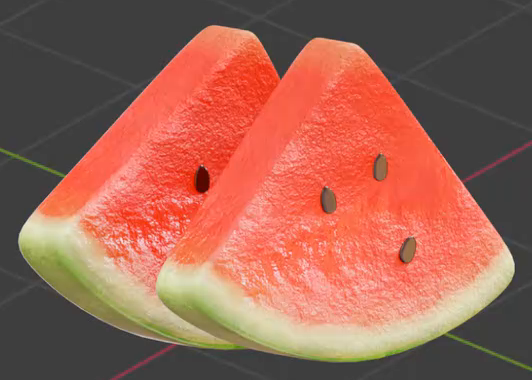
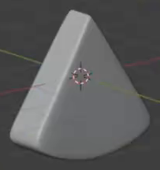
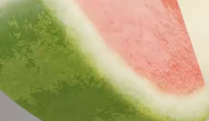

# Textured Watermelon Wedge

Create an editable watermelon slice with a rounded triangular volume, red textured flesh, a pale inner rind, green patterned skin, and small dark seeds. The finished asset should have the moist surface character and clear layered appearance shown below. One complete wedge is required; the second wedge in the reference is an optional presentation duplicate.

## Starting Scene

Use Blender 5.1.2 with Cycles GPU rendering. Start from an empty scene or native Blender primitives. The `input/` directory is empty; no external model, image, texture, or HDRI is required. Build the wedge and seeds as editable scene geometry. The rind and flesh may share a mesh or use separate geometry, provided their final boundaries and appearance meet the requirements below.

## Wedge Form

Create a solid slice with a broad triangular cut face, a gently rounded tip, a curved lower edge, and visible thickness. Its thickness must be clearly smaller than its height and base width. Preserve broad, relatively flat cut faces and a rounded outer base. Soften the perimeter without losing the recognizable triangular silhouette.

The body must read as a continuous solid from front, side, and underside views. Keep the silhouette smooth and avoid visible holes, intersecting shell fragments, or pinched shading. Surface texture must not be used to conceal unfinished body geometry.

## Seeds

Add a small group of at least two discrete seeds on the visible red cut face. Each seed should have a small elongated, flattened volume with a rounded body and a tapered end. Retain editable seed geometry with visible thickness and smooth edges.

Place seeds in separated central and off-center areas of the flesh. Use slight changes in angle and spacing to make the group irregular while leaving the red flesh readable. Keep the group inside the red region and leave the pale rind clear. Seeds should sit against or partly embed in the flesh, with their bodies visible above the surface and no obvious floating gaps.

## Color Regions

Make the red flesh occupy most of each broad cut face. A continuous pale cream to yellow-green inner-rind band must follow the curved lower edge, separating the flesh from the green outer skin. Keep this band subordinate to the flesh area. The green skin must wrap around the curved outer base and remain visible in the final view.

Use a gently irregular, softly blended flesh-to-rind boundary. Keep the red, pale, and green regions readable without loose patches crossing into the wrong region. Give the visible seeds a dark brown to nearly black color that contrasts with the flesh.

## Surface Character

Give the red flesh fine irregular grain together with broader shallow surface variation. Its soft highlights should suggest a moist cut surface while preserving the red color and overall wedge silhouette.

Give the outer skin irregular light and dark green markings that vary in shape and size. Confine this pattern to the green skin. The pale band should remain lighter and visually quieter than the skin. Keep the flesh's textured wet appearance distinct from the rind, and give the dark seeds a smooth surface with small readable highlights.

## Material Editability

Keep the flesh color, pale-rind color, skin-pattern appearance, flesh surface relief, and seed color editable in the submitted scene. These adjustments may use any native material organization that preserves the intended regions. Changing the flesh color must leave the rind and seeds unchanged; changing skin-pattern scale or contrast must affect only the outer skin; changing flesh relief must leave the rind boundary and seed geometry intact.

## Presentation

Compose a static view that shows the entire wedge, a broad seeded cut face, the pale rind band, the green base, and enough of a side to reveal thickness. Use a simple background and soft lighting that make the surface differences readable. Keep the wedge unobstructed and large enough to inspect, with no clipping at the image edges. An optional second wedge must not conceal the required wedge's seeds or rind.

## Deliverables

- `submission.blend`: the complete editable scene, including the watermelon geometry, assigned materials, and the camera and lighting used for the final image.
- `build.py`: a Blender Python script that recreates the scene from the stated starting conditions and saves the resulting scene as `submission.blend`. The script must not depend on an existing submission file or undeclared local assets.
- `B132_Textured_Watermelon_Wedge.png`: a static PNG rendered from the actual submitted scene. Use the saved scene and its intended camera; source images, viewport screenshots, and externally substituted images are not acceptable.
