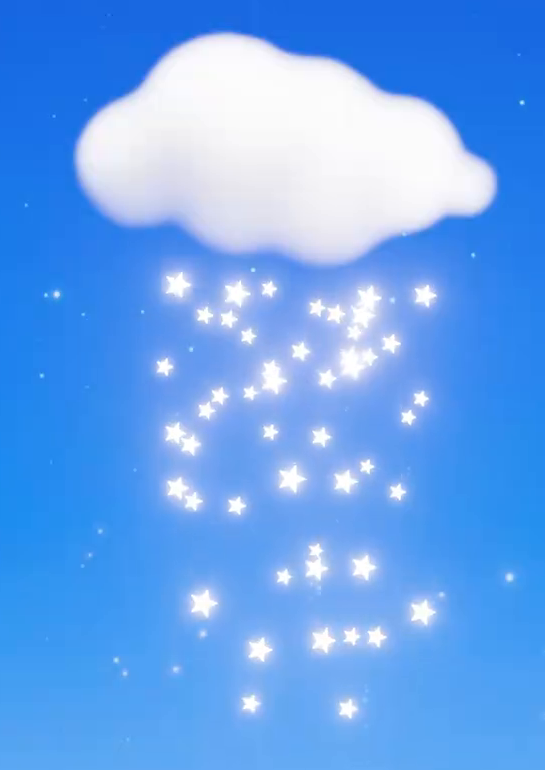
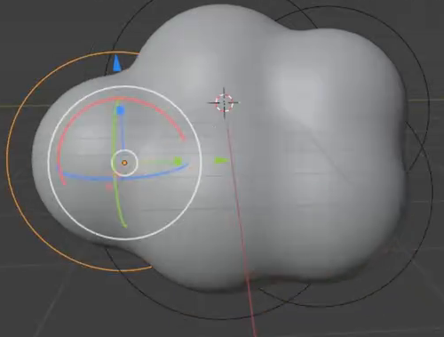
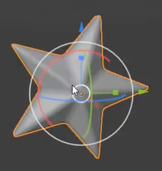
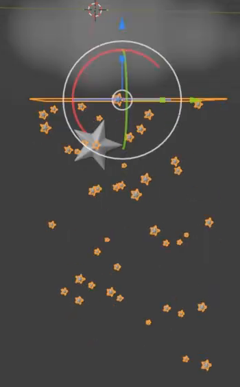

# Volumetric Cloud and Falling Stars

Create an editable white volumetric cloud that releases a shower of small, glowing five-point stars. The cloud stays in place while stars appear at different positions beneath it and fall through a blue portrait composition. Deliver a reproducible Blender scene and an eight-second animation.

The reference establishes the cloud silhouette, luminous stars, and vertical arrangement. Small decorative background sparkles are optional.

## You will need

- Use Blender 5.1.2 and Cycles with GPU rendering.
- No input assets are provided. The `input/` directory is empty. Start from a new scene and create the cloud, star geometry, materials, animation, lighting, and camera with native Blender data.
- Use the cloud's visible width, called W below, as the scale reference. World-unit dimensions are unrestricted.

## 1. Editable cloud form

Build one continuous cloud envelope with at least three joined rounded lobes, a broad raised center, and a gently scalloped lower edge. Its overall silhouette is wider than it is tall. Keep this form linked to editable geometric source data or equivalent spatial shape controls: enlarging or moving one lobe must update the nearby volume contour when the scene evaluates, and restoring the control must restore the contour.

The source geometry is an editing aid. The rendered cloud must obtain its appearance from the volume described in Section 4.

## 2. Solid five-point stars

Create a reusable star with five distinct outer points and five inward notches. Give it a closed, three-dimensional body, a raised central region, and softened edges. The tips and notches must remain recognizable after smoothing. Inspectable front, side, and oblique views must show real thickness, continuous surfaces, and no open seams or severe shading creases.

Use this geometry for the visible falling stars. Their largest projected width should remain below one eighth of W so they read as a shower beneath the cloud.

## 3. Shared star generation

Keep the shower connected to a shared star geometry source or equivalent common geometry controls. Editing a point on that source must update all generated stars when the scene is reevaluated, while preserving each star's position and relative size. The relationship must affect stars actually used by the animation.

Distribute birth positions across a region beneath the cloud, with stars emerging from its underside or immediately below it. Use visibly different star sizes and irregular spacing; the largest and smallest visible stars should differ by roughly a factor of two. Keep individual star sizes stable during their visible descent. Hide any emission surface and the separate full-size source star from the final camera view.

## 4. Cloud volume and star emission

The cloud must be a genuine three-dimensional participating volume: a substantial white interior with subtle density variation, soft translucent boundaries, and small irregularities around its rounded lobes. Preserve a readable cloud shape without a hard shell, obvious voxel blocks, or a featureless opaque cutout.

Give the falling stars white self-emission through their actual materials. They must remain luminous when direct lights are disabled in an inspection copy of the scene. Preserve the five-point silhouette at the delivered exposure. A restrained glow is appropriate, but an external glow overlay cannot supply the stars' emission.

## 5. Falling motion and replay

Use frames **1 through 200 inclusive at 25 fps**, for an **8-second** non-looping shot. Keep the cloud and camera stationary throughout.

- At frame 1, show the intact cloud and no more than three newly born stars close to its underside, with the lower falling region still empty.
- Introduce stars throughout the clip. At frames 50, 100, 150, and 200, show at least 12 distinct falling stars with several different heights, sizes, and lateral positions. Frame 200 remains an active rain state; it does not have to match frame 1.
- Trackable stars must descend smoothly from the birth region. During the clip, at least three stars must each travel downward by at least one quarter of W. Modest sideways drift is allowed, but motion must read primarily as falling, without upward jumps or repeated teleporting through the visible field.
- Stars may leave below the camera or disappear at the end of their individual lifetimes. They must not form a rigid group that merely translates as one object.
- Returning to frame 1 and replaying must reproduce the same star positions, sizes, and visible population at the same frames. Include or regenerate any necessary caches from the delivered files. A physical simulation is optional; the evaluated animation is required.

The large source star, orange emission outline, and editing controls in this diagnostic reference are not part of the final shot.

## 6. Final portrait shot

Frame the entire cloud in the upper portion of a blue portrait composition, with enough room below it to follow the descent. Use a portrait render of at least 720 by 1280 pixels. Keep the cloud's silhouette separated from the background and retain individually readable stars through the developed rain states. Lighting should reveal the cloud's rounded volume while the star emission remains the brightest accent. Keep editing aids and source geometry out of the rendered shot.

## Deliverables

- `submission.blend`: the complete editable scene, with the declared timeline, materials, shared geometry relationships, camera, and render settings. It must reopen and replay without missing external assets.
- `build.py`: a Blender Python script that recreates the scene from a new scene and **saves the rebuilt result as `submission.blend`**. Include any scene data or cache generation needed for the saved file to reopen and reproduce the animation; rebuilding only an unsaved in-memory scene is insufficient.
- `B133_Volumetric_Cloud_And_Falling_Stars_dynamic.mp4`: the actual camera render of frames 1-200 at 25 fps from the submitted scene, in a playable MP4 file. The video must show the submitted scene's geometry, materials, and animation rather than source images, viewport captures, or external replacement footage.
