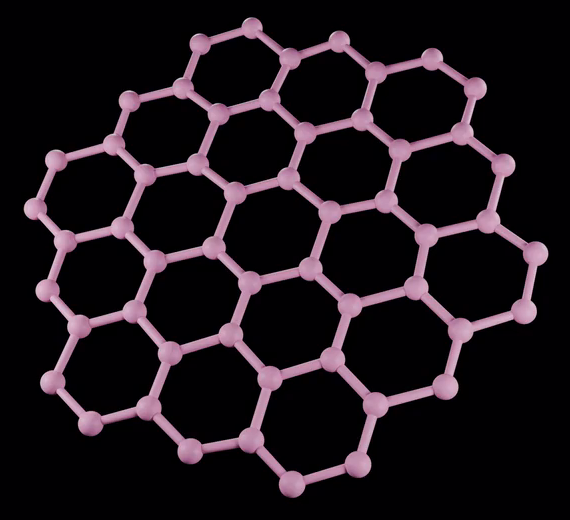
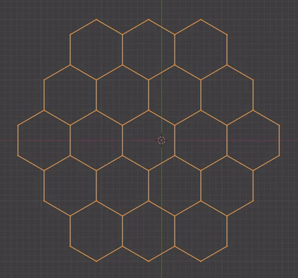
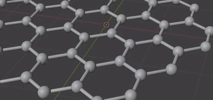

# Editable Honeycomb Ball and Strut Sheet

Create a compact, planar honeycomb sheet whose junctions are round spheres and whose edges are slender circular rods. Preserve an editable shared network so the spheres and connecting rods respond together when a junction moves.

## Starting Scene

Use Blender 5.1.2. Start from an empty scene. No input assets are provided or required; the input directory is intentionally empty. Create the entire sheet with native Blender geometry and procedural tools. A honeycomb add-on is optional, and no particular extension or node arrangement is required. Use Cycles with GPU rendering for the final image.

## Honeycomb Layout

Form one connected sheet of 19 open hexagonal cells. In a face-on view, the staggered rows contain 3, 4, 5, 4, and 3 cells, producing the compact outline in the reference. Keep the hexagons regular and equally sized, with shared edges and junctions. The network must occupy a single plane, with no stacked layers, filled cell interiors, isolated fragments, or extra branches outside the boundary.

## Spherical Junctions

Place one equal-sized, truly three-dimensional sphere at every network junction, including the boundary. Keep the spheres centered on the network, noticeably wider than the rods, and small enough for the cell interiors to remain clearly open. Adjacent cells must use the same junction sphere at a shared corner.

## Cylindrical Struts and Contacts

Give every network edge one straight rod with a circular cross-section and consistent thickness. Rods must have substantial visible length between the spheres and connect the intended neighboring junctions. Their ends should disappear cleanly into the junction spheres, without gaps, protruding caps, doubled rods, or diagonal shortcuts across the cells. Do not replace the rods with flat strips or render-only lines.

## Editable Network

Retain a single editable network that determines both sphere centers and rod connections in the saved scene. Moving an interior network junction a small distance within the sheet plane must move its sphere and update every incident rod to the new position, without manually repairing the rods or changing remote junctions. The saved result must retain this behavior; a baked display mesh alone is insufficient. Equivalent native implementations are acceptable.

## Size Controls

Provide two clearly identifiable, independent controls in the saved scene: one for all junction-sphere sizes and one for all rod thicknesses. A modest increase or decrease in either control must affect its intended component throughout the populated sheet while preserving the other component's size, network positions, and cell connections. Keep both controls editable after saving, and save the default state with the proportions shown in the first reference.

## Surface and Presentation

Make the existing spheres and rods appear smoothly rounded, with clean silhouettes and continuous shading. Avoid visibly faceted spheres, polygonal rod cross-sections, shading seams, and surface artifacts at normal inspection distance.

Apply a consistent pale pink or pink-lavender material to both spheres and rods, with soft highlights that reveal their round forms. Present the entire sheet against a dark, unobtrusive background in a slightly oblique view. Keep all boundary junctions inside the image and leave enough visible openings to read the hexagonal pattern.

## Deliverables

- `submission.blend`: the complete scene, including the editable network, size controls, assigned materials, and a render-ready camera and lighting setup.
- `build.py`: a reproducible Blender Python script that creates the complete scene from the empty starting scene and saves the resulting scene as `submission.blend`. It must recreate the edit behavior and saved controls as well as the visible model.
- `B134_Editable_Honeycomb_Ball_and_Strut_Sheet.png`: a static PNG rendered from the actual submitted scene with the full sheet clearly visible. Source images, viewport screenshots, and external replacements are not acceptable substitutes.
