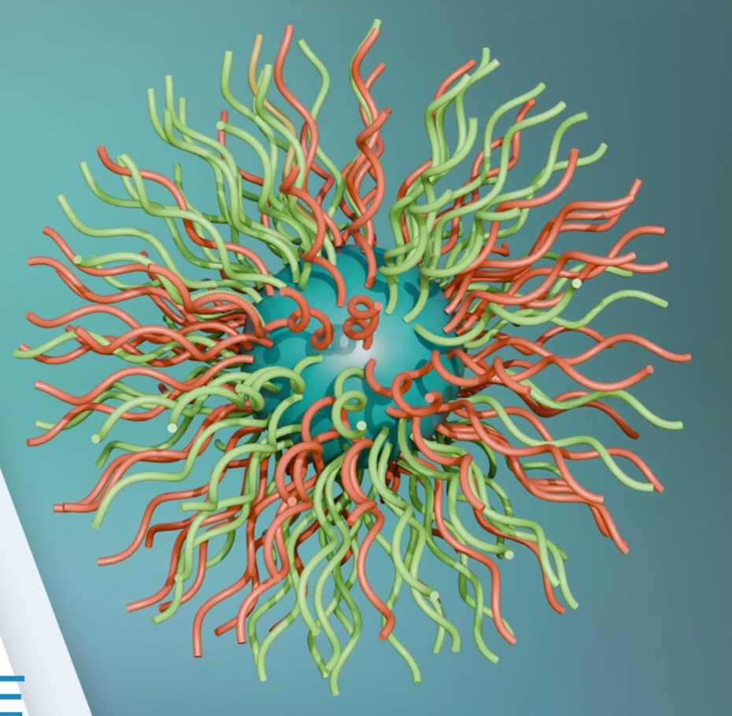
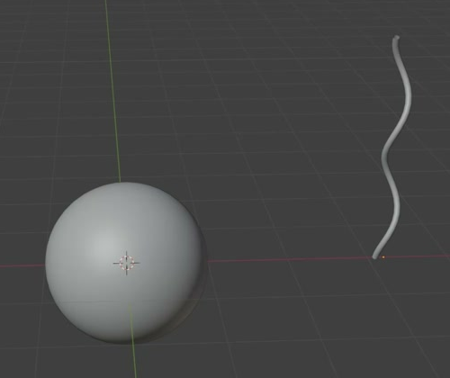
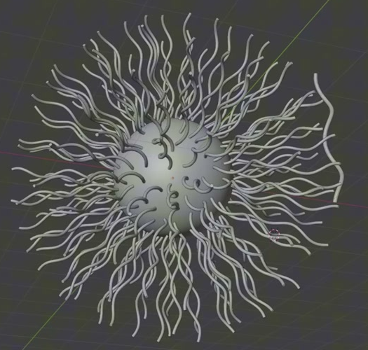

# Wavy Strand Nanoparticle

Create a static, editable nanoparticle: a smooth spherical core surrounded by a dense coat of slender, gently wavy tubes. The strands grow outward in all directions, with varied roll around their radial axes. Preserve a reusable generator so the strand shape, coat density, spacing, scale, and random seed remain useful controls.

## Starting Scene

Use Blender 5.1.2 and Cycles with GPU rendering. Start from an empty scene. The `input/` directory is empty; no external model, texture, image, or extension is required. Create the core and strand source with native Blender geometry. This is a static asset, with no required animation or physical simulation.

## 1. Spherical Core

Create a complete, rounded three-dimensional sphere at the center of the particle. Its outline and shading must remain smooth from different viewpoints, without visible faceting, dents, holes, or a flattened side. Keep portions of the core visible between the strand roots.

## 2. Wavy Strand Geometry

Create a reusable strand source with an open path that runs mainly from root to tip and bends gently from side to side. Its silhouette should show successive smooth changes of direction, rather than a straight rod, closed loop, tight spring, or branched structure. Give it a slender circular cross-section, consistent thickness along its length, and closed ends.

The visible coat must use this strand form. Its outward reach should be comparable to the core radius, while its thickness remains much smaller than its length. Preserve smooth curved silhouettes, continuous tubular surfaces, and clean end caps on the visible strands. Local crossings are acceptable, but sharp kinks, torn surfaces, and collapsed segments are not.

## 3. Radial Coat

Populate the whole spherical surface, including its rear and polar regions. Aim for a dense but readable coat with roughly even root spacing. Avoid a single ring, a flat fan, a large bald sector, or one unusually crowded patch. The core must still be discernible through gaps.

Each strand must start at the core surface, with its main root-to-tip direction following the local outward radial direction. Roots may enter the surface slightly so there is no visible gap. Strands around the silhouette should extend away from the core, while front-facing strands may be foreshortened. Vary their roll around the outward direction to avoid uniformly aligned waves, while keeping the overall envelope approximately spherical.

## 4. Live Generator

Keep the coat linked to an editable shared strand source and to the core surface. A collection of independently placed, frozen tubes is insufficient. Geometry Nodes or an equivalent reusable procedural implementation is acceptable; the controls may live in its native parameters and must have clear labels.

The saved scene must support these reversible changes without manually replacing individual strands:

- Editing the shared strand's bends or thickness updates the populated coat. A strand-scale control changes their outward reach while retaining their root attachment and radial direction.
- Lowering coat density produces a visibly sparser coat; increasing minimum root spacing separates roots and prevents densely packed root clusters. These changes recompute coverage over the whole core while preserving the strand form and radial orientation.
- Changing a random seed gives a different arrangement of roots or strand rolls. Returning to the original seed and settings reproduces the original arrangement. Different strands must retain varied roll without losing the radial organization.

Save the finished dense coat as the default state. Retain the source geometry for editing, but exclude the standalone source from the final image.

## 5. Surface and Presentation

Use a teal core and a mixture of coral and light-green strands, guided by the colored reference. Both strand colors should appear in several parts of the coat, rather than being split into separate halves. Give these surfaces an opaque, nonmetallic appearance with restrained highlights that reveal their rounded form. Use actual scene materials on the core and strand geometry.

Frame the complete nanoparticle against a quiet background, with enough separation to read the fine strands, the visible core, and the outer silhouette. Keep all strand tips inside the image. Light the subject so the color families and curved surfaces remain readable. The final image contains the nanoparticle, without a detached source strand or unrelated demonstration objects.

## Deliverables

- `submission.blend`: the complete scene, with its editable source, functioning generator and controls, materials, camera, and Cycles GPU render setup. Save the finished default state.
- `build.py`: a Blender Python script that recreates the complete scene from an empty scene and saves the resulting scene as `submission.blend`. Include a short usage comment and make any required procedural code available through the script or saved file. Recreating an unsaved in-memory scene is insufficient.
- `B135_Wavy_Strand_Nanoparticle.png`: a finished PNG rendered from the actual submitted scene. It must show the complete default-state nanoparticle; do not substitute a reference image, viewport screenshot, or external replacement.
