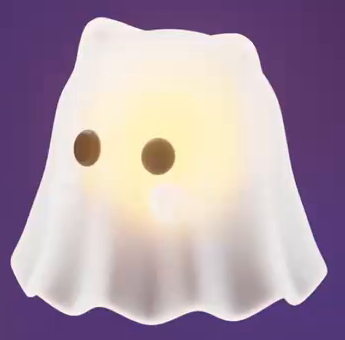
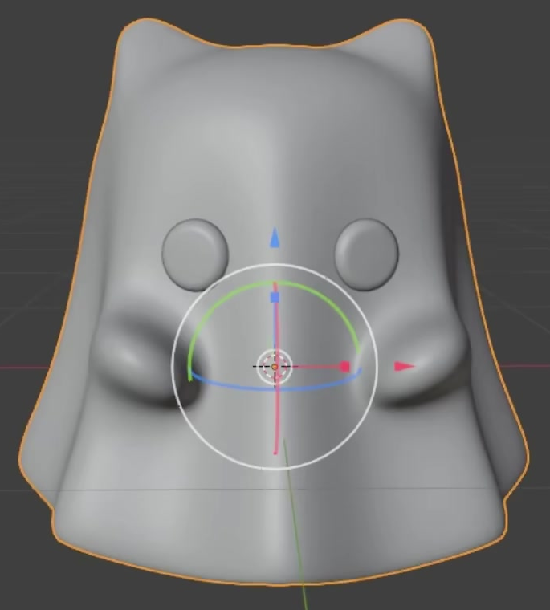
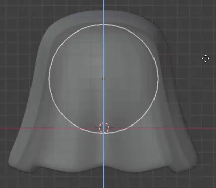

# Transparent Luminous Ghost

Create a small stylized ghost with a translucent, softly luminous shell, a scalloped hem, two short ears and arms, dark oval eyes, and a warm glowing sphere contained inside its body.

## Starting Scene

Use Blender 5.1.2 and Cycles with GPU rendering. Start from an empty scene and create the required geometry using native Blender objects. No input assets are provided; `../input/` is empty. The reference images define the form and material appearance. The required result is a single static ghost.

## 1. Bell-Shaped Shell

Build a three-dimensional shell with a rounded upper body and sides that widen toward the hem. Its overall silhouette should feel compact and soft, with a broad base relative to the upper body. Keep an open underside and a real interior cavity. Give the shell a thin, visible wall thickness with a continuous rim around the opening.

## 2. Scalloped Hem and Folds

Shape the lower edge into multiple adjoining, rounded scallops with alternating high and low points. Let their inward and outward contours continue upward as soft vertical folds in the lower body. Distribute this treatment around the body, including the rear, so it reads as a draped shell in three dimensions.

## 3. Ears and Arms

Form two short, rounded ear-like peaks at the top, separated by a shallow dip. Add two short, rounded arms below eye level, one on each side of the body. They should project slightly forward and outward, remain small relative to the body, and blend naturally into its surface. Keep the paired features approximately balanced about the body's centerline.

## 4. Rounded Eyes

Place two similarly sized, vertically oval eyes on the front of the upper body. Use shallow three-dimensional forms with rounded edges, visibly attached to the curved shell. Keep them separated, level with one another, and balanced about the centerline. Give both eyes an opaque dark material so their shapes remain distinct against the glowing body.

## 5. Continuous Surface Finish

Finish the shell and its folds with smooth curvature and consistent shading. The rounded hem, existing ear and arm transitions, and eye edges should avoid accidental sharp ridges, visible faceting, pinching, or shading seams. Keep the shell free from unintended holes and self-intersections while preserving its intentional bottom opening. The folds must remain visible after smoothing.

## 6. Translucent Shell and Luminous Core

Give the shell a pale, glossy, translucent appearance. Light and color from inside must pass through it, while reflections and soft highlights continue to describe its curved shape. Include a subtle, view-dependent self-emission contribution that brightens grazing regions of the shell without flattening its folds into featureless white.

Place a smooth spherical core fully inside the upper central body. Keep it clear of the shell, eyes, and open hem. Give this sphere a warm orange-yellow material with real self-emission, producing a soft warm center visible through the shell. The transmitted glow may blur the sphere's outline, but its warmth should remain distinct from the pale shell. The core's material must cause this internal luminosity, and the body must retain readable form around it.

Keep the shell and core materials independently editable in the saved scene. A change to the core's emission should change the internal brightness while the outer geometry remains intact.

## 7. Final View

Present the whole ghost in a front or gentle three-quarter view with both eyes, the ears, arms, and complete hem readable. Use an unobtrusive background and lighting that reveal the pale shell and warm interior. Leave space around the silhouette and choose exposure that preserves the dark eyes and lower-body folds.

## Deliverables

- `submission.blend`: the editable ghost scene, including its geometry, assigned materials, camera, lighting, and Cycles GPU render settings.
- `build.py`: a script that recreates the scene from an empty Blender scene and saves the recreated result as `submission.blend`. It must reproduce the required geometry, materials, camera, lighting, and render settings without external assets.
- `B136_Transparent_Luminous_Ghost.png`: a static image rendered from the actual saved `submission.blend` scene using the final view above. Submit the rendered scene itself, without viewport interface overlays or replacement source imagery.
