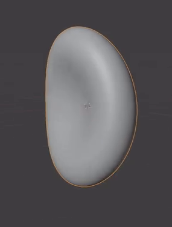
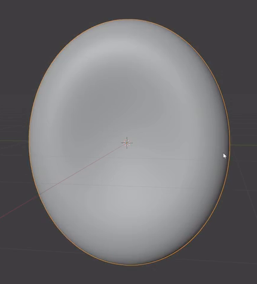
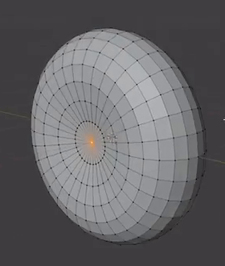
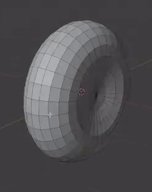
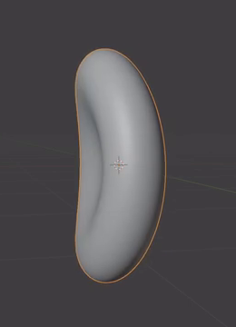

# Editable Biconcave Red Blood Cell

Create one smooth, closed red blood cell model with a shallow depression on each broad face, a thick rounded perimeter, and a gentle overall bend. Preserve editable geometry and live controls for bend amount and geometric refinement.

## Starting Scene

Use Blender 5.1.2. Start from a new scene and construct the cell from native Blender geometry. No external input assets are supplied or required; the input directory is empty. Keep the model editable in the saved file. Use Cycles with GPU rendering for the final inspection image.

This is a static modeling task. A neutral material is sufficient; color, translucency, and a biological environment are not required. Scene scale and object orientation are free, provided the following shape relationships are preserved.

## Disk Proportions

The unbent cell is a compact, approximately circular disk. Its two broad dimensions should be similar, and its thickness should be visibly smaller than its diameter while remaining substantial. Avoid a sphere, a long oval, a flat sheet, or a torus with an open center.

## Two-Sided Concavity

Both broad faces must sink inward toward their centers. Each depression should occupy a broad central region and transition gradually into a fuller surrounding annulus. The central bridge between the faces remains solid and thinner than the surrounding ring. The depressions must be modeled geometry that remains visible from different viewing directions.

The two images below show opposing broad faces during construction. Use them for the depression and annulus relationship; the completed model should have the smooth finish shown in the other references.

## Rim and Surface Integrity

Join the two broad faces through a continuous, plump outer edge with a rounded cross-section. Preserve a clear transition from the thin center through the fuller annulus to the outermost edge. The perimeter must not become a sharp flange or a narrow seam between separate sheets.

The finished cell must be one connected, closed surface with consistent outward-facing normals, positive thickness, and no holes or self-intersections. Keep enough editable surface structure to revise the broad faces and perimeter. At the saved refinement setting, the curved bowls, annulus, and silhouette should be smooth, without visible polygon steps, pinched centers, or abrupt shading bands.

## Gentle Bend

Save the cell with a mild, continuous bend across the disk, comparable to the completed reference. An edge or oblique view must reveal that the body curves as a whole. The bend should retain the disk identity, two depressions, and rounded perimeter without folding the cell onto itself, twisting it into a spiral, or producing a sharp crease.

## Editable Geometric Evaluation

Keep a live bend amount on the cell's geometric evaluation. Setting it to zero must recover the unbent biconcave disk. Reducing its magnitude should reduce the overall curvature, and restoring the saved value must recover the delivered shape. These changes must act on the cell geometry without manually rebuilding its mesh or exchanging it for another model. Preserve the face depressions, positive thickness, and smooth perimeter throughout this adjustment.

Also retain an editable refinement control that changes the evaluated geometric density of the same cell. A lower supported setting should expose a coarser evaluation; restoring the saved higher setting should recover the smooth surface while keeping the biconcave profile and bend. Equivalent native geometric implementations are acceptable. A shading-only switch or ordinary object scaling does not provide either of these geometric behaviors.

## Deliverables

- `submission.blend`: the completed editable cell, saved with its gentle bend, live geometric controls, and a camera and lighting arrangement suitable for inspecting its shape.
- `build.py`: a Blender Python script that recreates the scene from a fresh Blender session and saves `submission.blend` in the current working directory. The saved result must contain the cell, editable geometric behavior, and inspection setup.
- `B137_Editable_Biconcave_Red_Blood_Cell.png`: a Cycles GPU render from the actual submitted scene. Frame the entire cell in a clear oblique view that reveals a central depression, the rounded edge, and overall bend. Use a plain background and lighting that keeps the form legible. The PNG must be an actual scene render, not a viewport screenshot, source image, or external replacement.
